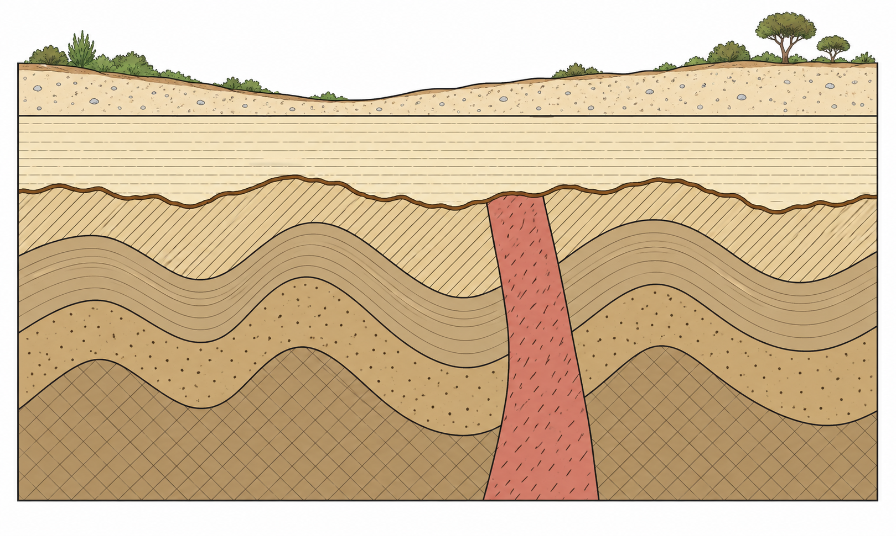

# G1 · Reconstruïm una història geològica

**Evidència d'avaluació · CA 6.1**  
**Durada:** 2 sessions

## Situació

Un tall geològic és una representació simplificada del subsòl que permet reconstruir una part de la història d'un territori. Les roques, les estructures i els contactes que hi apareixen no s'han format al mateix temps: cada element aporta informació sobre què va passar abans i què va passar després.

En aquesta activitat hauràs de **deduir i explicar la història geològica representada en el tall**. No basta indicar l'ordre dels esdeveniments: les conclusions s'han de justificar a partir de les evidències del dibuix i dels principis geològics que corresponguin.

## Tall geològic

---

# Sessió 1 · Reconstrucció

## 1. Observa el tall

Examina atentament el tall abans de començar a ordenar els esdeveniments.

Identifica els elements geològics que consideris rellevants per reconstruir-ne la història. Fixa't especialment en:

- les diferents unitats de roca;
- la disposició i orientació dels estrats;
- els contactes entre unitats;
- les estructures que tallen altres materials;
- les superfícies que interrompen o trunquen estructures anteriors;
- la forma actual de la superfície del terreny.

### Elements rellevants que has identificat

| Element o estructura | Què observes en el tall? |
|---|---|
| 1 | |
| 2 | |
| 3 | |
| 4 | |
| 5 | |
| 6 | |

## 2. Estableix relacions temporals

Selecciona **almenys cinc relacions temporals importants** que puguis demostrar a partir del tall.

Per a cada una, indica:

1. quins dos elements o esdeveniments compares;
2. quin és anterior i quin és posterior;
3. quina evidència del tall ho demostra;
4. quin principi geològic sustenta la teva interpretació.

| Relació temporal | Evidència observable | Principi geològic utilitzat |
|---|---|---|
| 1 | | |
| 2 | | |
| 3 | | |
| 4 | | |
| 5 | | |
| 6 | | |

## 3. Construeix una cronologia provisional

Ordena els esdeveniments geològics que has deduït **del més antic al més recent**.

No et limitis a enumerar les capes: incorpora també els processos o esdeveniments que hagin modificat els materials.

1. 
2. 
3. 
4. 
5. 
6. 
7. 
8. 
9. 
10. 

Abans d'acabar la sessió, revisa la seqüència i comprova que **cap esdeveniment posterior aparegui abans que una estructura o material que necessàriament havia d'existir perquè es pogués produir**.

---

# Sessió 2 · Revisió i explicació

## 4. Revisa la teva reconstrucció

Torna a observar el tall i compara'l amb la cronologia provisional de la sessió anterior.

Comprova especialment:

- si l'ordre de les unitats sedimentàries és coherent;
- si has situat correctament els processos que deformen o tallen materials anteriors;
- si has detectat superfícies que indiquen interrupcions en el registre geològic;
- si has incorporat els esdeveniments més recents que expliquen l'aspecte actual del relleu.

Si detectes una contradicció, modifica la cronologia i explica breument què has canviat.

### Canvis respecte de la cronologia provisional

## 5. Seqüència geològica definitiva

Escriu la seqüència definitiva **del més antic al més recent**.

1. 
2. 
3. 
4. 
5. 
6. 
7. 
8. 
9. 
10. 

## 6. Reconstrueix la història geològica

Redacta una explicació coherent de la història geològica representada en el tall.

La resposta ha de:

- seguir un ordre cronològic clar;
- diferenciar materials, estructures i processos;
- justificar les relacions temporals principals a partir d'evidències observables;
- utilitzar correctament els principis geològics que permeten establir l'edat relativa;
- emprar terminologia geològica adequada.

**No basta escriure una llista d'esdeveniments. Has d'explicar com saps que es varen produir en aquest ordre.**

### Història geològica

## Abans d'entregar

Comprova que pots respondre afirmativament aquestes preguntes:

- He identificat els elements necessaris per interpretar el tall?
- He distingit observacions del tall de les inferències que en faig?
- He justificat les relacions d'edat amb principis geològics?
- La meva seqüència és compatible amb totes les estructures del tall?
- He incorporat els esdeveniments més recents fins arribar al relleu actual?
- La meva explicació és una història geològica argumentada i no només una enumeració?
