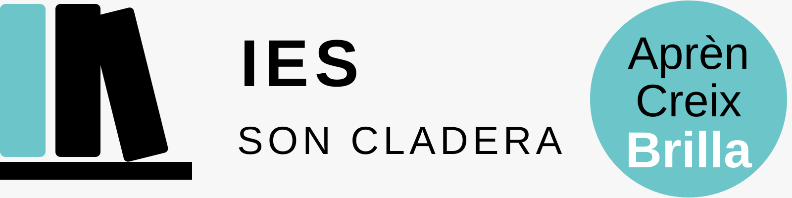

<meta name="robots" content="noindex,nofollow">

  

# G2 · Comprendre el risc

## El cas del Torrent Gros

**Biologia i Geologia · 4t d'ESO**

**Nom i llinatges:** ________________________________________________

**Grup:** ____________  **Data:** __________________

---

## Situació

El **Torrent Gros** forma part de la xarxa de drenatge de Mallorca. Com passa en molts cursos torrencials mediterranis, el cabal pot variar molt al llarg del temps. Després d'un episodi de precipitació intensa, la quantitat d'aigua que circula pel torrent pot augmentar ràpidament.

Al territori que envolta el torrent hi ha persones, habitatges, vies de comunicació, instal·lacions i altres infraestructures. Per això, una avinguda no és només un procés natural: pot arribar a tenir conseqüències sobre la població i sobre els béns situats a les zones afectades.

Ara bé, **no tots els elements exposats patirien necessàriament els mateixos danys**. La ubicació d'un edifici, les seves característiques, la facilitat d'evacuació, l'existència de sistemes d'alerta o la preparació de la població poden modificar les conseqüències d'un mateix episodi.

Les activitats humanes també poden canviar el risc. Ocupar zones que poden resultar afectades pot augmentar el nombre de persones i béns exposats. En canvi, la planificació territorial, l'adaptació dels edificis, els sistemes d'alerta i altres mesures de prevenció poden reduir les conseqüències.

Per tant, encara que **no puguem impedir que plogui intensament**, això no significa que el risc sigui inevitable ni que sempre hagi de ser el mateix.

---

## 1 · Procés natural i risc

**a)** Quin és el **procés o perill natural** principal descrit al text?

**b)** Explica per què no és correcte dir que *el Torrent Gros, per si mateix, és el risc*.

---

## 2 · Què pot quedar afectat?

Identifica **dos elements exposats** que apareguin al text.

**Element exposat 1:**

**Element exposat 2:**

Explica què significa que aquests elements estiguin **exposats**.

---

## 3 · Mateixa avinguda, conseqüències diferents

Dos edificis poden estar afectats pel mateix episodi d'avinguda i, tot i així, patir conseqüències diferents.

Explica aquesta afirmació utilitzant el concepte de **vulnerabilitat**.

---

## 4 · Les nostres accions poden modificar el risc

### a) Una actuació que pot augmentar-lo

Indica una actuació humana que podria **augmentar el risc** al territori proper al torrent.

**Actuació:**

Explica **com** aquesta actuació augmentaria el risc.

Quin component modifica principalment?

- [ ] El perill
- [ ] L'exposició
- [ ] La vulnerabilitat

Justifica la resposta.

### b) Una actuació que pot reduir-lo

Proposa una mesura que podria **reduir el risc**.

**Mesura:**

Explica **com** aquesta mesura contribuiria a reduir-lo.

Quin component modifica principalment?

- [ ] El perill
- [ ] L'exposició
- [ ] La vulnerabilitat

Justifica la resposta.

---

## 5 · Explicació final

Un company afirma:

> **«Si no podem impedir les pluges intenses, no podem fer res per reduir el risc.»**

**Estàs d'acord amb aquesta afirmació?**

Redacta una resposta argumentada. A la teva explicació has de relacionar, quan sigui necessari, els conceptes de **perill, exposició, vulnerabilitat i risc**, i explicar de quina manera les actuacions humanes poden modificar les conseqüències d'un procés natural.

---

## Abans d'entregar

Comprova que:

- has diferenciat el **procés natural** del **risc**;
- has identificat correctament què significa **exposició**;
- has explicat la **vulnerabilitat** amb les teves paraules;
- has justificat com una actuació humana pot augmentar o reduir el risc;
- la resposta final és una **explicació argumentada**, no només una llista de definicions.
