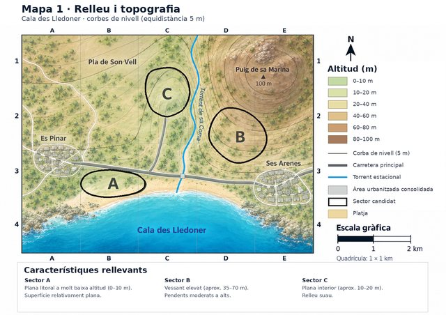
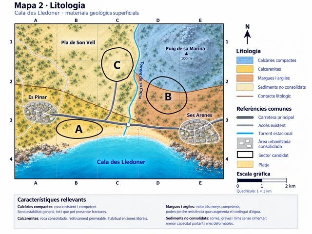
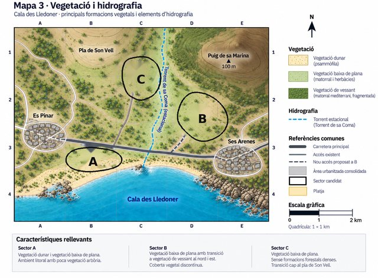
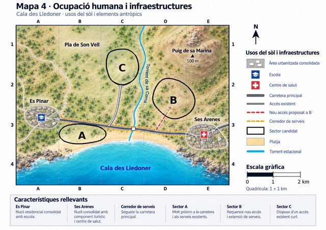
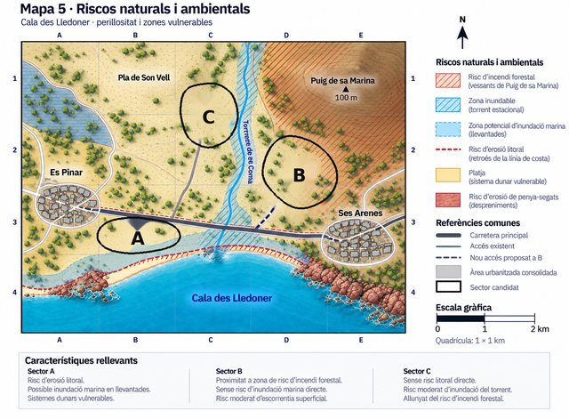
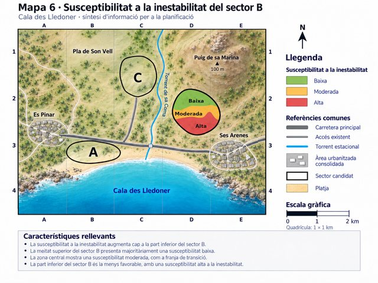
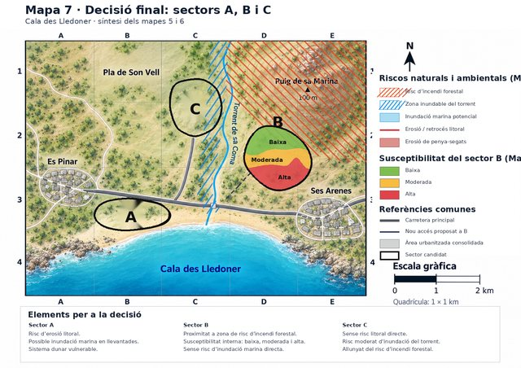

# G2 · On construiríem?

---

## Situació

L’Ajuntament de **Cala des Lledoner** estudia on situar un nou barri. S’han delimitat tres sectors candidats: **A, B i C**.

La decisió no es pot prendre a partir d’una sola dada. Començaràs analitzant:

- relleu i pendent;
- litologia;
- vegetació i hidrografia;
- ocupació humana i infraestructures.

Més endavant rebràs informació nova i hauràs de comprovar si la teva primera decisió continua essent defensable.

L’objectiu no és endevinar quin sector «vol» el professor. **A, B o C poden ser defensables si la decisió està ben argumentada amb les dades.**

> **Regla de treball:** quan facis una afirmació important, indica en quin mapa et bases.

---

## Primers mapes

<figure style="margin:0;">
  
  <figcaption style="font-size:.9rem;margin-top:.35rem;">
    <strong>Mapa 1 · Relleu i topografia</strong> · Clica la miniatura per obrir el mapa a mida completa.
  </figcaption>
</figure>
<figure style="margin:0;">
  
  <figcaption style="font-size:.9rem;margin-top:.35rem;">
    <strong>Mapa 2 · Litologia</strong> · Clica la miniatura per obrir el mapa a mida completa.
  </figcaption>
</figure>
<figure style="margin:0;">
  
  <figcaption style="font-size:.9rem;margin-top:.35rem;">
    <strong>Mapa 3 · Vegetació i hidrografia</strong> · Clica la miniatura per obrir el mapa a mida completa.
  </figcaption>
</figure>
<figure style="margin:0;">
  
  <figcaption style="font-size:.9rem;margin-top:.35rem;">
    <strong>Mapa 4 · Ocupació humana i infraestructures</strong> · Clica la miniatura per obrir el mapa a mida completa.
  </figcaption>
</figure>

---

## 1. Llegim el territori

Completa la taula amb informació concreta dels mapes 1–4.

| Factor | Sector A | Sector B | Sector C |
|---|---|---|---|
| **Relleu, altitud i pendent** (M1) |  |  |  |
| **Litologia** (M2) |  |  |  |
| **Vegetació / hidrografia** (M3) |  |  |  |
| **Accessos i infraestructures** (M4) |  |  |  |
| **Possible avantatge per urbanitzar-hi** |  |  |  |
| **Possible limitació o problema** |  |  |  |

En la teva anàlisi has de comprovar, com a mínim:

- si el terreny és pla o té pendent;
- quin material geològic hi ha sota cada sector;
- si hi ha vegetació o elements ambientals que podrien quedar afectats;
- quina relació té cada sector amb la carretera, els accessos i els serveis;
- quins elements humans podrien quedar exposats si es produeix un fenomen natural.

---

## 2. Perill, exposició, vulnerabilitat i risc

Escull **un possible problema natural** que pugui afectar algun dels sectors a partir de la informació disponible.

**Sector:** ____________

**Procés o perill natural que consideres possible:**  
____________________________________________________________________

**Què hi podria quedar exposat si s’hi construeix el barri?**  
____________________________________________________________________  
____________________________________________________________________

**Quines característiques dels elements exposats podrien fer-los més o menys vulnerables?**  
____________________________________________________________________  
____________________________________________________________________

**Per què això podria convertir-se en un risc si s’urbanitza el sector?**  
____________________________________________________________________  
____________________________________________________________________

---

## 3. Comparació inicial

Ordena els tres sectors de **més favorable a menys favorable** segons la informació disponible ara.

1. __________________
2. __________________
3. __________________

Justifica l’ordre amb **almenys tres evidències procedents de mapes diferents**.

1. **Mapa ____:** ___________________________________________________  
   _________________________________________________________________

2. **Mapa ____:** ___________________________________________________  
   _________________________________________________________________

3. **Mapa ____:** ___________________________________________________  
   _________________________________________________________________

---

## 4. Primera decisió

**Triaria el sector ____________.**

Explica la decisió integrant relleu, litologia, vegetació o hidrografia, i infraestructures/factors humans.

____________________________________________________________________  
____________________________________________________________________  
____________________________________________________________________  
____________________________________________________________________  
____________________________________________________________________

### Principal inconvenient de la teva proposta

____________________________________________________________________  
____________________________________________________________________

### Mesura de prevenció o planificació que consideraries necessària

____________________________________________________________________  
____________________________________________________________________

> **Atura’t aquí fins que el professor t’indiqui que pots continuar.** No modifiquis aquesta primera decisió quan rebis informació nova. Ha de quedar constància de què pensaves abans.

---

# Informació nova

Ara rebràs informació que no tenies quan vas prendre la primera decisió.

## Mapes nous

<figure style="margin:0;">
  
  <figcaption style="font-size:.9rem;margin-top:.35rem;">
    <strong>Mapa 5 · Riscs naturals i ambientals</strong> · Clica la miniatura per obrir el mapa a mida completa.
  </figcaption>
</figure>
<figure style="margin:0;">
  
  <figcaption style="font-size:.9rem;margin-top:.35rem;">
    <strong>Mapa 6 · Susceptibilitat a la inestabilitat del sector B</strong> · Clica la miniatura per obrir el mapa a mida completa.
  </figcaption>
</figure>

---

## 5. Què aporten les dades noves?

### Mapa 5 · Riscs naturals i ambientals

Per a cada sector, identifica **només els riscs o condicionants que realment apareixen al mapa**.

| Sector | Risc(s) o condicionant(s) del mapa 5 | Què implica per a una possible urbanització? |
|---|---|---|
| **A** |  |  |
| **B** |  |  |
| **C** |  |  |

### Mapa 6 · Susceptibilitat a la inestabilitat del sector B

Descriu com varia la susceptibilitat dins B.

**Part superior de B:** ______________________________________________

**Zona central de B:** _______________________________________________

**Part inferior de B:** ______________________________________________

El mapa 6 no diu simplement que «B és segur» o que «B és perillós». Explica per què aquesta afirmació seria massa simple:

____________________________________________________________________  
____________________________________________________________________  
____________________________________________________________________

---

## 6. Posa a prova la teva primera decisió

**Decisió inicial:** sector ____________

### Quina dada nova és més important per revisar-la?

**Mapa:** ______

**Dada concreta:**  
____________________________________________________________________  
____________________________________________________________________

Aquesta dada:

- [ ] reforça la meva proposta;
- [ ] la debilita;
- [ ] introdueix un problema nou, però continua essent viable;
- [ ] fa que consideri més favorable un altre sector.

**Per què?**

____________________________________________________________________  
____________________________________________________________________  
____________________________________________________________________

---

## 7. Revisió crítica

Després d’analitzar els mapes 5 i 6:

- [ ] **Mantenc** la meva primera decisió.
- [ ] **Canvi** la meva primera decisió.

**Decisió revisada:** sector ____________

Justifica la revisió explicant:

1. què pensaves inicialment;
2. quina informació nova has incorporat;
3. si aquesta informació modifica alguna conclusió;
4. per què la decisió revisada és més sòlida.

____________________________________________________________________  
____________________________________________________________________  
____________________________________________________________________  
____________________________________________________________________  
____________________________________________________________________  
____________________________________________________________________

> Mantenir la decisió no és millor ni pitjor que canviar-la. S’avalua si has examinat les dades noves i si la conclusió és coherent amb elles.

---

## 8. Mapa de síntesi final

**Obre aquest mapa només quan el professor ho indiqui.**

<figure style="margin:0;">
  
  <figcaption style="font-size:.9rem;margin-top:.35rem;">
    <strong>Mapa 7 · Decisió final: sectors A, B i C</strong> · Clica la miniatura per obrir el mapa a mida completa.
  </figcaption>
</figure>

Al mapa 7, marca sobre la còpia impresa:

1. **el sector que proposes**;
2. **la zona concreta dins el sector on situaries el barri**;
3. si és necessari, **una part del sector que evitaries**.

No és obligatori ocupar tot el sector candidat.

### Proposta final

**Sector elegit:** ____________

**Part concreta del sector que ocuparies:**  
____________________________________________________________________  
____________________________________________________________________

**Part que evitaries, si n’hi ha:**  
____________________________________________________________________  
____________________________________________________________________

### Justificació científica final

Utilitza dades de **com a mínim quatre mapes diferents**, incloent obligatòriament:

- almenys un dels mapes 1–4;
- el mapa 5;
- i, si la teva decisió afecta B o el compares amb B, el mapa 6.

____________________________________________________________________  
____________________________________________________________________  
____________________________________________________________________  
____________________________________________________________________  
____________________________________________________________________  
____________________________________________________________________  
____________________________________________________________________

---

## 9. Risc i prevenció de la proposta final

**Perill o procés natural més important:**  
____________________________________________________________________

**Elements que quedarien exposats:**  
____________________________________________________________________

**Què podria fer que aquests elements fossin més o menys vulnerables?**  
____________________________________________________________________  
____________________________________________________________________

**Acció humana que podria potenciar el risc:**  
____________________________________________________________________

**Mesura de prevenció o reducció del risc:**  
____________________________________________________________________  
____________________________________________________________________

---

## 10. Conclusió

> **Proposaria construir el nou barri __________________________________, perquè ____________________________________________________________. La principal limitació és ____________________________________________, i la reduiria mitjançant ________________________________________________.**

---

<strong>Informació per al docent · criteris d’avaluació</strong>

### Criteris curriculars implicats

**CA 5.1** — Identificar els possibles riscs naturals potenciats per determinades accions humanes sobre una zona geogràfica concreta, tenint en compte les seves característiques litològiques, relleu, vegetació i factors socioeconòmics.

**CA 4.2** — Analitzar críticament la solució a un problema sobre fenòmens biològics i geològics, canviant els procediments utilitzats o les conclusions si aquesta solució no fos viable o davant noves dades aportades amb posterioritat.

### Indicadors observables

**CA 5.1**
- Extreu correctament informació de relleu, litologia, vegetació/hidrografia i ocupació humana.
- Relaciona les característiques territorials amb possibles riscs o limitacions.
- Identifica perill, elements exposats i factors de vulnerabilitat.
- Compara A, B i C amb evidències concretes procedents de diversos mapes.
- Integra relleu, litologia, vegetació i factors socioeconòmics en la decisió final.
- Explica com les accions humanes poden augmentar, reduir o redistribuir el risc.
- Formula una proposta territorial concreta i contempla mesures de prevenció.

**CA 4.2**
- Formula una **decisió inicial explícita** que es conserva com a punt de partida.
- Identifica quines dades noves afecten la viabilitat de la solució inicial.
- Reexamina explícitament la primera decisió.
- Manté o modifica la decisió de manera fonamentada.
- Ajusta la proposta dins el sector quan la distribució espacial del risc és desigual.
- Explica per què la conclusió final és més robusta que la inicial.

### Correspondència amb la fitxa

| Apartat | Evidència principal | CA |
|---|---|---|
| 1–4 | Anàlisi territorial i decisió inicial | 5.1 / 4.2 |
| 5 | Identificació i interpretació de dades noves | 5.1 / 4.2 |
| 6–7 | Impacte de les dades noves i revisió de la decisió | 4.2 |
| 8 | Integració cartogràfica i proposta espacial | 5.1 / 4.2 |
| 9 | Perill, exposició, vulnerabilitat, acció humana i prevenció | 5.1 |
| 10 | Síntesi argumentada | 5.1 / 4.2 |

### Pauta de correcció qualitativa

**CA 5.1 — nivell alt**
- Integra diverses capes cartogràfiques.
- Usa evidències concretes.
- Relaciona correctament risc, exposició, vulnerabilitat i acció humana.
- La proposta final és territorialment concreta i incorpora mesures de reducció del risc.

**CA 4.2 — nivell alt**
- Recupera amb claredat la primera decisió.
- Analitza l’impacte de les dades noves.
- Manté o modifica la proposta amb una justificació explícita.
- Ajusta espacialment la proposta quan les dades ho exigeixen.

### Notes de control

- **C continua essent candidat fins al final.**
- El **Mapa 5 oficial** és *Riscs naturals i ambientals*.
- El mapa 6 aporta informació específica sobre la distribució interna de la susceptibilitat de B.
- El mapa 7 és una **síntesi**, no una font de risc nova.
- No hi ha un sector únic automàticament correcte: s’avalua la coherència de l’argumentació amb les dades.
- Per valorar realment el CA 4.2 cal conservar la primera decisió abans de mostrar els mapes 5–6.

