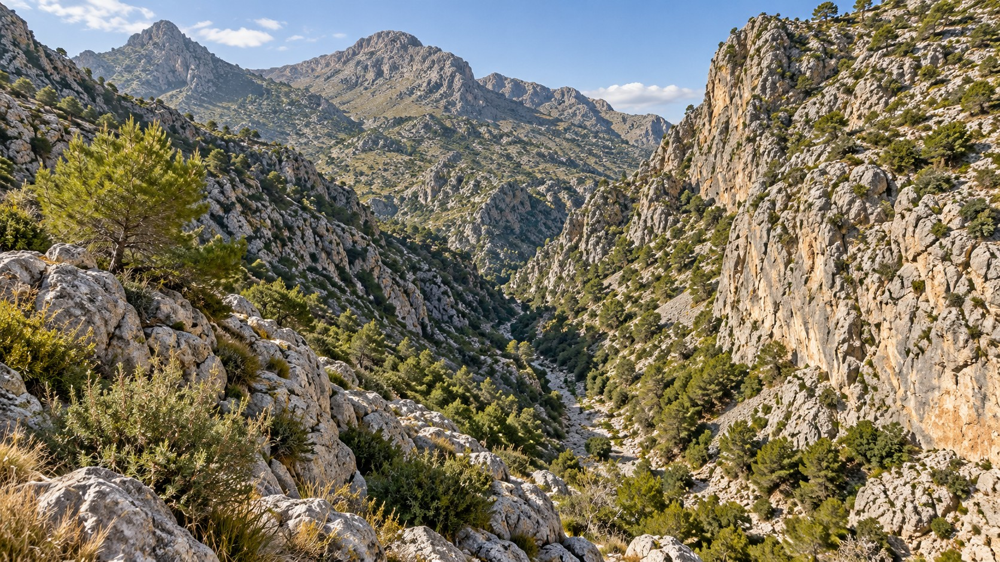
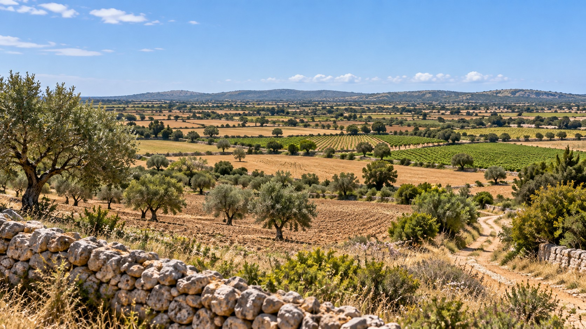
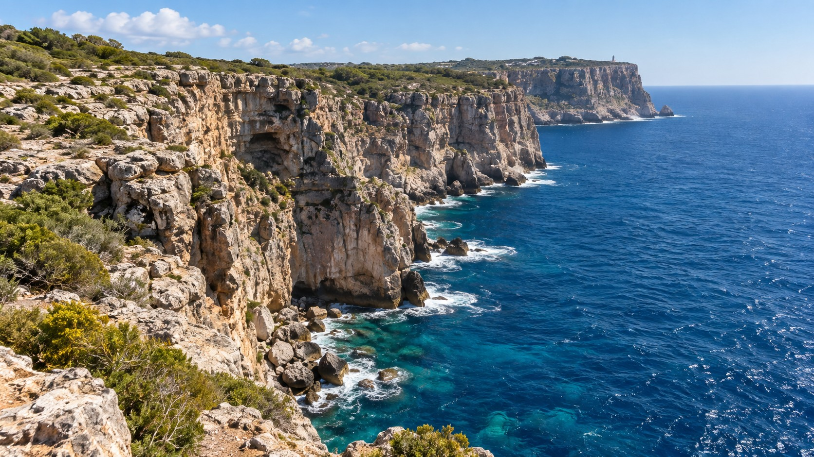
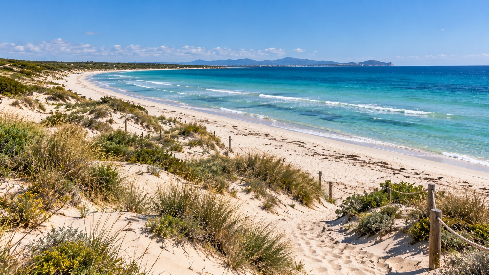

<section class="pv-seccio pv-portada" markdown>

# GEO-01 · Llegim un paisatge

## Què podem saber simplement mirant-lo?

<!-- DOCENT: Activitat guiada de construcció de coneixement. No és una evidència formal. Idea rectora: passar de mirar un paisatge a interpretar-lo geològicament. -->

</section>

<section class="pv-seccio pv-visual" markdown>

# 1 · Mirar

## Què hi veis?

Escriviu <strong>tres coses que pugueu afirmar només perquè les veis</strong>.

<!-- DOCENT: No demanar encara causes ni explicacions. Si apareixen, separar-les de les observacions. -->

</section>

<section class="pv-seccio pv-visual" markdown>

# 2 · Comparar

Pensau en el paisatge A i comparau-lo amb aquest.

<strong>Quina diferència entre A i B us sembla geològicament més important?</strong>

No cercam encara la causa. Primer hem de decidir **què és diferent**.

<!-- DOCENT: Fer seleccionar informació, no només enumerar elements. -->

</section>

<section class="pv-seccio" markdown>

# 3 · Observar no és explicar

Compareu aquestes dues afirmacions:

> **1.** El vessant és molt inclinat.

> **2.** L'aigua ha erosionat aquest vessant.

  
<strong>Quina classificació és correcta?</strong>

  

    <button type="button" class="pv-opcio" data-feedback="obs-a" aria-pressed="false">A · 1 és una observació i 2 és una inferència</button>
    <button type="button" class="pv-opcio" data-feedback="obs-b" aria-pressed="false">B · 1 és una inferència i 2 és una observació</button>
  

  

    <strong>Exacte.</strong> La inclinació es pot descriure a partir del que veim. En canvi, atribuir-la a l'erosió és una explicació que hem d'argumentar amb dades.
  

  

    <strong>Revisau-ho.</strong> «El vessant és molt inclinat» descriu una característica visible. «L'aigua ha erosionat...» proposa una causa i, per tant, és una inferència.
  

**Observar** és descriure allò que les dades mostren. **Inferir** és proposar una explicació a partir d'aquestes observacions.

<!-- DOCENT: Introduir els termes observació/inferència només després que l'alumnat hagi decidit. -->

</section>

<section class="pv-seccio" markdown>

# 4 · Relleu i paisatge

Tornau mentalment als paisatges A i B.

Hi hem vist, entre altres coses, **vessants, una vall o torrentera, vegetació, camps de conreu, camins i murs de pedra**.

<strong>Quins d'aquests elements descriuen la forma del terreny? Quins formen part del paisatge però no del relleu?</strong>

**El relleu** és el conjunt de formes de la superfície terrestre.

**El paisatge** inclou el relleu i també altres elements naturals i humans visibles.

> El relleu forma part del paisatge, però **relleu i paisatge no són sinònims**.

</section>

<section class="pv-seccio pv-visual" markdown>

# 5 · Del que actua al que passa

<strong>Quin agent geològic sembla més evident en aquest paisatge? Què observau que us fa pensar això?</strong>

Ara distingirem dues coses que sovint es confonen: **l'agent** i **el procés**.

</section>

<section class="pv-seccio" markdown>

# Agent o procés?

Pensau la classificació abans de clicar cada terme. En clicar-lo, en veureu la categoria.

  <button type="button" class="pv-terme" data-resposta="Agent">aigua</button>
  <button type="button" class="pv-terme" data-resposta="Agent">vent</button>
  <button type="button" class="pv-terme" data-resposta="Agent">mar</button>
  <button type="button" class="pv-terme" data-resposta="Agent">gravetat</button>
  <button type="button" class="pv-terme" data-resposta="Procés">meteorització</button>
  <button type="button" class="pv-terme" data-resposta="Procés">erosió</button>
  <button type="button" class="pv-terme" data-resposta="Procés">transport</button>
  <button type="button" class="pv-terme" data-resposta="Procés">sedimentació</button>

**Els agents** són els elements o forces que actuen sobre el terreny. **Els processos** descriuen què passa amb els materials.

<!-- DOCENT: No desenvolupar encara tipus de meteorització ni dinàmiques fluvials/litorals. L'objectiu és només separar agent i procés. -->

</section>

<section class="pv-seccio pv-visual" markdown>

# 6 · Una dada nova

Tornam al **paisatge A**.

Ara sabem que el terreny està format principalment per **roca calcària**.

  
<strong>Aquesta dada pot canviar la nostra interpretació del relleu?</strong>

  

    <button type="button" class="pv-opcio" data-feedback="lito-a" aria-pressed="false">A · Sí, és una dada rellevant</button>
    <button type="button" class="pv-opcio" data-feedback="lito-b" aria-pressed="false">B · No, el tipus de roca no hi té relació</button>
  

  

    <strong>Sí.</strong> Els materials no responen tots igual davant els mateixos processos. Conèixer la litologia ens permet formular explicacions que abans no podíem justificar.
  

  

    <strong>No exactament.</strong> Els processos actuen sobre materials concrets, i aquests poden tenir resistències i comportaments diferents. La litologia és, per tant, una dada rellevant.
  

<!-- DOCENT: Aquest és el nucli de l'activitat: una dada nova obliga a revisar o afinar una interpretació inicial. -->

</section>

<section class="pv-seccio" markdown>

# 7 · Construïm una explicació millor

Dos llocs poden estar sotmesos a processos semblants i, tot i així, presentar relleus molt diferents.

**materials + processos geològics + temps → modelatge del relleu**

La litologia **condiciona** com respon el terreny, però no és l'únic factor. També hi poden intervenir l'estructura geològica, la pendent, el clima i el temps d'actuació dels processos.

<strong>Per què, per tant, “mateix agent” no significa necessàriament “mateix relleu”?</strong>

<!-- DOCENT: Evitar una cadena causal rígida. El model és deliberadament simple, però no atribueix el relleu a un únic factor. -->

</section>

<section class="pv-seccio pv-visual" markdown>

# 8 · Transferim: un paisatge nou

Sense informació addicional, separau les vostres idees en tres grups:

  
<strong>Puc afirmar perquè ho observ</strong>

  
<strong>Ho proposaria com a inferència o hipòtesi</strong>

  
<strong>Necessitaria més informació per comprovar-ho</strong>

<!-- DOCENT: No donar vocabulari de suport d'entrada. És la transferència del patró observació → inferència → necessitat de dades. -->

</section>

<section class="pv-seccio" markdown>

# Tiquet de sortida

Respon individualment:

### 1. Quina diferència hi ha entre **relleu** i **paisatge**?

### 2. Escriu un **agent geològic** i un **procés geològic**, i explica per què no són el mateix.

### 3. Per què dos terrenys sotmesos a processos semblants poden presentar relleus diferents?

### 4. Escriu una **observació** i una **inferència** sobre el paisatge D.

</section>

<section class="pv-seccio" markdown>

# Idees que ens enduim

- El **relleu** forma part del **paisatge**.
- **Observar** no és el mateix que **inferir** o explicar.
- **Agent geològic** i **procés geològic** no són el mateix.
- La **litologia** condiciona com respon el terreny als processos.
- El relleu es modela per la interacció entre **materials, processos i temps**, juntament amb altres factors.
- Una dada nova pot obligar-nos a **revisar una interpretació**.

<!-- DOCENT: Mostrar aquesta secció només al final, després del tiquet de sortida. -->

</section>

