

<section class="pv-seccio pv-portada" markdown>

# GEO-02 · Del mapa al relleu

## Com podem representar una muntanya en un full pla?

<!-- DOCENT: Sessió 2 de construcció. Idea rectora: descobrir que les corbes de nivell codifiquen l'altitud i permeten reconstruir mentalment el relleu. -->

</section>

<section class="pv-seccio pv-visual" markdown>

# 1 · Un problema de representació

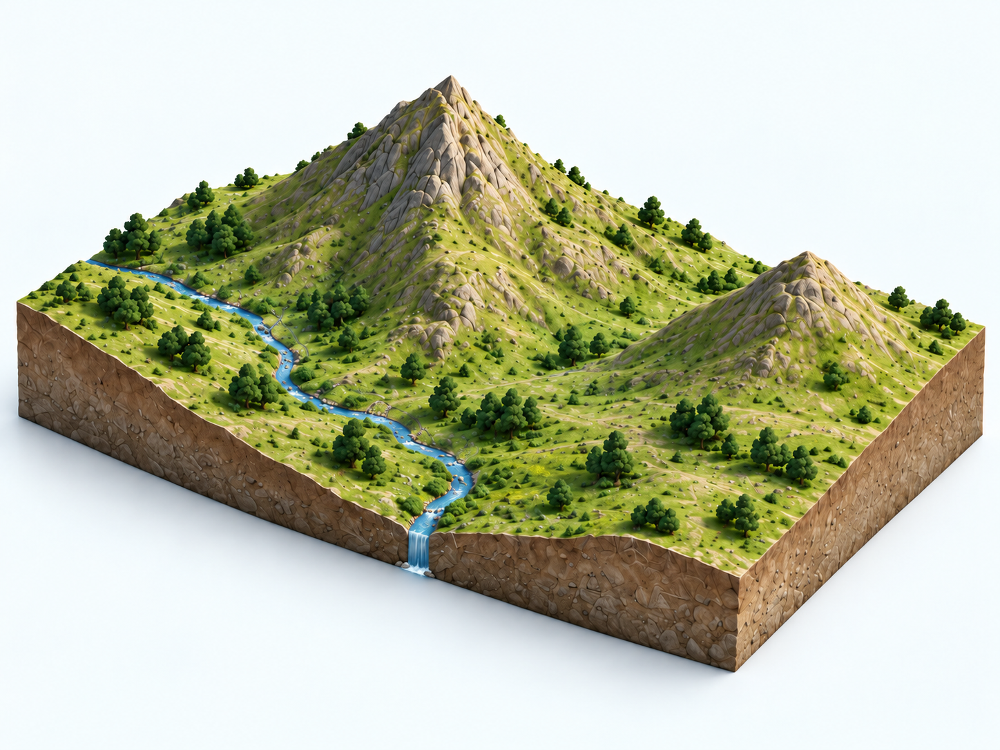

<strong>Com podríem representar aquest relleu en un full pla sense perdre la informació sobre l'altura?</strong>

Pensau-ho durant mig minut i comentau una proposta amb la persona del costat.

<!-- DOCENT: No introduir encara el terme “corba de nivell”. Recollir propostes: colors, números, ombres, línies... -->

</section>

<section class="pv-seccio" markdown>

# 2 · Tallam el relleu

Imaginem que travessam el terreny amb un **pla perfectament horitzontal**.

<strong>Què passa amb la línia de contacte entre el pla i el relleu quan pujam el pla?</strong>

  

    <button type="button" class="pv-opcio" data-feedback="tall-100" aria-pressed="false">100 m</button>
    <button type="button" class="pv-opcio" data-feedback="tall-150" aria-pressed="false">150 m</button>
    <button type="button" class="pv-opcio" data-feedback="tall-200" aria-pressed="false">200 m</button>
    <button type="button" class="pv-opcio" data-feedback="tall-250" aria-pressed="false">250 m</button>
  

  

    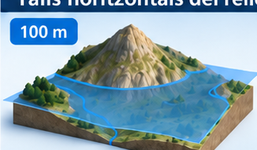
  

  

    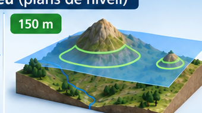
  

  

    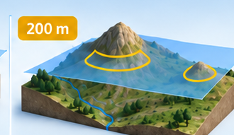
  

  

    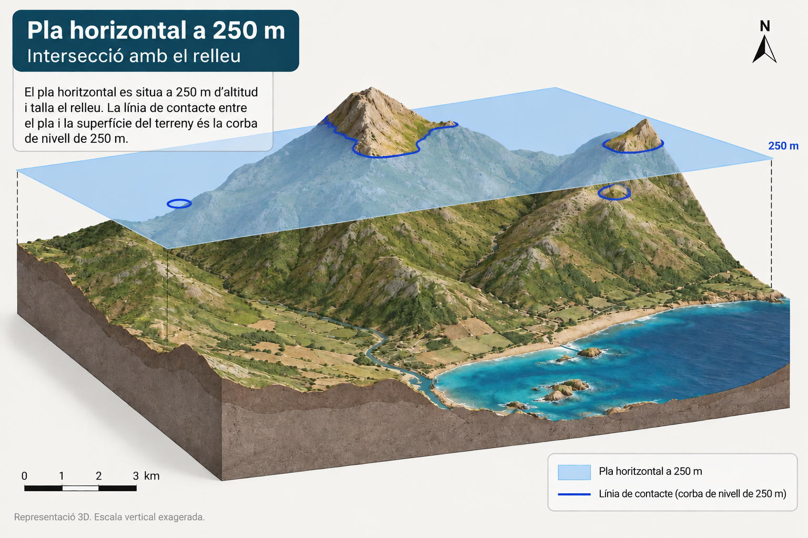
  

<!-- DOCENT: Fer clicar els nivells en ordre. L'objectiu és observar que cada pla talla només els punts situats a aquella altitud. -->

</section>

<section class="pv-seccio" markdown>

# 3 · I si miram cada tall des de dalt?

Ara miram el mateix territori en planta i hi projectam **la línia de contacte de cada tall**.

  

    <button type="button" class="pv-opcio" data-feedback="contorn-100" aria-pressed="false">100 m</button>
    <button type="button" class="pv-opcio" data-feedback="contorn-150" aria-pressed="false">150 m</button>
    <button type="button" class="pv-opcio" data-feedback="contorn-200" aria-pressed="false">200 m</button>
    <button type="button" class="pv-opcio" data-feedback="contorn-250" aria-pressed="false">250 m</button>
    <button type="button" class="pv-opcio" data-feedback="contorn-tots" aria-pressed="false">Superposa'ls</button>
  

  

    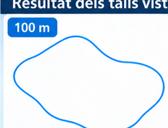
  

  

    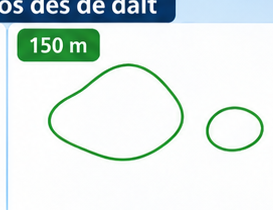
  

  

    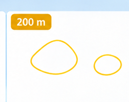
  

  

    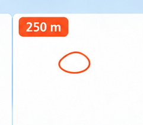
  

  

    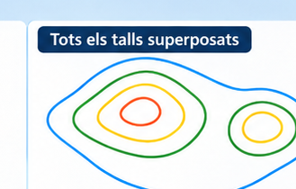
  

<strong>Què conserva cada línia del relleu original?</strong>

<!-- DOCENT: Cercar que aparegui la idea “tots els punts d'aquesta línia són igual d'alts” abans de donar el terme formal. -->

</section>

<section class="pv-seccio" markdown>

# 4 · Descobrim la regla

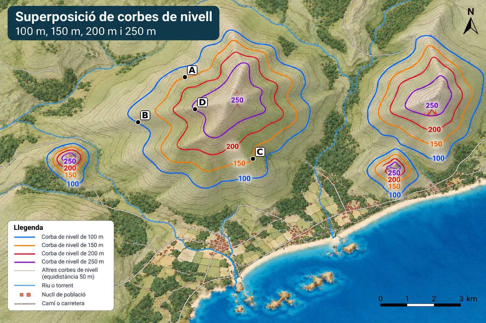

  
<strong>Quins dos punts estan exactament a la mateixa altitud?</strong>

  

    <button type="button" class="pv-opcio" data-feedback="mateixa-ac" aria-pressed="false">A · A i C</button>
    <button type="button" class="pv-opcio" data-feedback="mateixa-ab" aria-pressed="false">B · A i B</button>
    <button type="button" class="pv-opcio" data-feedback="mateixa-bd" aria-pressed="false">C · B i D</button>
    <button type="button" class="pv-opcio" data-feedback="mateixa-cd" aria-pressed="false">D · C i D</button>
  

  

    <strong>Exacte.</strong> A i C són damunt la mateixa línia: representen punts situats a la mateixa altitud.
    
<strong>Una corba de nivell és una línia que uneix punts situats a la mateixa altitud.</strong>

  

  

    <strong>Revisau-ho.</strong> A i B són damunt línies diferents. Seguiu la línia completa abans de decidir.
  

  

    <strong>Revisau-ho.</strong> Els dos punts poden semblar pròxims, però no pertanyen a la mateixa línia.
  

  

    <strong>Revisau-ho.</strong> C i D són a línies diferents. La distància entre punts no determina l'altitud.
  

<!-- DOCENT: Formalitzar “corba de nivell” només després de la resposta. Aquesta pantalla tanca el primer bloc conceptual. -->

</section>

<section class="pv-seccio pv-visual" markdown>

# 5 · Quina és la cota?

Tornau a mirar els punts del mapa.

  
<strong>El punt B és damunt una corba de nivell. Quina és la seva cota?</strong>

  

    <button type="button" class="pv-opcio" data-feedback="cota-50" aria-pressed="false">50 m</button>
    <button type="button" class="pv-opcio" data-feedback="cota-100" aria-pressed="false">100 m</button>
    <button type="button" class="pv-opcio" data-feedback="cota-150" aria-pressed="false">150 m</button>
    <button type="button" class="pv-opcio" data-feedback="cota-250" aria-pressed="false">250 m</button>
  

  

    <strong>Revisau-ho.</strong> Seguiu la corba sobre la qual està situat B i cercau-ne el valor.
  

  

    <strong>Exacte.</strong> B està damunt la corba de 100 m.
    
<strong>La cota és l'altitud d'un punt respecte del nivell de la mar.</strong> Si el punt és damunt una corba de nivell, la seva cota coincideix amb el valor d'aquella corba.

  

  

    <strong>Revisau-ho.</strong> La corba de 150 m passa més cap a l'interior del relleu; B és sobre la corba exterior blava.
  

  

    <strong>Revisau-ho.</strong> 250 m correspon a una corba molt més interior i pròxima a les zones altes.
  

<!-- DOCENT: Introduir el terme “cota” només després de la resposta. Diferenciar la cota, que correspon a un punt, de la corba de nivell, que és una línia. -->

</section>

<section class="pv-seccio" markdown>

# 6 · I si no hi ha número?

Suposau que aquestes són **cinc corbes de nivell consecutives** d'un mapa:

**100 m → ? → 200 m → ? → 300 m**

  
<strong>Quines cotes tenen les dues corbes sense número?</strong>

  

    <button type="button" class="pv-opcio" data-feedback="equi-a" aria-pressed="false">125 m i 225 m</button>
    <button type="button" class="pv-opcio" data-feedback="equi-b" aria-pressed="false">150 m i 250 m</button>
    <button type="button" class="pv-opcio" data-feedback="equi-c" aria-pressed="false">175 m i 275 m</button>
    <button type="button" class="pv-opcio" data-feedback="equi-d" aria-pressed="false">200 m i 300 m</button>
  

  

    <strong>Revisau-ho.</strong> Entre 100 i 200 m hi ha dues passes iguals, no quatre.
  

  

    <strong>Exacte.</strong> La seqüència és 100 → 150 → 200 → 250 → 300 m.
    
<strong>L'equidistància és la diferència d'altitud entre dues corbes de nivell consecutives.</strong> En aquest cas és de <strong>50 m</strong>.

  

  

    <strong>Revisau-ho.</strong> La diferència d'altitud ha de ser constant entre totes les corbes consecutives.
  

  

    <strong>Revisau-ho.</strong> Una corba consecutiva no pot tenir la mateixa cota que la següent.
  

<!-- DOCENT: L'esquema és deliberadament simplificat i especifica que les corbes són consecutives. L'objectiu és construir el significat d'equidistància sense dependre de la densitat de línies del mapa base. -->

</section>

<section class="pv-seccio pv-visual" markdown>

# 7 · On és més alt?

Ara combinam el que sabem sobre **corbes de nivell** i **cotes**.

  
<strong>Quin ordre situa els punts de menor a major altitud?</strong>

  

    <button type="button" class="pv-opcio" data-feedback="ordre-correcte" aria-pressed="false">B &lt; A = C &lt; D</button>
    <button type="button" class="pv-opcio" data-feedback="ordre-b" aria-pressed="false">A = C &lt; B &lt; D</button>
    <button type="button" class="pv-opcio" data-feedback="ordre-c" aria-pressed="false">B &lt; D &lt; A = C</button>
    <button type="button" class="pv-opcio" data-feedback="ordre-d" aria-pressed="false">D &lt; A = C &lt; B</button>
  

  

    <strong>Exacte.</strong> B és a 100 m; A i C són a 150 m; D és a 250 m.
    
Un mapa topogràfic ens permet comparar altituds encara que no hàgim vist el relleu directament.

  

  

    <strong>Revisau-ho.</strong> B és sobre la corba més exterior de 100 m, per davall d'A i C.
  

  

    <strong>Revisau-ho.</strong> D és sobre la corba de 250 m i, per tant, és el punt més alt dels quatre.
  

  

    <strong>Revisau-ho.</strong> Heu invertit l'ordre: les corbes més interiors d'aquest relleu representen cotes més elevades.
  

<!-- DOCENT: Activitat d'integració. Fer justificar l'ordre verbalment: “B és a 100 m; A i C a 150 m; D a 250 m”. No és evidència formal. -->

</section>

<section class="pv-seccio pv-visual" markdown>

8 · Les línies ens diuen alguna cosa més

Fins ara hem utilitzat les corbes per saber a quina altitud és un lloc. Però la seva separació també ens informa de com canvia l'altitud amb la distància.

  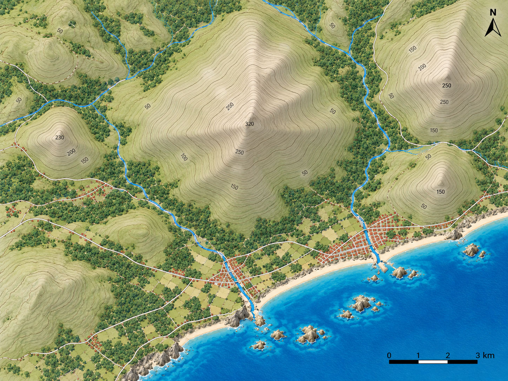
  <svg viewBox="0 0 1448 1086" preserveAspectRatio="xMidYMid meet" aria-hidden="true" style="position:absolute; inset:0; width:100%; height:100%; pointer-events:none;">
    <defs>
      <filter id="pv-cota-blur-8">
        <feGaussianBlur stdDeviation="10"/>
      </filter>
      <clipPath id="pv-zones-cotes-8">
        <ellipse cx="136" cy="83" rx="30" ry="18"/>
        <ellipse cx="42" cy="271" rx="30" ry="18"/>
        <ellipse cx="139" cy="385" rx="44" ry="28"/>
        <ellipse cx="198" cy="435" rx="30" ry="18"/>
        <ellipse cx="236" cy="451" rx="30" ry="18"/>
        <ellipse cx="407" cy="297" rx="30" ry="18"/>
        <ellipse cx="575" cy="205" rx="30" ry="18"/>
        <ellipse cx="612" cy="293" rx="30" ry="18"/>
        <ellipse cx="641" cy="343" rx="30" ry="18"/>
        <ellipse cx="786" cy="131" rx="32" ry="18"/>
        <ellipse cx="715" cy="348" rx="42" ry="24"/>
        <ellipse cx="505" cy="434" rx="32" ry="18"/>
        <ellipse cx="663" cy="476" rx="32" ry="18"/>
        <ellipse cx="659" cy="534" rx="32" ry="18"/>
        <ellipse cx="684" cy="595" rx="32" ry="18"/>
        <ellipse cx="918" cy="314" rx="30" ry="18"/>
        <ellipse cx="881" cy="484" rx="30" ry="18"/>
        <ellipse cx="1098" cy="69" rx="30" ry="18"/>
        <ellipse cx="1146" cy="139" rx="30" ry="18"/>
        <ellipse cx="1169" cy="183" rx="30" ry="18"/>
        <ellipse cx="1237" cy="266" rx="36" ry="20"/>
        <ellipse cx="1201" cy="318" rx="36" ry="20"/>
        <ellipse cx="1201" cy="363" rx="30" ry="18"/>
        <ellipse cx="1201" cy="406" rx="30" ry="18"/>
        <ellipse cx="1181" cy="431" rx="30" ry="18"/>
        <ellipse cx="1222" cy="556" rx="30" ry="18"/>
        <ellipse cx="1170" cy="594" rx="30" ry="18"/>
      </clipPath>
    </defs>

<image href="figures/mapa_base.png" x="0" y="0" width="1448" height="1086" clip-path="url(#pv-zones-cotes-8)" filter="url(#pv-cota-blur-8)"/>

<ellipse cx="735" cy="405" rx="88" ry="108" fill="none" stroke="#111" stroke-width="7" stroke-dasharray="18 12"/>
<text x="799" y="328" font-size="52" font-weight="700" fill="#111" stroke="#fff" stroke-width="10" paint-order="stroke">A</text>

<ellipse cx="515" cy="245" rx="124" ry="92" fill="none" stroke="#111" stroke-width="7" stroke-dasharray="18 12"/>
<text x="402" y="189" font-size="52" font-weight="700" fill="#111" stroke="#fff" stroke-width="10" paint-order="stroke">B</text>

  </svg>

  
<strong>En quina zona guanyaríeu més altitud recorrent una distància horitzontal curta?</strong>

  

    <button type="button" class="pv-opcio" data-feedback="pendent-a" aria-pressed="false">A · Zona A</button>
    <button type="button" class="pv-opcio" data-feedback="pendent-b" aria-pressed="false">B · Zona B</button>
  

  

    <strong>Exacte.</strong> A la zona A les corbes estan molt més juntes: passam per diversos canvis d'altitud en poca distància horitzontal.
    
<strong>Corbes juntes → pendent fort. Corbes separades → pendent suau.</strong>

  

  

    <strong>Revisau-ho.</strong> A la zona B les corbes estan més separades. Per guanyar la mateixa altitud necessitam recórrer més distància horitzontal, de manera que el pendent és més suau.
  

<!-- DOCENT: Fer verbalitzar la relació abans de donar la regla. No calcular encara pendent en percentatge ni en graus: aquí interessa la lectura qualitativa del mapa. -->

</section>

<section class="pv-seccio pv-visual" markdown>

9 · Més alt no vol dir més pendent

Ara compararem dues zones diferents del mateix mapa. P és en una zona més alta que Q.

  
  <svg viewBox="0 0 1448 1086" preserveAspectRatio="xMidYMid meet" aria-hidden="true" style="position:absolute; inset:0; width:100%; height:100%; pointer-events:none;">
    <defs>
      <filter id="pv-cota-blur-9">
        <feGaussianBlur stdDeviation="10"/>
      </filter>
      <clipPath id="pv-zones-cotes-9">
        <ellipse cx="136" cy="83" rx="30" ry="18"/>
        <ellipse cx="42" cy="271" rx="30" ry="18"/>
        <ellipse cx="139" cy="385" rx="44" ry="28"/>
        <ellipse cx="198" cy="435" rx="30" ry="18"/>
        <ellipse cx="236" cy="451" rx="30" ry="18"/>
        <ellipse cx="407" cy="297" rx="30" ry="18"/>
        <ellipse cx="575" cy="205" rx="30" ry="18"/>
        <ellipse cx="612" cy="293" rx="30" ry="18"/>
        <ellipse cx="641" cy="343" rx="30" ry="18"/>
        <ellipse cx="786" cy="131" rx="32" ry="18"/>
        <ellipse cx="715" cy="348" rx="42" ry="24"/>
        <ellipse cx="505" cy="434" rx="32" ry="18"/>
        <ellipse cx="663" cy="476" rx="32" ry="18"/>
        <ellipse cx="659" cy="534" rx="32" ry="18"/>
        <ellipse cx="684" cy="595" rx="32" ry="18"/>
        <ellipse cx="918" cy="314" rx="30" ry="18"/>
        <ellipse cx="881" cy="484" rx="30" ry="18"/>
        <ellipse cx="1098" cy="69" rx="30" ry="18"/>
        <ellipse cx="1146" cy="139" rx="30" ry="18"/>
        <ellipse cx="1169" cy="183" rx="30" ry="18"/>
        <ellipse cx="1237" cy="266" rx="36" ry="20"/>
        <ellipse cx="1201" cy="318" rx="36" ry="20"/>
        <ellipse cx="1201" cy="363" rx="30" ry="18"/>
        <ellipse cx="1201" cy="406" rx="30" ry="18"/>
        <ellipse cx="1181" cy="431" rx="30" ry="18"/>
        <ellipse cx="1222" cy="556" rx="30" ry="18"/>
        <ellipse cx="1170" cy="594" rx="30" ry="18"/>
      </clipPath>
    </defs>

<image href="figures/mapa_base.png" x="0" y="0" width="1448" height="1086" clip-path="url(#pv-zones-cotes-9)" filter="url(#pv-cota-blur-9)"/>

<circle cx="613" cy="292" r="14" fill="#111" stroke="#fff" stroke-width="5"/>
<text x="635" y="276" font-size="42" font-weight="700" fill="#111" stroke="#fff" stroke-width="9" paint-order="stroke">P · zona alta</text>

<circle cx="138" cy="386" r="14" fill="#111" stroke="#fff" stroke-width="5"/>
<text x="163" y="372" font-size="42" font-weight="700" fill="#111" stroke="#fff" stroke-width="9" paint-order="stroke">Q · zona més baixa</text>

  </svg>

  
<strong>Quina de les dues zones té el pendent més fort?</strong>

  

    <button type="button" class="pv-opcio" data-feedback="altura-p" aria-pressed="false">A · P, perquè és a més altitud</button>
    <button type="button" class="pv-opcio" data-feedback="altura-q" aria-pressed="false">B · Q, perquè les corbes del seu entorn estan més juntes</button>
  

  

    <strong>Aquí heu comparat altitud, no pendent.</strong> La cota ens diu a quina altura és un lloc; el pendent ens diu com de ràpid canvia aquesta altitud quan ens desplaçam horitzontalment.
  

  

    <strong>Exacte.</strong> Encara que Q sigui més baix, les corbes del seu entorn estan més juntes i indiquen un canvi d'altitud més ràpid amb la distància.
    
<strong>Altitud i pendent són variables diferents:</strong> un lloc baix pot ser molt costerut i un lloc alt pot tenir un pendent relativament suau.

  

<!-- DOCENT: Aquesta pantalla ataca explícitament la confusió “més alt = més pendent”. Demanar a l'alumnat que justifiqui la resposta parlant de separació entre corbes, no de cota. -->

</section>

