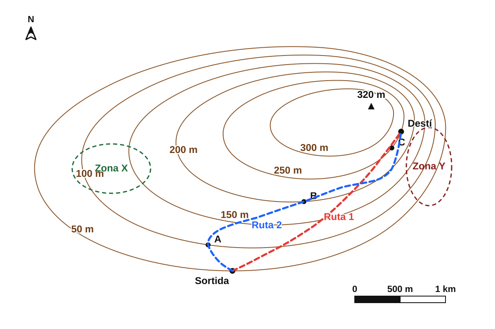

<section class="pv-seccio pv-portada" markdown>

# GEO-02 · Del mapa al relleu

## Com podem representar una muntanya en un full pla?

<!-- DOCENT: Sessió 2 de construcció. Idea rectora: descobrir que les corbes de nivell codifiquen l'altitud i permeten reconstruir mentalment el relleu. -->

</section>

<section class="pv-seccio pv-visual" markdown>

# 1 · Un problema de representació

<strong>Com podríem representar aquest relleu en un full pla sense perdre la informació sobre l'altura?</strong>

Pensau-ho durant mig minut i comentau una proposta amb la persona del costat.

<!-- DOCENT: No introduir encara el terme “corba de nivell”. Recollir propostes: colors, números, ombres, línies... -->

</section>

<section class="pv-seccio" markdown>

# 2 · Tallam el relleu

Imaginem que travessam el terreny amb un **pla perfectament horitzontal**.

<strong>Què passa amb la línia de contacte entre el pla i el relleu quan pujam el pla?</strong>

  

    <button type="button" class="pv-opcio" data-feedback="tall-100" aria-pressed="false">100 m</button>
    <button type="button" class="pv-opcio" data-feedback="tall-150" aria-pressed="false">150 m</button>
    <button type="button" class="pv-opcio" data-feedback="tall-200" aria-pressed="false">200 m</button>
    <button type="button" class="pv-opcio" data-feedback="tall-250" aria-pressed="false">250 m</button>
  

  

    
  

  

    
  

  

    
  

  

    
  

<!-- DOCENT: Fer clicar els nivells en ordre. L'objectiu és observar que cada pla talla només els punts situats a aquella altitud. -->

</section>

<section class="pv-seccio" markdown>

# 3 · I si miram cada tall des de dalt?

Ara miram el mateix territori en planta i hi projectam **la línia de contacte de cada tall**.

  

    <button type="button" class="pv-opcio" data-feedback="contorn-100" aria-pressed="false">100 m</button>
    <button type="button" class="pv-opcio" data-feedback="contorn-150" aria-pressed="false">150 m</button>
    <button type="button" class="pv-opcio" data-feedback="contorn-200" aria-pressed="false">200 m</button>
    <button type="button" class="pv-opcio" data-feedback="contorn-250" aria-pressed="false">250 m</button>
    <button type="button" class="pv-opcio" data-feedback="contorn-tots" aria-pressed="false">Superposa'ls</button>
  

  

    
  

  

    
  

  

    
  

  

    
  

  

    
  

<strong>Què conserva cada línia del relleu original?</strong>

<!-- DOCENT: Cercar que aparegui la idea “tots els punts d'aquesta línia són igual d'alts” abans de donar el terme formal. -->

</section>

<section class="pv-seccio" markdown>

# 4 · Descobrim la regla

  
<strong>Quins dos punts estan exactament a la mateixa altitud?</strong>

  

    <button type="button" class="pv-opcio" data-feedback="mateixa-ac" aria-pressed="false">A · A i C</button>
    <button type="button" class="pv-opcio" data-feedback="mateixa-ab" aria-pressed="false">B · A i B</button>
    <button type="button" class="pv-opcio" data-feedback="mateixa-bd" aria-pressed="false">C · B i D</button>
    <button type="button" class="pv-opcio" data-feedback="mateixa-cd" aria-pressed="false">D · C i D</button>
  

  

    <strong>Exacte.</strong> A i C són damunt la mateixa línia: representen punts situats a la mateixa altitud.
    
<strong>Una corba de nivell és una línia que uneix punts situats a la mateixa altitud.</strong>

  

  

    <strong>Revisau-ho.</strong> A i B són damunt línies diferents. Seguiu la línia completa abans de decidir.
  

  

    <strong>Revisau-ho.</strong> Els dos punts poden semblar pròxims, però no pertanyen a la mateixa línia.
  

  

    <strong>Revisau-ho.</strong> C i D són a línies diferents. La distància entre punts no determina l'altitud.
  

<!-- DOCENT: Formalitzar “corba de nivell” només després de la resposta. Aquesta pantalla tanca el primer bloc conceptual. -->

</section>

<section class="pv-seccio pv-visual" markdown>

# 5 · Quina és la cota?

Tornau a mirar els punts del mapa.

  
<strong>El punt B és damunt una corba de nivell. Quina és la seva cota?</strong>

  

    <button type="button" class="pv-opcio" data-feedback="cota-50" aria-pressed="false">50 m</button>
    <button type="button" class="pv-opcio" data-feedback="cota-100" aria-pressed="false">100 m</button>
    <button type="button" class="pv-opcio" data-feedback="cota-150" aria-pressed="false">150 m</button>
    <button type="button" class="pv-opcio" data-feedback="cota-250" aria-pressed="false">250 m</button>
  

  

    <strong>Revisau-ho.</strong> Seguiu la corba sobre la qual està situat B i cercau-ne el valor.
  

  

    <strong>Exacte.</strong> B està damunt la corba de 100 m.
    
<strong>La cota és l'altitud d'un punt respecte del nivell de la mar.</strong> Si el punt és damunt una corba de nivell, la seva cota coincideix amb el valor d'aquella corba.

  

  

    <strong>Revisau-ho.</strong> La corba de 150 m passa més cap a l'interior del relleu; B és sobre la corba exterior blava.
  

  

    <strong>Revisau-ho.</strong> 250 m correspon a una corba molt més interior i pròxima a les zones altes.
  

<!-- DOCENT: Introduir el terme “cota” només després de la resposta. Diferenciar la cota, que correspon a un punt, de la corba de nivell, que és una línia. -->

</section>

<section class="pv-seccio" markdown>

# 6 · I si no hi ha número?

Suposau que aquestes són **cinc corbes de nivell consecutives** d'un mapa:

**100 m → ? → 200 m → ? → 300 m**

  
<strong>Quines cotes tenen les dues corbes sense número?</strong>

  

    <button type="button" class="pv-opcio" data-feedback="equi-a" aria-pressed="false">125 m i 225 m</button>
    <button type="button" class="pv-opcio" data-feedback="equi-b" aria-pressed="false">150 m i 250 m</button>
    <button type="button" class="pv-opcio" data-feedback="equi-c" aria-pressed="false">175 m i 275 m</button>
    <button type="button" class="pv-opcio" data-feedback="equi-d" aria-pressed="false">200 m i 300 m</button>
  

  

    <strong>Revisau-ho.</strong> Entre 100 i 200 m hi ha dues passes iguals, no quatre.
  

  

    <strong>Exacte.</strong> La seqüència és 100 → 150 → 200 → 250 → 300 m.
    
<strong>L'equidistància és la diferència d'altitud entre dues corbes de nivell consecutives.</strong> En aquest cas és de <strong>50 m</strong>.

  

  

    <strong>Revisau-ho.</strong> La diferència d'altitud ha de ser constant entre totes les corbes consecutives.
  

  

    <strong>Revisau-ho.</strong> Una corba consecutiva no pot tenir la mateixa cota que la següent.
  

<!-- DOCENT: L'esquema és deliberadament simplificat i especifica que les corbes són consecutives. L'objectiu és construir el significat d'equidistància sense dependre de la densitat de línies del mapa base. -->

</section>

<section class="pv-seccio pv-visual" markdown>

# 7 · On és més alt?

Ara combinam el que sabem sobre **corbes de nivell** i **cotes**.

  
<strong>Quin ordre situa els punts de menor a major altitud?</strong>

  

    <button type="button" class="pv-opcio" data-feedback="ordre-correcte" aria-pressed="false">B &lt; A = C &lt; D</button>
    <button type="button" class="pv-opcio" data-feedback="ordre-b" aria-pressed="false">A = C &lt; B &lt; D</button>
    <button type="button" class="pv-opcio" data-feedback="ordre-c" aria-pressed="false">B &lt; D &lt; A = C</button>
    <button type="button" class="pv-opcio" data-feedback="ordre-d" aria-pressed="false">D &lt; A = C &lt; B</button>
  

  

    <strong>Exacte.</strong> B és a 100 m; A i C són a 150 m; D és a 250 m.
    
Un mapa topogràfic ens permet comparar altituds encara que no hàgim vist el relleu directament.

  

  

    <strong>Revisau-ho.</strong> B és sobre la corba més exterior de 100 m, per davall d'A i C.
  

  

    <strong>Revisau-ho.</strong> D és sobre la corba de 250 m i, per tant, és el punt més alt dels quatre.
  

  

    <strong>Revisau-ho.</strong> Heu invertit l'ordre: les corbes més interiors d'aquest relleu representen cotes més elevades.
  

<!-- DOCENT: Activitat d'integració. Fer justificar l'ordre verbalment: “B és a 100 m; A i C a 150 m; D a 250 m”. No és evidència formal. -->

</section>

<section class="pv-seccio pv-visual" markdown>

# 8 · Les línies ens diuen alguna cosa més

Fins ara hem utilitzat les corbes per saber **a quina altitud** és un lloc. Però la seva separació també ens informa de **com canvia l'altitud amb la distància**.

  
  <svg viewBox="0 0 1536 1024" aria-hidden="true" style="position:absolute; inset:0; width:100%; height:100%; pointer-events:none;">
    <ellipse cx="720" cy="405" rx="92" ry="112" fill="none" stroke="#111" stroke-width="7" stroke-dasharray="18 12"/>
    <text x="785" y="325" font-size="52" font-weight="700" fill="#111" stroke="#fff" stroke-width="10" paint-order="stroke">A</text>
    <ellipse cx="500" cy="245" rx="125" ry="95" fill="none" stroke="#111" stroke-width="7" stroke-dasharray="18 12"/>
    <text x="390" y="190" font-size="52" font-weight="700" fill="#111" stroke="#fff" stroke-width="10" paint-order="stroke">B</text>
  </svg>

  
<strong>En quina zona guanyaríeu més altitud recorrent una distància horitzontal curta?</strong>

  

    <button type="button" class="pv-opcio" data-feedback="pendent-a" aria-pressed="false">A · Zona A</button>
    <button type="button" class="pv-opcio" data-feedback="pendent-b" aria-pressed="false">B · Zona B</button>
  

  

    <strong>Exacte.</strong> A la zona A les corbes estan molt més juntes: passam per diversos canvis d'altitud en poca distància horitzontal.
    
<strong>Corbes juntes → pendent fort. Corbes separades → pendent suau.</strong>

  

  

    <strong>Revisau-ho.</strong> A la zona B les corbes estan més separades. Per guanyar la mateixa altitud necessitam recórrer més distància horitzontal, de manera que el pendent és més suau.
  

<!-- DOCENT: Fer verbalitzar la relació abans de donar la regla. No calcular encara pendent en percentatge ni en graus: aquí interessa la lectura qualitativa del mapa. -->

</section>

<section class="pv-seccio pv-visual" markdown>

# 9 · Més alt no vol dir més pendent

Ara compararem dues zones diferents del mateix mapa. **P és en una zona més alta que Q.**

  
  <svg viewBox="0 0 1536 1024" aria-hidden="true" style="position:absolute; inset:0; width:100%; height:100%; pointer-events:none;">
    <circle cx="615" cy="260" r="14" fill="#111" stroke="#fff" stroke-width="5"/>
    <text x="635" y="245" font-size="42" font-weight="700" fill="#111" stroke="#fff" stroke-width="9" paint-order="stroke">P · zona alta</text>
    <circle cx="220" cy="445" r="14" fill="#111" stroke="#fff" stroke-width="5"/>
    <text x="245" y="430" font-size="42" font-weight="700" fill="#111" stroke="#fff" stroke-width="9" paint-order="stroke">Q · zona més baixa</text>
  </svg>

  
<strong>Quina de les dues zones té el pendent més fort?</strong>

  

    <button type="button" class="pv-opcio" data-feedback="altura-p" aria-pressed="false">A · P, perquè és a més altitud</button>
    <button type="button" class="pv-opcio" data-feedback="altura-q" aria-pressed="false">B · Q, perquè les corbes del seu entorn estan més juntes</button>
  

  

    <strong>Aquí heu comparat altitud, no pendent.</strong> La cota ens diu a quina altura és un lloc; el pendent ens diu com de ràpid canvia aquesta altitud quan ens desplaçam horitzontalment.
  

  

    <strong>Exacte.</strong> Encara que Q sigui més baix, les corbes del seu entorn estan més juntes i indiquen un canvi d'altitud més ràpid amb la distància.
    
<strong>Altitud i pendent són variables diferents:</strong> un lloc baix pot ser molt costerut i un lloc alt pot tenir un pendent relativament suau.

  

<!-- DOCENT: Aquesta pantalla ataca explícitament la confusió “més alt = més pendent”. Demanar a l'alumnat que justifiqui la resposta parlant de separació entre corbes, no de cota. -->

</section>

<section class="pv-seccio pv-visual" markdown>

# 10 · Quina distància recorrerem?

Un mapa no només redueix el relleu: també redueix **les distàncies**. Per recuperar la distància real necessitam una referència.

  
  <svg viewBox="0 0 1448 1086" preserveAspectRatio="xMidYMid meet" aria-hidden="true" style="position:absolute; inset:0; width:100%; height:100%; pointer-events:none;">
    <line x1="645" y1="748" x2="645" y2="586" stroke="#111" stroke-width="9" stroke-linecap="round"/>
    <circle cx="645" cy="748" r="14" fill="#111" stroke="#fff" stroke-width="5"/>
    <circle cx="645" cy="586" r="14" fill="#111" stroke="#fff" stroke-width="5"/>
    <text x="668" y="760" font-size="42" font-weight="700" fill="#111" stroke="#fff" stroke-width="9" paint-order="stroke">A</text>
    <text x="668" y="590" font-size="42" font-weight="700" fill="#111" stroke="#fff" stroke-width="9" paint-order="stroke">B</text>
    <rect x="1060" y="972" width="330" height="78" rx="16" fill="none" stroke="#111" stroke-width="6" stroke-dasharray="16 10"/>
  </svg>

  
<strong>Comparau la longitud A–B amb l'escala gràfica. Quina distància real aproximada representa?</strong>

  

    <button type="button" class="pv-opcio" data-feedback="escala-1" aria-pressed="false">1 km</button>
    <button type="button" class="pv-opcio" data-feedback="escala-2" aria-pressed="false">2 km</button>
    <button type="button" class="pv-opcio" data-feedback="escala-3" aria-pressed="false">3 km</button>
    <button type="button" class="pv-opcio" data-feedback="escala-6" aria-pressed="false">6 km</button>
  

  

    <strong>Revisau-ho.</strong> A–B és aproximadament el doble d'un tram d'1 km de la barra d'escala.
  

  

    <strong>Exacte.</strong> La longitud A–B equival aproximadament a dos trams d'1 km.
    
<strong>L'escala relaciona una distància mesurada al mapa amb la distància real.</strong> En una escala gràfica, podem comparar directament una longitud del mapa amb la barra graduada.

  

  

    <strong>Revisau-ho.</strong> A–B és clarament més curt que tota la barra de 3 km.
  

  

    <strong>Revisau-ho.</strong> No hem de multiplicar els 3 km de la barra per dos: hem de comparar la longitud A–B amb els trams graduats de la barra.
  

<strong>Atenció:</strong> aquesta és la distància en línia recta entre A i B. Un camí real que faci revolts pot ser més llarg.

<!-- DOCENT: Introduir “escala” després de la resposta. Treballar aquí només la lectura de l'escala gràfica; no és necessari introduir encara una escala numèrica ni conversions. La darrera frase prepara el problema de rutes del punt 11. -->

</section>

<section class="pv-seccio pv-visual" markdown>

# 11 · Quin camí triaríeu?

Hem d'anar des de la **sortida** fins al **destí**. Tenim dues rutes possibles.

La nostra prioritat és **evitar una pujada massa forta**, encara que haguem de recórrer més distància.

  
  <svg viewBox="0 0 1448 1086" preserveAspectRatio="xMidYMid meet" aria-hidden="true" style="position:absolute; inset:0; width:100%; height:100%; pointer-events:none;">
    <path d="M 670 780 C 675 700, 690 600, 720 480" fill="none" stroke="#c62828" stroke-width="12" stroke-linecap="round" stroke-linejoin="round"/>

    <path d="M 670 780
             C 760 760, 860 735, 930 700
             C 900 660, 820 645, 710 650
             C 620 655, 565 635, 575 600
             C 590 565, 670 550, 770 552
             C 850 552, 900 530, 885 505
             C 870 480, 810 470, 740 480
             C 728 482, 722 481, 720 480"
          fill="none" stroke="#1565c0" stroke-width="12" stroke-linecap="round" stroke-linejoin="round"/>

    <circle cx="670" cy="780" r="16" fill="#111" stroke="#fff" stroke-width="6"/>
    <circle cx="720" cy="480" r="16" fill="#111" stroke="#fff" stroke-width="6"/>
    <text x="692" y="805" font-size="38" font-weight="700" fill="#111" stroke="#fff" stroke-width="9" paint-order="stroke">SORTIDA</text>
    <text x="742" y="466" font-size="38" font-weight="700" fill="#111" stroke="#fff" stroke-width="9" paint-order="stroke">DESTÍ</text>

    <text x="700" y="625" font-size="40" font-weight="700" fill="#c62828" stroke="#fff" stroke-width="9" paint-order="stroke">Ruta A</text>
    <text x="845" y="674" font-size="40" font-weight="700" fill="#1565c0" stroke="#fff" stroke-width="9" paint-order="stroke">Ruta B</text>
  </svg>

  
<strong>Quina ruta és més curta?</strong>

  

    <button type="button" class="pv-opcio" data-feedback="ruta-curta-a" aria-pressed="false">A · Ruta A</button>
    <button type="button" class="pv-opcio" data-feedback="ruta-curta-b" aria-pressed="false">B · Ruta B</button>
  

  

    <strong>Exacte.</strong> La ruta A uneix la sortida i el destí de manera molt més directa. La ruta B fa un recorregut considerablement més llarg.
  

  

    <strong>Revisau-ho.</strong> Seguiu els dos recorreguts de principi a fi: la ruta B fa diversos revolts abans d'arribar al mateix destí.
  

  
<strong>Quina ruta permet guanyar altitud de manera més gradual?</strong>

  

    <button type="button" class="pv-opcio" data-feedback="ruta-pendent-a" aria-pressed="false">A · Ruta A</button>
    <button type="button" class="pv-opcio" data-feedback="ruta-pendent-b" aria-pressed="false">B · Ruta B</button>
  

  

    <strong>Revisau com travessa les corbes de nivell.</strong> La ruta A en talla moltes en poca longitud de recorregut: l'altitud augmenta ràpidament mentre avançam.
  

  

    <strong>Exacte.</strong> La ruta B alterna revolts i trams que segueixen aproximadament la direcció de les corbes de nivell. Això fa que recorreguem més distància entre un canvi d'altitud i el següent.
    
<strong>Mateix desnivell + més distància de recorregut → pujada més gradual.</strong>

    
Per tant: <strong>A és més curta; B té una pujada més suau.</strong>

  

<!-- DOCENT: No presentar B com a “millor” en absolut ni justificar-la només perquè té revolts. L'evidència és la relació entre el traçat i les corbes de nivell: B recorre més distància entre successius canvis d'altitud. -->

</section>

<section class="pv-seccio pv-visual" markdown>

# 12 · No basta triar: justifica-ho

Per a aquest grup hem decidit **triar la ruta B** perquè la prioritat és evitar una pujada massa forta.

  
  <svg viewBox="0 0 1448 1086" preserveAspectRatio="xMidYMid meet" aria-hidden="true" style="position:absolute; inset:0; width:100%; height:100%; pointer-events:none;">
    <path d="M 670 780 C 675 700, 690 600, 720 480" fill="none" stroke="#c62828" stroke-width="12" stroke-linecap="round" stroke-linejoin="round"/>

    <path d="M 670 780
             C 760 760, 860 735, 930 700
             C 900 660, 820 645, 710 650
             C 620 655, 565 635, 575 600
             C 590 565, 670 550, 770 552
             C 850 552, 900 530, 885 505
             C 870 480, 810 470, 740 480
             C 728 482, 722 481, 720 480"
          fill="none" stroke="#1565c0" stroke-width="12" stroke-linecap="round" stroke-linejoin="round"/>

    <circle cx="670" cy="780" r="16" fill="#111" stroke="#fff" stroke-width="6"/>
    <circle cx="720" cy="480" r="16" fill="#111" stroke="#fff" stroke-width="6"/>
    <text x="692" y="805" font-size="38" font-weight="700" fill="#111" stroke="#fff" stroke-width="9" paint-order="stroke">SORTIDA</text>
    <text x="742" y="466" font-size="38" font-weight="700" fill="#111" stroke="#fff" stroke-width="9" paint-order="stroke">DESTÍ</text>
    <text x="700" y="625" font-size="40" font-weight="700" fill="#c62828" stroke="#fff" stroke-width="9" paint-order="stroke">Ruta A</text>
    <text x="845" y="674" font-size="40" font-weight="700" fill="#1565c0" stroke="#fff" stroke-width="9" paint-order="stroke">Ruta B</text>
  </svg>

  
<strong>Quina explicació justifica millor la decisió?</strong>

  

    <button type="button" class="pv-opcio" data-feedback="just-altitud" aria-pressed="false">A · B, perquè arriba a una zona situada a més altitud.</button>
    <button type="button" class="pv-opcio" data-feedback="just-curta" aria-pressed="false">B · B, perquè és el recorregut més curt.</button>
    <button type="button" class="pv-opcio" data-feedback="just-correcta" aria-pressed="false">C · B, perquè els revolts fan que recorreguem més distància entre successius canvis d'altitud; així la pujada és més gradual, encara que el recorregut sigui més llarg.</button>
    <button type="button" class="pv-opcio" data-feedback="just-revolts" aria-pressed="false">D · B, simplement perquè té més revolts.</button>
  

  

    <strong>Aquí estau confonent altitud i pendent.</strong> Que el destí sigui més alt no ens diu quina ruta permet arribar-hi amb una pujada més gradual.
  

  

    <strong>No.</strong> La ruta més curta és A. Precisament triam B malgrat que és més llarga.
  

  

    <strong>Exacte.</strong> La justificació relaciona el traçat amb les corbes de nivell.
    
La ruta B té trams gairebé paral·lels a les corbes i les va travessant progressivament. Així recorrem <strong>més distància per guanyar el mateix desnivell</strong> i la pujada resulta més suau.

    
<strong>Decisió → evidència → explicació</strong> Triam B → travessa les corbes més gradualment → guanya altitud més a poc a poc.

  

  

    <strong>No basta mirar la forma del camí.</strong> Els revolts, per si sols, no demostren que el pendent sigui menor. L'evidència és <strong>com el recorregut travessa les corbes de nivell</strong> i quanta distància recorre entre dos canvis d'altitud.
  

<strong>I si la prioritat fos arribar-hi pel recorregut més curt?</strong> En aquest cas triaríem la <strong>ruta A</strong>.

<!-- DOCENT: El punt clau és impedir el raonament superficial “més revolts = millor”. Fer que l'alumnat argumenti amb les corbes de nivell i amb la distància recorreguda entre canvis d'altitud. -->

</section>

<section class="pv-seccio" markdown>

# 13 · Què podem llegir d'un mapa topogràfic?

Hem anat resolent problemes diferents. Ara reunim les pistes que ens dona el mapa.

**CORBES DE NIVELL → ALTITUD → PENDENT → DISTÀNCIA → DECISIÓ**

### 1 · Altitud

- Una **corba de nivell** uneix punts situats a la mateixa altitud.
- La **cota** indica l'altitud d'un punt respecte del nivell de la mar.
- L'**equidistància** és la diferència d'altitud entre dues corbes consecutives.

### 2 · Pendent

- Si les corbes estan **molt juntes**, l'altitud canvia ràpidament en poca distància: **pendent fort**.
- Si estan **més separades**, el canvi és més gradual: **pendent suau**.
- **Més alt no significa necessàriament més pendent.**

### 3 · Distància

- L'**escala** relaciona una distància representada al mapa amb la distància real.
- Una ruta amb revolts pot ser molt més llarga que la distància en línia recta entre dos punts.

### 4 · Prendre decisions

Per comparar recorreguts no basta mirar-ne la forma. Hem de combinar evidències:

**com travessa les corbes + quina distància recorre + quin és el nostre objectiu**.

  
<strong>Quina afirmació resumeix millor el que hem après?</strong>

  

    <button type="button" class="pv-opcio" data-feedback="sintesi-a" aria-pressed="false">A · El mapa ens diu quina ruta és sempre la millor.</button>
    <button type="button" class="pv-opcio" data-feedback="sintesi-b" aria-pressed="false">B · Les corbes només serveixen per saber l'altitud.</button>
    <button type="button" class="pv-opcio" data-feedback="sintesi-c" aria-pressed="false">C · El mapa aporta evidències sobre altitud, pendent i distància; nosaltres les combinam segons el problema que volem resoldre.</button>
  

  

    <strong>No exactament.</strong> El mapa aporta informació, però la decisió depèn del criteri que prioritzam: menys distància, menys pendent o un altre objectiu.
  

  

    <strong>És incomplet.</strong> Les corbes també ens permeten interpretar el pendent i, combinades amb l'escala, comparar recorreguts.
  

  

    <strong>Exacte.</strong> Llegir un mapa topogràfic no és només identificar símbols: és convertir-los en evidències per comprendre el relleu i prendre decisions justificades.
  

<!-- DOCENT: Aquesta pantalla és de síntesi, no d'avaluació formal. Fer que l'alumnat verbalitzi les relacions entre conceptes abans del repte final/exit ticket. -->

</section>

<section class="pv-seccio pv-visual" markdown>

# 14 · Què pots deduir del mapa?

Observa el mapa topogràfic i respon **breument, però justificant sempre la resposta amb una evidència del mapa**.

### 1 · Altitud

Quin dels punts **A, B o C** està situat a més altitud?

Explica com ho pots saber a partir de les corbes de nivell.

### 2 · Pendent

A quina zona, **X o Y**, el pendent és més fort?

Indica quina característica de les corbes de nivell t'ho permet deduir.

### 3 · Decidir una ruta

Si l'objectiu és arribar al **Destí amb una pujada tan gradual com sigui possible**, quina triaries: **Ruta 1 o Ruta 2**?

Justifica la resposta a partir de **com la ruta travessa les corbes de nivell i de la distància que recorre**.

<strong>Abans d'entregar:</strong> comprova que a cada resposta has indicat <strong>quina evidència del mapa</strong> has utilitzat.

<!-- DOCENT: Exit ticket breu, 3–4 minuts. Respostes esperades: 1) C, perquè és sobre una corba de major altitud que A i B. 2) Y, perquè les corbes hi estan més juntes. 3) Ruta 2, perquè recorre més distància per guanyar el mateix desnivell i travessa les corbes més gradualment. No acceptar com a justificació suficient “perquè té més revolts”. És evidència formativa, no avaluació formal d'un CA. -->

</section>

<section class="pv-seccio" markdown>

# 15 · I si tallam el territori per A–B?

Teniu davant el **mapa topogràfic imprès en A3**. Localitzau els punts **A** i **B** i seguiu amb el dit la línia recta que els uneix.

Imaginem que poguéssim fer un **tall vertical del terreny exactament al llarg d'A–B** i mirar el relleu de costat.

<strong>Quina forma creis que tendria?</strong>

Abans de mesurar res, fixau-vos en com la línia A–B travessa les corbes de nivell. Pensau on esperau trobar **pujades, baixades i trams més costeruts**.

  
<strong>On esperau que el tall sigui més costerut?</strong>

  

    <button type="button" class="pv-opcio" data-feedback="perfil-juntes" aria-pressed="false">A · Als trams on A–B travessa corbes molt juntes</button>
    <button type="button" class="pv-opcio" data-feedback="perfil-separades" aria-pressed="false">B · Als trams on A–B travessa corbes molt separades</button>
  

  

    <strong>Exacte.</strong> Si A–B travessa moltes corbes en poca distància, l'altitud canvia ràpidament i el relleu vist de costat serà més costerut.
    
Aquest tall del relleu vist de costat és el que anomenam un <strong>perfil topogràfic</strong>.

  

  

    <strong>Revisau la idea de pendent.</strong> Quan les corbes estan separades, necessitam recórrer més distància per guanyar la mateixa altitud: el pendent és més suau.
  

<strong>Predicció:</strong> sense dibuixar encara el perfil, assenyalau amb el dit un tram d'A–B que espereu que sigui especialment costerut i explicau per què.

<!-- DOCENT: Inici de la sessió 3. Cada alumne treballa amb el mapa A3 imprès. No mostrar encara cap perfil resolt ni començar a marcar les interseccions. L'objectiu és connectar la lectura del pendent de la sessió 2 amb la idea de representar el mateix relleu vist de costat. Introduir “perfil topogràfic” només després de la predicció. -->

</section>

<section class="pv-seccio" markdown>

# 16 · Guardam les petjades d'A–B

Per construir el perfil no necessitam copiar tot el mapa. Primer hem de conservar **on canvia l'altitud al llarg d'A–B**.

### Feina sobre el mapa A3

1. Col·locau una **tira estreta de paper** exactament damunt la línia **A–B**.
2. Marcau a la tira els extrems **A** i **B**.
3. Feis una petita marca **cada vegada que A–B travessa una corba de nivell**.
4. Manteniu l'ordre i la separació entre les marques: encara **no** hi escrigueu les cotes.

  
<strong>Què representa cadascuna de les marques que acabam de fer?</strong>

  

    <button type="button" class="pv-opcio" data-feedback="marca-interseccio" aria-pressed="false">A · Un punt del recorregut A–B on coneixem exactament l'altitud</button>
    <button type="button" class="pv-opcio" data-feedback="marca-distancia" aria-pressed="false">B · Un tram de la línia A–B que té sempre el mateix pendent</button>
    <button type="button" class="pv-opcio" data-feedback="marca-cim" aria-pressed="false">C · Un cim o una vall del perfil</button>
  

  

    <strong>Exacte.</strong> Cada marca correspon a la intersecció entre A–B i una corba de nivell. En aquest punt, la corba ens permet conèixer l'altitud.
    
La tira conserva una informació essencial: <strong>la posició horitzontal dels punts que després traslladarem al perfil</strong>.

  

  

    <strong>No exactament.</strong> Una marca és un punt concret, no un tram. El pendent l'interpretarem després a partir de com queden distribuïts aquests punts.
  

  

    <strong>No necessàriament.</strong> Tallar una corba de nivell només ens diu que en aquell punt tenim una altitud coneguda; no implica que hi hagi un cim o una vall.
  

<strong>Comprovació:</strong> abans de continuar, revisau de nou A–B de principi a fi. No vos deixeu cap corba sense marcar.

<!-- DOCENT: En aquest punt només es transfereix la posició de les interseccions. No assignar encara les cotes ni començar el gràfic. És important que la tira quedi ben alineada amb A–B i que conservi exactament les distàncies relatives entre marques. El punt 17 donarà altitud a cadascuna d'aquestes marques. -->

</section>

<section class="pv-seccio" markdown>

# 17 · Donam altitud a cada marca

La tira ja conserva **on** A–B travessa cada corba. Ara hem d'afegir la segona dada que necessitarem per construir el perfil: **a quina altitud és cada punt**.

### Feina sobre la tira

1. Tornau a col·locar la tira exactament damunt **A–B**.
2. A cada marca, identificau **quina corba de nivell** travessa la línia.
3. Si la corba duu la cota escrita, copiau-ne el valor al costat de la marca.
4. Si no duu número, seguiu la corba fins a trobar-ne la cota o deduïu-la a partir de les **corbes numerades pròximes i l'equidistància**.
5. Repetiu-ho de **A cap a B** fins que totes les marques tenguin una altitud.

  
<strong>Una de les corbes que travessa A–B no té la cota escrita just al costat. Què hem de fer?</strong>

  

    <button type="button" class="pv-opcio" data-feedback="cota-seguir" aria-pressed="false">A · Seguir la mateixa corba o usar l'equidistància per deduir-ne la cota</button>
    <button type="button" class="pv-opcio" data-feedback="cota-distancia" aria-pressed="false">B · Mesurar la distància fins a A i convertir-la en metres d'altitud</button>
    <button type="button" class="pv-opcio" data-feedback="cota-sequencia" aria-pressed="false">C · Posar automàticament una cota més alta que la marca anterior</button>
  

  

    <strong>Exacte.</strong> Una corba manté la mateixa cota en tot el seu recorregut. Si el número no és al punt d'intersecció, podem seguir la línia fins a trobar-lo; també podem deduir valors intermedis amb l'equidistància.
  

  

    <strong>No.</strong> La distància horitzontal i l'altitud són magnituds diferents. La cota l'obtenim de les corbes de nivell.
  

  

    <strong>Atenció.</strong> A–B pot travessar pujades i baixades. La cota següent no ha de ser necessàriament més alta: hem de llegir cada corba del mapa.
  

**Cada marca = posició al llarg d'A–B + altitud**

<strong>Comprovació:</strong> llegiu les cotes d'A cap a B. Si la seqüència només puja sense baixar mai, revisau el mapa: A–B travessa un relleu amb pujades i baixades.

<!-- DOCENT: L'objectiu és que cada intersecció quedi associada a una cota sense convertir l'activitat en una seqüència mecànica de números. Insistir que la línia A–B pot tallar la mateixa cota en posicions diferents i que les altituds poden augmentar o disminuir. No traslladar encara les marques al paper mil·limetrat: això començarà al punt 18. -->

</section>

<section class="pv-seccio" markdown>

# 18 · Duim les marques al paper mil·limetrat

Ja tenim, per a cada intersecció, dues dades: **on és al llarg d'A–B** i **quina cota té**. Ara començarem a construir el gràfic, però de moment només traslladarem la **posició horitzontal**.

**TIRA D'A–B → EIX HORITZONTAL DEL PERFIL**

### Feina sobre el paper mil·limetrat

1. Dibuixau una línia horitzontal amb la **mateixa longitud que el tram A–B de la tira**.
2. Marcau **A** a l'extrem esquerre i **B** a l'extrem dret.
3. Col·locau la tira sobre aquesta línia, fent coincidir exactament els dos extrems.
4. Traslladau a l'eix **totes les marques de les interseccions**, sense canviar-ne la separació.
5. Des de cada marca, traçau molt suaument una **guia vertical** cap amunt.

Encara **no situeu cap punt a una altitud concreta**. Ho farem a la passa següent.

  
<strong>Quina informació hem de conservar exactament en aquest pas?</strong>

  

    <button type="button" class="pv-opcio" data-feedback="horitzontal-separacio" aria-pressed="false">A · La separació entre les marques al llarg d'A–B</button>
    <button type="button" class="pv-opcio" data-feedback="horitzontal-altura" aria-pressed="false">B · L'altura gràfica de cada punt</button>
    <button type="button" class="pv-opcio" data-feedback="horitzontal-igual" aria-pressed="false">C · Que totes les marques quedin igualment separades</button>
  

  

    <strong>Exacte.</strong> L'eix horitzontal representa la posició al llarg d'A–B. Si dues interseccions són molt pròximes al mapa, també han de quedar molt pròximes al perfil.
    
La tira ens permet transferir aquestes distàncies <strong>sense haver de mesurar-les una per una</strong>.

  

  

    <strong>Encara no.</strong> En aquest pas només decidim **on cau cada punt horitzontalment**. La cota determinarà la seva posició vertical a la passa següent.
  

  

    <strong>No.</strong> Les marques no s'han de repartir de manera uniforme. Hem de conservar les distàncies relatives que tenien sobre A–B.
  

<strong>Comprovació:</strong> posau de nou la tira sobre l'eix. Totes les marques del paper mil·limetrat han de coincidir amb les de la tira.

<!-- DOCENT: En aquest punt es construeix únicament la coordenada horitzontal del perfil. Fer les guies verticals fines, a llapis, perquè serviran al punt 19. No introduir encara l'escala vertical ni situar punts segons les cotes. La idea clau és que l'eix horitzontal conserva la geometria d'A–B: ordre i distàncies relatives entre interseccions. -->

</section>

<section class="pv-seccio" markdown>

# 19 · Ara donam altura als punts

L'eix horitzontal ja ens diu **on** és cada intersecció al llarg d'A–B. Ara necessitam la segona coordenada: **a quina altitud és**.

**POSICIÓ HORITZONTAL + COTA → PUNT DEL PERFIL**

### Construïm l'eix vertical

1. A l'extrem esquerre del gràfic, dibuixau un **eix vertical** i escriviu-hi **Altitud (m)**.
2. Fixau amb el docent una **escala vertical regular** que inclogui totes les cotes de la tira.
3. Marcau els valors d'altitud mantenint sempre la mateixa separació per a un mateix increment de metres.
4. Per a cada marca de l'eix horitzontal, seguiu la seva **guia vertical** fins arribar a la cota que teniu escrita a la tira.
5. En aquesta intersecció, feis un **punt petit i precís**.
6. Repetiu-ho fins haver situat totes les marques.

Encara **no uniu els punts**. Primer comprovarem que tots són al lloc correcte.

  
<strong>Què representa ara cadascun dels punts del gràfic?</strong>

  

    <button type="button" class="pv-opcio" data-feedback="punt-dues-dades" aria-pressed="false">A · Una posició concreta d'A–B i l'altitud que té en aquell lloc</button>
    <button type="button" class="pv-opcio" data-feedback="punt-nomes-cota" aria-pressed="false">B · Només la cota d'una corba de nivell</button>
    <button type="button" class="pv-opcio" data-feedback="punt-pendent" aria-pressed="false">C · El pendent mitjà de tot el recorregut</button>
  

  

    <strong>Exacte.</strong> Cada punt combina dues informacions: la seva <strong>posició al llarg d'A–B</strong> i la seva <strong>altitud</strong>.
    
L'eix horitzontal respon <strong>on?</strong> i l'eix vertical respon <strong>a quina altura?</strong>

  

  

    <strong>És incomplet.</strong> Dos punts poden tenir la mateixa cota però trobar-se en llocs diferents d'A–B. Necessitam les dues coordenades.
  

  

    <strong>No.</strong> Un punt no representa un pendent. El pendent apareixerà en la inclinació del perfil quan relacionem punts successius.
  

<strong>Comprovació:</strong> si dues marques de la tira tenen la mateixa cota, els seus punts han de quedar a la mateixa altura del gràfic, encara que estiguin molt separats horitzontalment.

<!-- DOCENT: Fixar una escala vertical comuna per al grup perquè els perfils siguin comparables. L'objectiu conceptual és separar clarament les dues coordenades: x = posició/distància al llarg d'A–B; y = altitud. Fer punts petits i no unir-los encara. No introduir l'exageració vertical en aquest moment: el punt 20 se centrarà en reconstruir la forma del relleu unint i interpretant els punts. -->

</section>

<section class="pv-seccio" markdown>

# 20 · Reconstruïm el relleu

Ja tenim tots els punts situats. Ara deixam de veure una col·lecció de coordenades i començam a veure **la forma del terreny al llarg d'A–B**.

**PUNTS DEL PERFIL → LÍNIA DEL RELLEU**

### Dibuixam el perfil

1. Revisau una darrera vegada que tots els punts siguin a la **posició horitzontal** i a la **cota** correctes.
2. Començau a **A** i avançau cap a **B**.
3. Uniu els punts consecutius amb **una única línia contínua i suau** que passi per tots ells.
4. No utilitzeu la regla per convertir el relleu en una successió de segments rígids: el terreny real no forma angles a cada corba de nivell.
5. Manteniu la línia neta i no tapeu els punts fins haver comprovat que el perfil és coherent.

  
<strong>Què hauria de passar al perfil en un tram on A–B travessa moltes corbes de nivell molt juntes?</strong>

  

    <button type="button" class="pv-opcio" data-feedback="perfil-inclinat" aria-pressed="false">A · La línia del perfil hauria de ser més inclinada</button>
    <button type="button" class="pv-opcio" data-feedback="perfil-horitzontal" aria-pressed="false">B · La línia del perfil hauria de ser gairebé horitzontal</button>
    <button type="button" class="pv-opcio" data-feedback="perfil-cim" aria-pressed="false">C · Hi hauria d'haver necessàriament un cim</button>
  

  

    <strong>Exacte.</strong> Moltes corbes travessades en poca distància vol dir que l'altitud canvia ràpidament. Al perfil això es manifesta com un tram més inclinat.
    
<strong>Corbes juntes al mapa ↔ pendent fort al perfil.</strong>

  

  

    <strong>Revisau-ho.</strong> Si l'altitud canvia molt en poca distància, el perfil no pot ser gairebé horitzontal: ha de pujar o baixar amb força.
  

  

    <strong>No necessàriament.</strong> Les corbes juntes indiquen pendent fort, però no ens diuen per si soles que allà hi hagi un màxim del relleu.
  

### Tornam a la predicció del punt 15

Mirau el perfil acabat i comparau-lo amb el que havíeu imaginat abans de començar.

- On apareixen les **pujades i baixades**?
- Quin tram és **més costerut**?
- Coincideix amb el sector d'A–B on les corbes estaven més juntes?

<strong>Idea clau:</strong> el mapa topogràfic i el perfil són dues representacions diferents del <strong>mateix relleu</strong>: una vista des de dalt i l'altra vista de costat seguint A–B.

<!-- DOCENT: Aquest punt completa la construcció manual del perfil. No exigir una línia geomètricament exacta entre les interseccions: les corbes només fixen altituds en punts concrets del tall. La línia ha de ser contínua, suau i coherent amb el patró de pujades, baixades i pendents que mostra el mapa. Recuperar explícitament la predicció del punt 15 per tancar el cicle predicció → construcció → comprovació. -->

</section>

