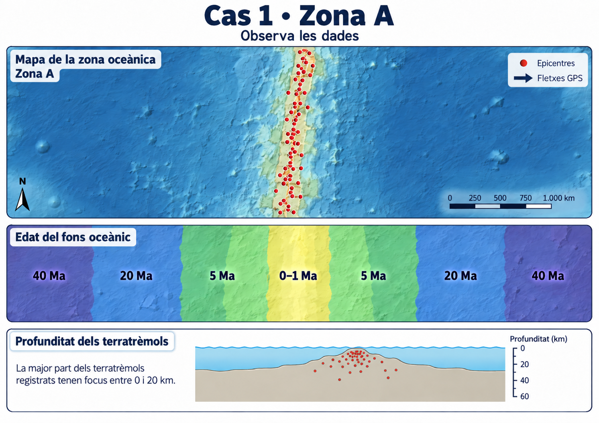
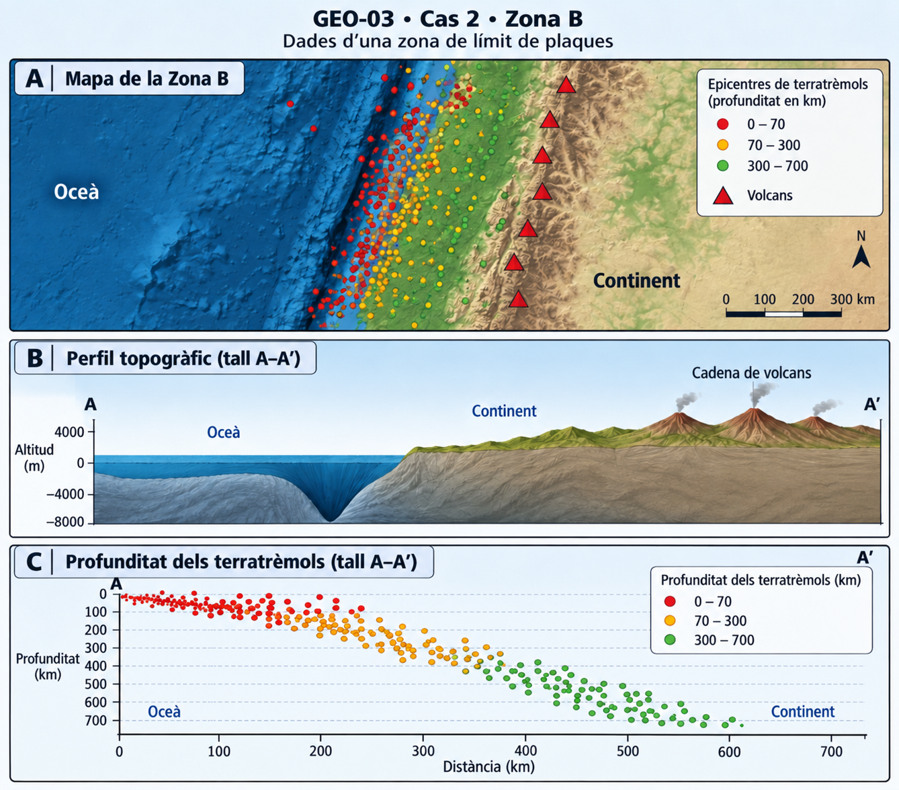

# GEO-03 · Tectònica en dades

**Durada:** 1 sessió  

## Situació

A les sessions anteriors hem construït un model de la Terra a partir d'evidències i hem vist que la litosfera està fragmentada en plaques que es mouen.

Ara treballarem en sentit contrari: rebràs **dades de diferents zones del planeta** i hauràs d'utilitzar-les per identificar quin tipus de límit de plaques és compatible amb cada cas.

No basta escriure el nom del límit. Una interpretació geològica ha d'estar **justificada amb evidències observables**.

En cada cas seguiràs la mateixa rutina:

**OBSERVA → IDENTIFICA → JUSTIFICA → INTERPRETA**

---

# Cas 1 · Zona A

## Dades disponibles

Observa amb atenció la informació de la figura abans de respondre.

La figura combina tres tipus de dades sobre la mateixa zona oceànica:

- la distribució dels **epicentres dels terratrèmols**;
- l'**edat del fons oceànic**;
- la **profunditat dels focus sísmics**.

## 1. OBSERVA · Descriu les dades

Respon sense posar encara nom al tipus de límit.

### 1.1 · Sismicitat

**a)** Com es distribueixen els epicentres dels terratrèmols al mapa?

**b)** Segons el tall inferior, a quina profunditat es localitza la major part dels focus sísmics?

**c)** Diries que la sismicitat d'aquesta zona és principalment superficial o profunda? Justifica-ho amb una dada de la figura.

### 1.2 · Edat del fons oceànic

**d)** On es localitza el fons oceànic més jove?

**e)** Què passa amb l'edat de les roques a mesura que ens allunyam de la zona central?

**f)** Compara els dos costats de la zona central. Quin patró hi observes?

## 2. IDENTIFICA · Què està passant?

Utilitza conjuntament les dades de sismicitat i d'edat del fons oceànic.

**a)** Quin tipus de moviment entre dues plaques és més compatible amb aquest patró?

**b)** Quin tipus de límit de plaques proposes per a la Zona A?

**c)** Quina gran estructura del relleu oceànic esperaries trobar associada a aquesta zona?

## 3. JUSTIFICA · Defensa la teva interpretació

No basta escriure «és un límit divergent». Has d'explicar **com ho saps**.

Selecciona almenys **tres evidències** de la figura i relaciona-les amb la teva interpretació.

| Afirmació | Evidència observable | Què indica aquesta evidència? |
|---|---|---|
| **Tipus de límit:** | 1. | |
| | 2. | |
| | 3. | |

### Conclusió argumentada

Redacta una conclusió de 3–5 línies. Ha de contenir:

- el tipus de límit que proposes;
- almenys dues dades concretes de la figura;
- una explicació de per què aquestes dades són compatibles amb la teva proposta.

## 4. INTERPRETA · Del patró al procés geològic

**a)** El patró d'edats indica que al centre de la Zona A es forma litosfera oceànica nova o que se'n destrueix? Justifica la resposta.

**b)** Explica per què el fons oceànic més antic es troba més lluny de la zona central.

**c)** Si aquest procés continuàs durant milions d'anys, què esperaries que passàs amb la distància entre els dos costats de la zona?

**d)** Quins dos fenòmens geològics de la figura associaries directament a l'activitat d'aquesta zona?

## 5. Revisa la teva resposta

Abans de continuar amb el cas següent, comprova:

- He descrit les dades abans d'interpretar-les?
- He identificat el tipus de límit a partir de més d'una evidència?
- He utilitzat correctament el patró d'edat del fons oceànic?
- He tingut en compte la profunditat dels terratrèmols?
- La meva conclusió explica **per què** les dades són compatibles amb el tipus de límit proposat?

<!-- DOCENT: Cas 1 amb andamisatge alt. La figura no mostra fletxes de moviment ni etiqueta el tipus de límit. L'objectiu és que l'alumnat integri tres fonts d'informació: relleu/patró sísmic, edat simètrica del fons oceànic i sismicitat superficial. En els casos següents es reduirà progressivament el nombre de preguntes d'observació i augmentarà l'autonomia en la justificació. -->

---

# Cas 2 · Zona B

## Dades disponibles

Observa la figura abans d'intentar posar nom al procés tectònic.

La figura combina tres representacions de la mateixa zona:

- un **mapa** amb epicentres de terratrèmols i volcans;
- un **perfil topogràfic** entre l'oceà i el continent;
- un tall que mostra la **profunditat dels terratrèmols** al llarg de la zona.

En aquest cas hauràs de seleccionar tu quines dades són més útils per interpretar què està passant.

## 1. OBSERVA · Cerca patrons

### 1.1 · Selecciona les dades rellevants

Descriu **tres patrons** de la figura que consideris importants per interpretar la Zona B.

| Patró observat | Què mostra la figura? |
|---|---|
| 1 | |
| 2 | |
| 3 | |

### 1.2 · Mira els terratrèmols en profunditat

**a)** Com varia, en general, la profunditat dels terratrèmols quan passam de l'oceà cap a l'interior del continent?

**b)** Quin patró geomètric formen aproximadament els focus sísmics en el tall A–A’?

**c)** On es concentren els terratrèmols més profunds: prop de l'oceà o més cap a l'interior del continent?

## 2. IDENTIFICA · Proposa una explicació tectònica

Utilitza conjuntament el relleu, el vulcanisme i la distribució dels terratrèmols.

**a)** Quin tipus de límit de plaques proposes per a la Zona B?

**b)** Quin procés concret creus que està tenint lloc entre les dues plaques?

**c)** Quina estructura del relleu submarí destaca al marge del continent?

## 3. JUSTIFICA · Defensa la teva interpretació

Construeix una justificació amb **almenys tres evidències diferents**. Una d'elles ha de fer referència obligatòriament a la **profunditat dels terratrèmols**.

| Afirmació | Evidència observable | Què indica aquesta evidència? |
|---|---|---|
| **Tipus de límit i procés:** | 1. | |
| | 2. | |
| | 3. | |

### Conclusió argumentada

Redacta una conclusió de 4–6 línies que expliqui:

- quin tipus de límit proposes;
- quin procés tectònic hi té lloc;
- quines dades de la figura sostenen aquesta interpretació;
- per què el patró de profunditat dels terratrèmols és especialment important.

## 4. INTERPRETA · Explica el procés

**a)** Si els focus sísmics formen una franja inclinada que s'endinsa sota el continent, quina explicació geològica és compatible amb aquest patró?

**b)** Explica com pot relacionar-se aquest procés amb la presència simultània d'una depressió oceànica molt profunda, una cadena de volcans i terratrèmols de profunditats molt diferents.

**c)** En aquesta zona, la litosfera oceànica es crea, es conserva o s'introdueix cap a l'interior de la Terra? Justifica-ho.

## 5. TRANSFEREIX · Aplica el patró a una altra zona

Imagina una altra regió del planeta on es detecten aquestes dades:

- una depressió oceànica estreta i molt profunda prop d'un continent;
- una alineació de volcans terra endins;
- terratrèmols superficials prop de l'oceà i terratrèmols de més de 300 km de profunditat cap a l'interior.

**Quina hipòtesi tectònica proposaries? Justifica-la utilitzant almenys dues de les dades anteriors.**

## 6. Revisa la teva resposta

Abans de continuar amb el cas següent, comprova:

- He seleccionat patrons rellevants i no només he enumerat elements de la figura?
- He explicat com varia la profunditat dels terratrèmols?
- He relacionat almenys tres evidències amb la meva proposta?
- He diferenciat el **tipus de límit** del **procés tectònic** que hi té lloc?
- La meva conclusió explica les dades, en lloc de limitar-se a posar una etiqueta?

<!-- DOCENT: Cas 2 amb menys andamisatge que el cas 1. La figura evita etiquetar la depressió oceànica com a fossa i no dibuixa explícitament cap placa subduint. La dada clau és l'augment sistemàtic de la profunditat dels terratrèmols cap al continent, que l'alumnat ha d'interpretar juntament amb el relleu i el vulcanisme. No exigir el terme “zona de Wadati-Benioff”; interessa el raonament que permet inferir una placa que s'endinsa sota una altra. -->
