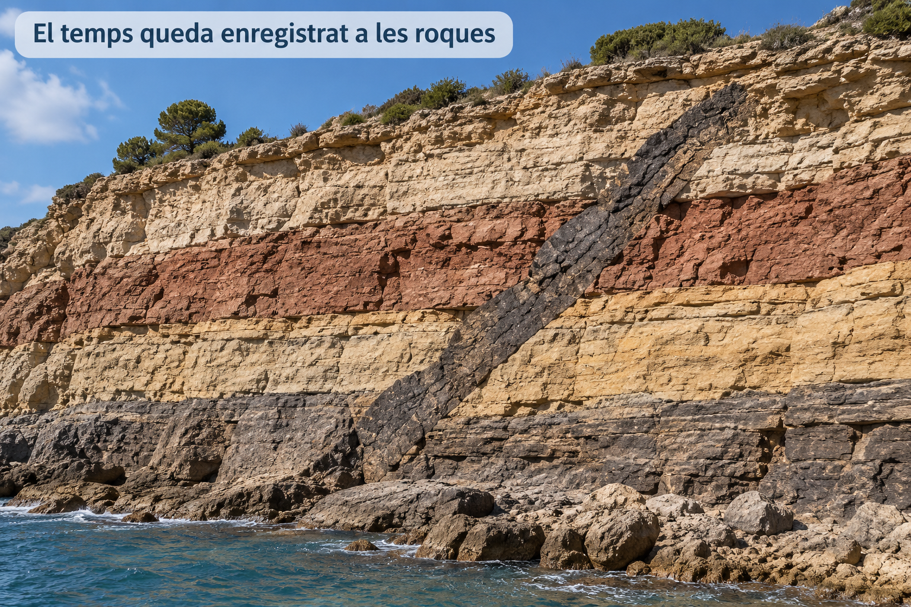
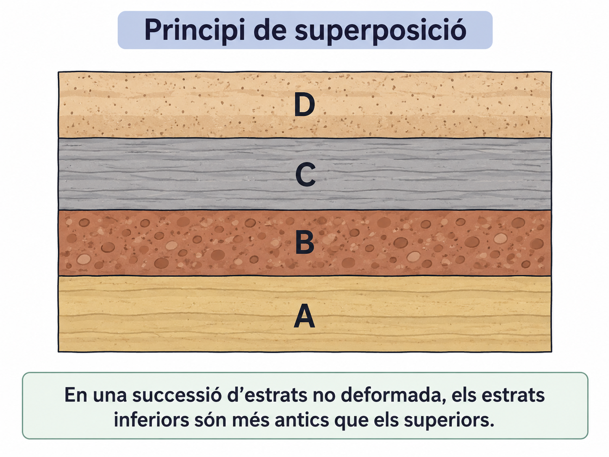
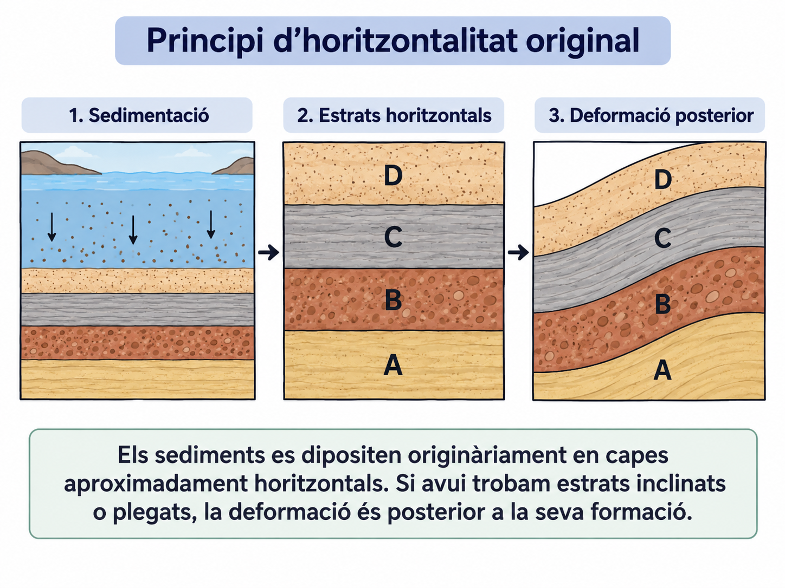
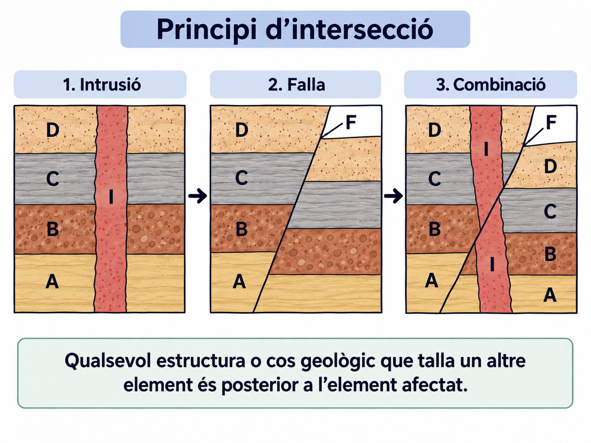
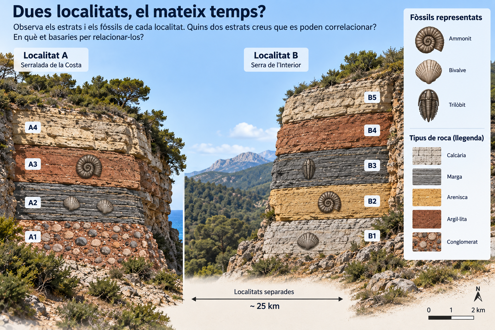
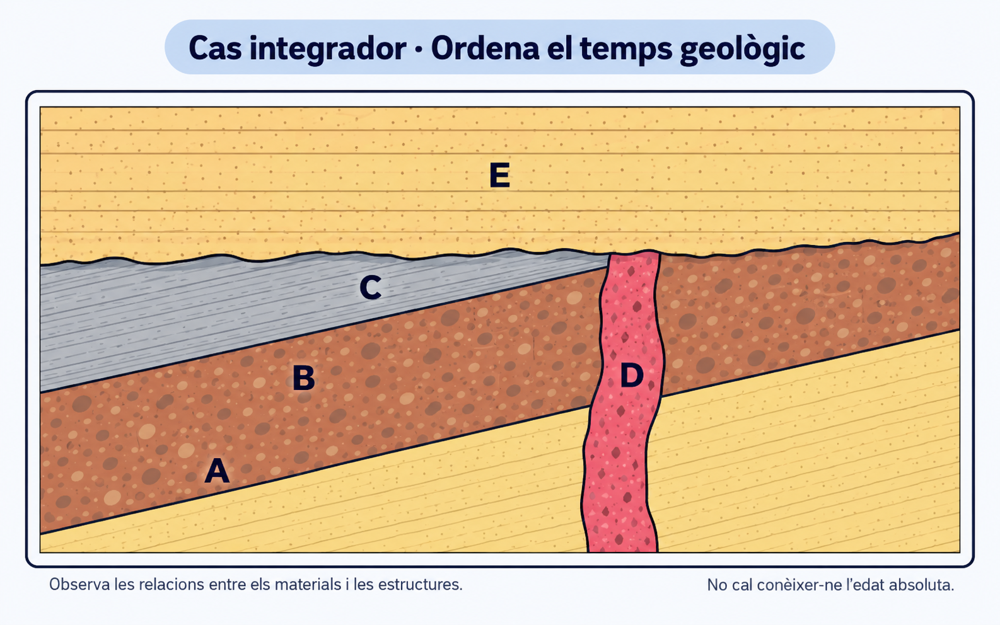
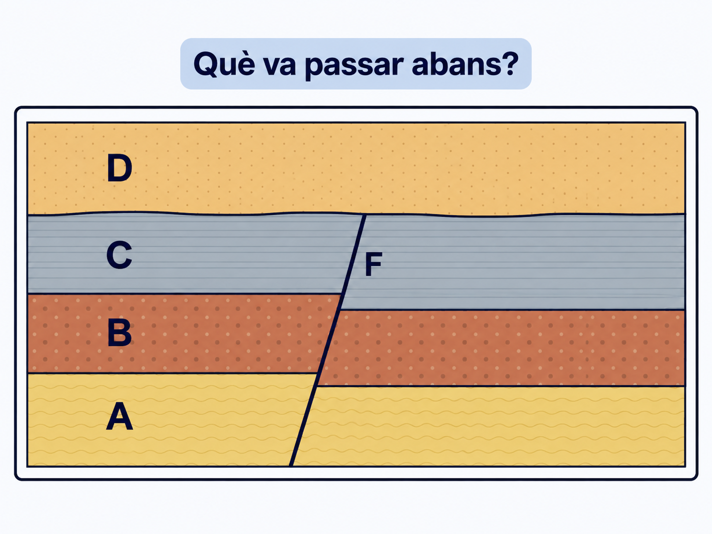

<section class="pv-seccio pv-portada" markdown>

# GEO-04 · Llegim el temps a les roques

## Com podem saber què va passar abans i què va passar després?

<!-- DOCENT: Activitat de construcció. Objectiu central: establir relacions temporals a partir d'evidències i principis geològics. Ha de preparar la sessió guiada “Com es reconstrueix un tall?”, GEO-05 i G1. -->

</section>

<section class="pv-seccio pv-visual" markdown>

# 1 · El repte: les roques tenen memòria

Observa l'aflorament abans de continuar.

  
<strong>Podem establir l'ordre d'alguns esdeveniments geològics encara que no en sapiguem l'edat en anys?</strong>

  

    <button type="button" class="pv-opcio" data-feedback="repte-a" aria-pressed="false">A · No. Sense una edat numèrica no podem ordenar-los.</button>
    <button type="button" class="pv-opcio" data-feedback="repte-b" aria-pressed="false">B · Sí. Algunes relacions ens permeten saber què és anterior i què és posterior.</button>
  

  

    <strong>Revisau-ho.</strong> Si una estructura travessa una roca, aquella roca havia d'existir abans de poder ser travessada. Aquesta relació ja ens dona informació temporal.
  

  

    <strong>Exacte.</strong> Podem ordenar materials i esdeveniments sense saber necessàriament quants anys tenen.
  

**Datació relativa** significa establir l'ordre dels materials i dels esdeveniments: què és més antic, què és més modern i què va passar abans o després.

> La datació relativa **no ens dona necessàriament una edat en anys**.

<!-- DOCENT: No convertir aquesta entrada en una explicació de datació absoluta. La distinció només serveix per situar el tipus de raonament que farem. -->

</section>

<section class="pv-seccio pv-visual" markdown>

# 2 · Apilar el temps

Mira els quatre estrats A, B, C i D.

  
<strong>Quin estrat s'havia de formar primer?</strong>

  

    <button type="button" class="pv-opcio" data-feedback="sup-a" aria-pressed="false">A</button>
    <button type="button" class="pv-opcio" data-feedback="sup-b" aria-pressed="false">B</button>
    <button type="button" class="pv-opcio" data-feedback="sup-c" aria-pressed="false">C</button>
    <button type="button" class="pv-opcio" data-feedback="sup-d" aria-pressed="false">D</button>
  

  

    <strong>Correcte.</strong> B només es podia dipositar damunt A si A ja existia.
  

  
<strong>No.</strong> Hi ha un estrat situat davall B que s'havia d'haver format abans.

  
<strong>No.</strong> C reposa damunt materials que ja havien de ser presents.

  
<strong>No.</strong> D és l'estrat superior i, en aquesta successió no deformada, és el més modern.

## Principi de superposició

En una successió d'estrats que conserva la seva disposició original, **els estrats inferiors són més antics que els situats damunt seu**.

<strong>Ordena mentalment A, B, C i D del més antic al més modern abans de continuar.</strong>

<!-- DOCENT: Fer verbalitzar “més antic que / més modern que”. No basta recitar el nom del principi. -->

</section>

<section class="pv-seccio pv-visual" markdown>

# 3 · Si ara estan inclinats...

La figura mostra una seqüència: sedimentació, estrats horitzontals i deformació posterior.

  
<strong>Què va passar primer?</strong>

  

    <button type="button" class="pv-opcio" data-feedback="hor-a" aria-pressed="false">A · La formació dels estrats</button>
    <button type="button" class="pv-opcio" data-feedback="hor-b" aria-pressed="false">B · La inclinació o el plegament</button>
  

  

    <strong>Correcte.</strong> Primer es varen formar les capes i després varen ser deformades.
  

  

    <strong>Revisau-ho.</strong> La deformació afecta estrats que ja existien.
  

## Principi d'horitzontalitat original

Els sediments es dipositen originàriament en capes **aproximadament horitzontals**. Si avui trobam estrats inclinats o plegats, la deformació és posterior a la seva formació.

> Veure estrats deformats ens permet deduir **un esdeveniment posterior** a la sedimentació.

</section>

<section class="pv-seccio pv-visual" markdown>

# 4 · Qui talla a qui?

Observa els tres casos: una intrusió, una falla i una combinació de totes dues.

  
<strong>En el primer cas, què és posterior?</strong>

  

    <button type="button" class="pv-opcio" data-feedback="int1-a" aria-pressed="false">A · Els estrats</button>
    <button type="button" class="pv-opcio" data-feedback="int1-b" aria-pressed="false">B · La intrusió</button>
  

  
<strong>No.</strong> La intrusió travessa els estrats; per tant, els estrats ja existien.

  
<strong>Correcte.</strong> La intrusió és posterior als materials que travessa.

## Principi d'intersecció

Una estructura o cos geològic que **talla un altre element és posterior** a l'element tallat.

  
<strong>En el cas 3, quina seqüència és compatible amb la figura?</strong>

  

    <button type="button" class="pv-opcio" data-feedback="int2-a" aria-pressed="false">A · falla → intrusió → estrats</button>
    <button type="button" class="pv-opcio" data-feedback="int2-b" aria-pressed="false">B · estrats → intrusió → falla</button>
    <button type="button" class="pv-opcio" data-feedback="int2-c" aria-pressed="false">C · intrusió → estrats → falla</button>
  

  
<strong>No.</strong> Tant la intrusió com la falla afecten materials que ja existien.

  
<strong>Exacte.</strong> La intrusió talla els estrats i la falla talla també la intrusió.

  
<strong>No.</strong> La intrusió no pot ser anterior als estrats que travessa.

<!-- DOCENT: Aquest és el primer encadenament temporal explícit de tres esdeveniments. -->

</section>

<section class="pv-seccio pv-visual" markdown>

# 5 · Dues localitats, el mateix temps?

Els dos afloraments són de **localitats diferents** i no hi ha continuïtat lateral entre ells.

<strong>Quins dos estrats creus que es poden correlacionar? En quina evidència et bases?</strong>

Abans de comprovar la idea, fixa't que els estrats correlacionables **no tenen per què ocupar la mateixa posició** dins cada successió ni estar formats per la mateixa roca.

  
<strong>Si dos estrats de localitats diferents contenen el mateix fòssil guia, però tenen litologies diferents, poden correspondre al mateix interval de temps?</strong>

  

    <button type="button" class="pv-opcio" data-feedback="fos-a" aria-pressed="false">A · Sí</button>
    <button type="button" class="pv-opcio" data-feedback="fos-b" aria-pressed="false">B · No</button>
  

  

    <strong>Correcte.</strong> En un mateix moment es poden dipositar sediments diferents en ambients diferents. La litologia no ha de coincidir.
  

  

    <strong>Revisau-ho.</strong> “Mateixa edat” no significa necessàriament “mateixa roca”. Dos ambients sedimentaris diferents poden produir litologies diferents al mateix temps.
  

## Principi de successió faunística

Els organismes que han viscut a la Terra han anat canviant al llarg del temps. Per això, determinats fòssils característics ens permeten **ordenar i correlacionar estrats** de localitats diferents.

**Fòssil guia:** fòssil especialment útil per correlacionar estrats perquè correspon a un interval temporal relativament curt i té una distribució geogràfica prou àmplia.

<!-- DOCENT: En aquesta activitat el fòssil compartit funciona com a fòssil guia. Evitar transmetre que qualsevol ammonit o qualsevol trilobit, com a grup complet, és automàticament un fòssil guia. -->

</section>

<section class="pv-seccio" markdown>

# 6 · El present ens ajuda a llegir el passat

Imagina que avui observes un torrent que transporta fragments de roca. Durant el transport, els fragments xoquen, es desgasten i poden acabar més arrodonits.

Milers o milions d'anys després, un geòleg troba una roca formada per **còdols arrodonits cimentats**.

  
<strong>Quina interpretació és més raonable?</strong>

  

    <button type="button" class="pv-opcio" data-feedback="act-a" aria-pressed="false">A · Processos semblants als que observam avui poden ajudar a explicar com es va formar la roca.</button>
    <button type="button" class="pv-opcio" data-feedback="act-b" aria-pressed="false">B · Els processos actuals no ens poden dir res sobre les roques del passat.</button>
  

  

    <strong>Exacte.</strong> Observant processos actuals podem interpretar moltes empremtes conservades a les roques.
  

  

    <strong>No.</strong> Una part essencial del raonament geològic consisteix precisament a utilitzar processos observables avui per interpretar el registre del passat.
  

## Principi d'actualisme

Els processos geològics que observam avui ens ajuden a interpretar els materials i les estructures formats en el passat.

> Això **no significa** que tots els processos hagin actuat sempre amb la mateixa intensitat ni que les condicions de la Terra no hagin canviat.

<!-- DOCENT: No presentar l'actualisme com “tot ha estat sempre igual”. El que es conserva és la possibilitat d'utilitzar processos coneguts per interpretar evidències antigues. -->

</section>

<section class="pv-seccio" markdown>

# 7 · Cinc eines per ordenar el passat

| Si observes... | Principi que et pot ajudar |
|---|---|
| Estrats situats uns damunt els altres | **Superposició** |
| Estrats inclinats o plegats | **Horitzontalitat original** |
| Una estructura que talla una altra | **Intersecció** |
| Fòssils característics en estrats de llocs diferents | **Successió faunística** |
| Empremtes d'un procés semblant a un procés actual | **Actualisme** |

<strong>No es tracta de memoritzar cinc definicions: es tracta de saber quin principi et permet justificar una relació temporal.</strong>

</section>

<section class="pv-seccio pv-visual" markdown>

# 8 · Ara combina les pistes

En aquest tall hi ha cinc unitats o estructures: **A, B, C, D i E**.

Respon primer sense intentar reconstruir encara tota la història.

  
<strong>1. Quin és més antic, A o C?</strong>

  

    <button type="button" class="pv-opcio" data-feedback="cas1-a" aria-pressed="false">A · A</button>
    <button type="button" class="pv-opcio" data-feedback="cas1-b" aria-pressed="false">B · C</button>
  

  
<strong>Correcte.</strong> A és inferior a B i C dins la successió inclinada: aplicam superposició.

  
<strong>Revisau-ho.</strong> La inclinació és posterior a la sedimentació; no canvia l'ordre original dels estrats en aquest cas.

  
<strong>2. La deformació d'A, B i C és anterior o posterior a la seva sedimentació?</strong>

  

    <button type="button" class="pv-opcio" data-feedback="cas2-a" aria-pressed="false">A · Anterior</button>
    <button type="button" class="pv-opcio" data-feedback="cas2-b" aria-pressed="false">B · Posterior</button>
  

  
<strong>No.</strong> Primer s'han de formar els estrats perquè després puguin ser inclinats.

  
<strong>Correcte.</strong> Ho deduïm amb el principi d'horitzontalitat original.

  
<strong>3. La intrusió D és anterior o posterior a C?</strong>

  

    <button type="button" class="pv-opcio" data-feedback="cas3-a" aria-pressed="false">A · Anterior</button>
    <button type="button" class="pv-opcio" data-feedback="cas3-b" aria-pressed="false">B · Posterior</button>
  

  
<strong>No.</strong> D talla C; per tant, C ja existia.

  
<strong>Correcte.</strong> Principi d'intersecció: D és posterior als materials que talla.

  
<strong>4. D és anterior o posterior a E?</strong>

  

    <button type="button" class="pv-opcio" data-feedback="cas4-a" aria-pressed="false">A · D és anterior a E</button>
    <button type="button" class="pv-opcio" data-feedback="cas4-b" aria-pressed="false">B · D és posterior a E</button>
  

  
<strong>Correcte.</strong> D queda truncada per la superfície erosiva i E la cobreix sense ser tallat per la intrusió.

  
<strong>Revisau-ho.</strong> Si D fos posterior a E, hauria de travessar també E.

<strong>Finalment, ordena aquests esdeveniments del més antic al més modern: sedimentació d'A, B i C · deformació · intrusió D · erosió · sedimentació d'E.</strong>

<!-- DOCENT: Aquesta és la transició cap a la sessió següent. Encara no exigir una narració completa de la història geològica; primer consolidar les relacions temporals locals. -->

</section>

<section class="pv-seccio" markdown>

# 9 · De relacions temporals a història geològica

Fins ara hem treballat sobretot preguntes locals:

**Què és més antic? Què és posterior? Quina evidència ho demostra? Quin principi ho justifica?**

La passa següent serà **encadenar totes aquestes relacions** per reconstruir una història geològica completa.

**observació → relació temporal → principi → procés → història**

> Una història geològica no s'endevina: **es reconstrueix i es justifica amb evidències**.

</section>

<section class="pv-seccio pv-visual" markdown>

# 10 · Exit ticket

## Ho pots fer sense ajuda?

Ara no tens retroacció automàtica. Respon individualment.

**1. Quin és més antic, A o C? Justifica-ho.**

**2. La falla F és anterior o posterior a C? Quina observació ho demostra?**

**3. La falla F és anterior o posterior a D? Justifica la resposta.**

<!-- DOCENT: No és evidència formal ni s'ha de qualificar com un CA. Lectura ràpida: verd = relació correcta i justificació basada en la figura; groc = relació correcta però justificació imprecisa; vermell = ordre temporal incorrecte o justificació incompatible. Utilitzar el resultat per decidir el punt de partida de “Com es reconstrueix un tall?”. -->

</section>

<section class="pv-seccio" markdown>

# Si has fet aquesta activitat pel teu compte

Comprova que, sense mirar les definicions, pots explicar amb les teves paraules:

- com saps quin estrat és més antic en una successió no invertida;
- què et diu trobar estrats inclinats o plegats;
- què pots deduir quan una estructura talla una altra;
- com poden ajudar els fòssils a relacionar estrats de llocs diferents;
- per què els processos actuals ens ajuden a interpretar el passat.

Si qualcuna d'aquestes idees no et queda clara, torna al bloc corresponent abans de passar a la següent activitat.

</section>

<!-- SESSIÓ 10 · COM ES RECONSTRUEIX UN TALL? -->

<section class="pv-seccio pv-portada" markdown>

# Sessió guiada · Com es reconstrueix un tall?

## Del que observam a una història geològica argumentada

Avui no aprendrem un principi nou. Aprendrem a **combinar els que ja coneixem** per reconstruir una seqüència d'esdeveniments.

**observació → relació temporal → principi → procés → història**

<!-- DOCENT: Sessió 10. Modelar en veu alta el procediment que després s'exigirà a GEO-05 i G1. No convertir el tall en un exercici de memorització d'una seqüència fixa. -->

</section>

<section class="pv-seccio geo04-reconstruccio-pas" data-geo-step="pas-1" data-highlight="unitat-a unitat-b unitat-c unitat-d intrusio-x falla-f superficie-actual" data-context="superficie-erosiva" markdown>

# 1 · El repte: quina història amaga aquest tall?

No intentis ordenar-ho tot encara.

<strong>Què podem afirmar amb seguretat només observant la figura?</strong>

<!-- DOCENT: Recollir observacions descriptives, no interpretacions. Exemples acceptables: A és sota B; X travessa A-B-C; D és horitzontal; F talla D. Si apareix una cronologia completa, tornar a demanar quina observació concreta la justifica. -->

</section>

<section class="pv-seccio geo04-reconstruccio-pas" data-geo-step="pas-2" data-highlight="unitat-a unitat-b unitat-c unitat-d intrusio-x falla-f superficie-erosiva superficie-actual" markdown>

# 2 · Primer observa; encara no contis la història

Identifica en el tall:

- quatre unitats sedimentàries: **A, B, C i D**;
- una intrusió: **X**;
- una falla: **F**;
- dues superfícies irregulars que haurem d'interpretar.

> **Descriure no és explicar.** Primer identificam què hi ha i quines relacions geomètriques observam.

<!-- DOCENT: Les etiquetes “Superfície erosiva” i “Superfície actual erosiva” romanen ocultes a l'SVG. No donar encara el nom de les superfícies: l'alumnat l'ha d'inferir a partir de la geometria. -->

</section>

<section class="pv-seccio geo04-reconstruccio-pas" data-geo-step="pas-3" data-highlight="unitat-a unitat-b unitat-c" data-context="contactes-inclinats" markdown>

# 3 · Què és més antic: A, B o C?

  
<strong>Quina seqüència ordena correctament A, B i C del més antic al més modern?</strong>

  

    <button type="button" class="pv-opcio" data-feedback="tall-abc-a" aria-pressed="false">A · A → B → C</button>
    <button type="button" class="pv-opcio" data-feedback="tall-abc-b" aria-pressed="false">B · C → B → A</button>
  

  
<strong>Correcte.</strong> A és inferior a B i B és inferior a C. Aplicam el principi de superposició.

  
<strong>Revisau-ho.</strong> La inclinació actual no implica que la successió s'hagi invertit.

**Observació:** A és sota B i B és sota C.  
**Relació temporal:** A és anterior a B, i B és anterior a C.  
**Principi:** superposició.

</section>

<section class="pv-seccio geo04-reconstruccio-pas" data-geo-step="pas-4" data-highlight="unitat-a unitat-b unitat-c" data-context="contactes-inclinats" markdown>

# 4 · Si A, B i C estan inclinats...

  
<strong>Quan es va produir la inclinació?</strong>

  

    <button type="button" class="pv-opcio" data-feedback="tall-inc-a" aria-pressed="false">A · Abans de formar-se A, B i C</button>
    <button type="button" class="pv-opcio" data-feedback="tall-inc-b" aria-pressed="false">B · Després de formar-se A, B i C</button>
  

  
<strong>No.</strong> No podem inclinar conjuntament uns estrats que encara no existeixen.

  
<strong>Correcte.</strong> Els sediments es varen dipositar primer i la deformació és posterior.

**Observació:** A, B i C comparteixen la mateixa inclinació.  
**Relació temporal:** la deformació és posterior a la seva sedimentació.  
**Principi:** horitzontalitat original.

</section>

<section class="pv-seccio geo04-reconstruccio-pas" data-geo-step="pas-5" data-highlight="intrusio-x" data-context="unitat-a unitat-b unitat-c" markdown>

# 5 · Què ens diu X?

  
<strong>La intrusió X és anterior o posterior als estrats A, B i C?</strong>

  

    <button type="button" class="pv-opcio" data-feedback="tall-x-a" aria-pressed="false">A · Anterior</button>
    <button type="button" class="pv-opcio" data-feedback="tall-x-b" aria-pressed="false">B · Posterior</button>
  

  
<strong>No.</strong> X no podria travessar uns materials que encara no existissin.

  
<strong>Correcte.</strong> X talla A, B i C i, per tant, és posterior a aquests materials.

**Observació:** X talla A, B i C.  
**Relació temporal:** X és posterior a A, B i C.  
**Principi:** intersecció.

<strong>Podem saber només amb aquesta observació si X és anterior o posterior a la deformació?</strong>

<!-- DOCENT: Punt de rigor. La geometria representada permet afirmar que X és posterior als estrats, però la relació exacta entre la intrusió i la deformació només queda resolta si interpretam que el dic talla la successió ja inclinada. Fer verbalitzar aquesta evidència i no donar per fet que “intrusió” sempre és posterior a “deformació”. -->

</section>

<section class="pv-seccio geo04-reconstruccio-pas" data-geo-step="pas-6" data-highlight="superficie-erosiva" data-context="unitat-c intrusio-x" data-show-labels="label-superficie-erosiva fletxa-superficie-erosiva" markdown>

# 6 · Una superfície també conta una història

Mira especialment què passa al sostre de **C** i de **X**.

  
<strong>Quina explicació és més coherent amb aquesta superfície irregular?</strong>

  

    <button type="button" class="pv-opcio" data-feedback="tall-ero-a" aria-pressed="false">A · Una erosió va eliminar part dels materials anteriors.</button>
    <button type="button" class="pv-opcio" data-feedback="tall-ero-b" aria-pressed="false">B · A, B i C es varen dipositar damunt D.</button>
  

  
<strong>Correcte.</strong> La superfície trunca els materials previs i registra un episodi d'erosió.

  
<strong>No.</strong> D cobreix aquesta superfície; no és el material situat davall la successió antiga.

**Observació:** C i X queden truncats per una superfície irregular.  
**Relació temporal:** l'erosió és posterior als materials que trunca.  
**Procés:** erosió.

> Alguns esdeveniments deixen una roca. **D'altres deixen una superfície.**

</section>

<section class="pv-seccio geo04-reconstruccio-pas" data-geo-step="pas-7" data-highlight="unitat-d" data-context="unitat-a unitat-b unitat-c superficie-erosiva" markdown>

# 7 · I D?

D és pràcticament horitzontal i reposa damunt la superfície que acaba d'identificar-se.

  
<strong>D és anterior o posterior a l'erosió?</strong>

  

    <button type="button" class="pv-opcio" data-feedback="tall-d-a" aria-pressed="false">A · Anterior</button>
    <button type="button" class="pv-opcio" data-feedback="tall-d-b" aria-pressed="false">B · Posterior</button>
  

  
<strong>No.</strong> La superfície erosiva havia d'existir abans que D s'hi dipositàs damunt.

  
<strong>Correcte.</strong> Primer es produeix l'erosió i després es diposita D.

A més, **X no talla D**: el dic queda interromput a la superfície erosiva.

> Ara ja podem afirmar que la sedimentació de D és posterior a la deformació, a la intrusió X i a l'erosió.

</section>

<section class="pv-seccio geo04-reconstruccio-pas" data-geo-step="pas-8" data-highlight="falla-f" data-context="unitat-a unitat-b unitat-c intrusio-x unitat-d" markdown>

# 8 · Finalment, F

  
<strong>Quina observació ens permet afirmar que F és posterior a D?</strong>

  

    <button type="button" class="pv-opcio" data-feedback="tall-f-a" aria-pressed="false">A · F talla i desplaça D.</button>
    <button type="button" class="pv-opcio" data-feedback="tall-f-b" aria-pressed="false">B · D és horitzontal.</button>
  

  
<strong>Correcte.</strong> Per intersecció, la falla és posterior al material que talla i desplaça.

  
<strong>No.</strong> L'horitzontalitat de D no estableix per si sola la seva relació temporal amb F.

**Observació:** F talla i desplaça D i les unitats inferiors.  
**Relació temporal:** F és posterior a totes aquestes unitats.  
**Principi:** intersecció.

</section>

<section class="pv-seccio geo04-reconstruccio-pas" data-geo-step="pas-9" data-highlight="unitat-a unitat-b unitat-c intrusio-x superficie-erosiva unitat-d falla-f superficie-actual" markdown>

# 9 · Reconstruïm la cronologia completa

  
<strong>Quina seqüència és compatible amb totes les relacions que hem establert?</strong>

  

    <button type="button" class="pv-opcio" data-feedback="tall-crono-a" aria-pressed="false">A · A → B → C → deformació → X → erosió → D → F → erosió actual</button>
    <button type="button" class="pv-opcio" data-feedback="tall-crono-b" aria-pressed="false">B · A → B → C → X → D → deformació → erosió → F</button>
    <button type="button" class="pv-opcio" data-feedback="tall-crono-c" aria-pressed="false">C · D → A → B → C → deformació → F → X → erosió</button>
  

  
<strong>Correcte.</strong> Aquesta seqüència respecta la superposició, la deformació, les interseccions i les superfícies erosives observades.

  
<strong>No.</strong> D no pot ser anterior a la deformació i a l'erosió que afecten la successió inferior.

  
<strong>No.</strong> D cobreix els materials antics i F talla D; aquesta seqüència inverteix diverses relacions observables.

**Del més antic al més modern:**  
A → B → C → deformació → intrusió X → erosió → sedimentació de D → falla F → erosió actual.

<!-- DOCENT: No acceptar la seqüència només perquè coincideix amb la mostrada. Demanar justificacions puntuals: “Per què X va després de C?”, “Per què D va després de l'erosió?”, “Per què F va després de D?”. -->

</section>

<section class="pv-seccio geo04-reconstruccio-pas" data-geo-step="pas-10" data-highlight="unitat-a unitat-b unitat-c intrusio-x superficie-erosiva unitat-d falla-f superficie-actual" data-show-labels="label-superficie-erosiva fletxa-superficie-erosiva label-superficie-actual fletxa-superficie-actual" markdown>

# 10 · De la cronologia a la història geològica

Una cronologia és una llista. Una **història geològica** explica els processos i justifica l'ordre a partir de les evidències.

**observació → relació temporal → principi → procés → història**

<strong>Mostra una possible reconstrucció</strong>

Primer es varen dipositar successivament els sediments que originaren els estrats **A, B i C**. Posteriorment aquests materials es varen **deformar i inclinar**. Després es va produir la **intrusió X**, que talla els tres estrats. Una etapa d'**erosió** va truncar els materials inclinats i la intrusió. Damunt aquesta superfície es va dipositar horitzontalment **D**. Més tard, la **falla F** va tallar i desplaçar totes les unitats anteriors. Finalment, l'erosió va modelar la **superfície actual**.

> Quan reconstrueixis un tall nou, no cerquis una recepta fixa. **Cerca relacions que puguis justificar.**

<!-- DOCENT: Tancament de la sessió 10. La passa següent és GEO-05, on l'alumnat aplicarà el procediment amb talls nous i dificultat progressiva. -->

</section>

  <object id="geo04-tall-persistent" class="geo04-tall-object" type="image/svg+xml" data="figures/tall_sessio10_interactiu.svg" aria-label="Tall geològic que es va interpretant al llarg de la sessió 10"></object>
  
1 · El repte: quina història amaga aquest tall?

