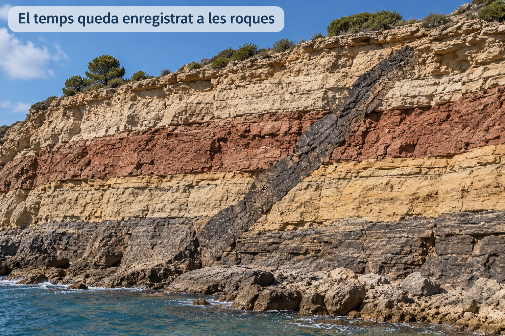
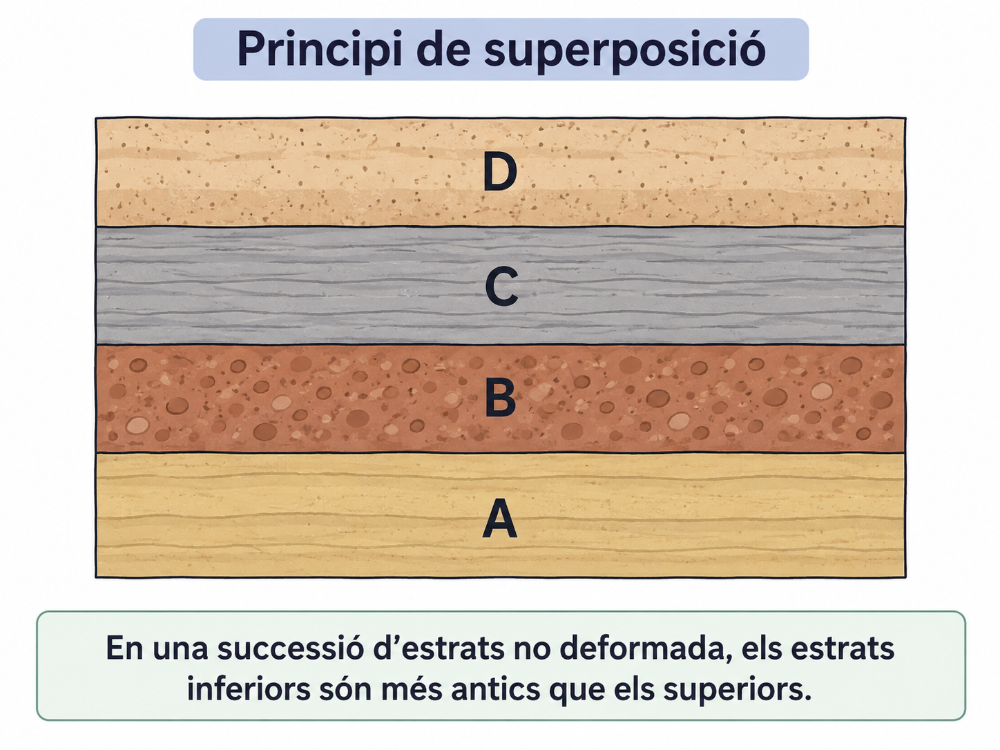
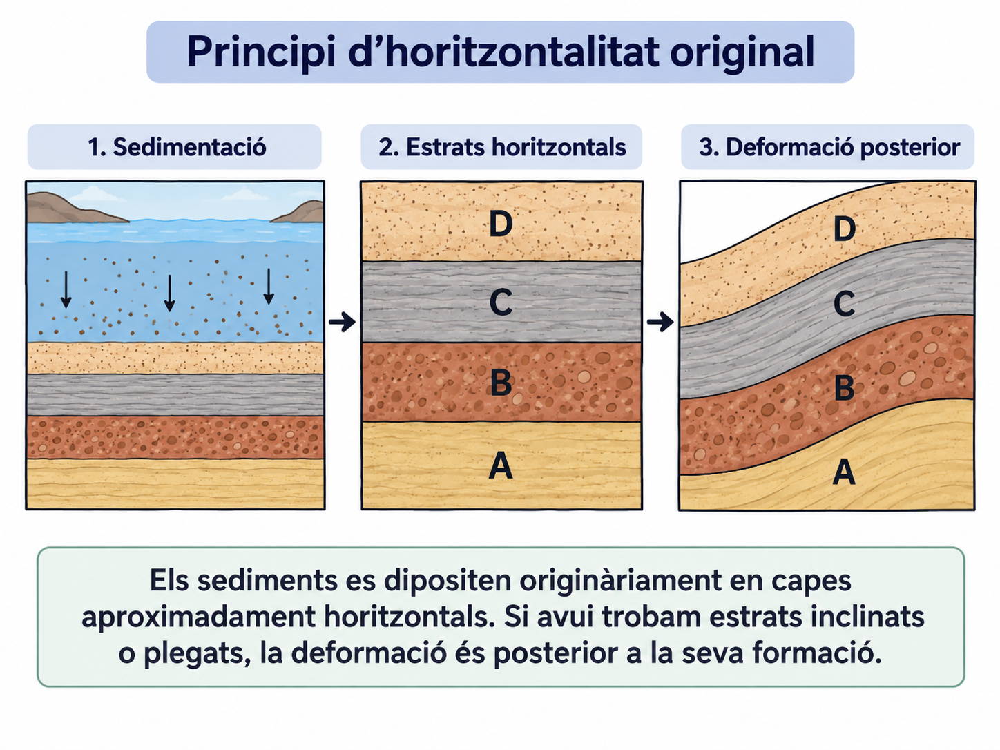
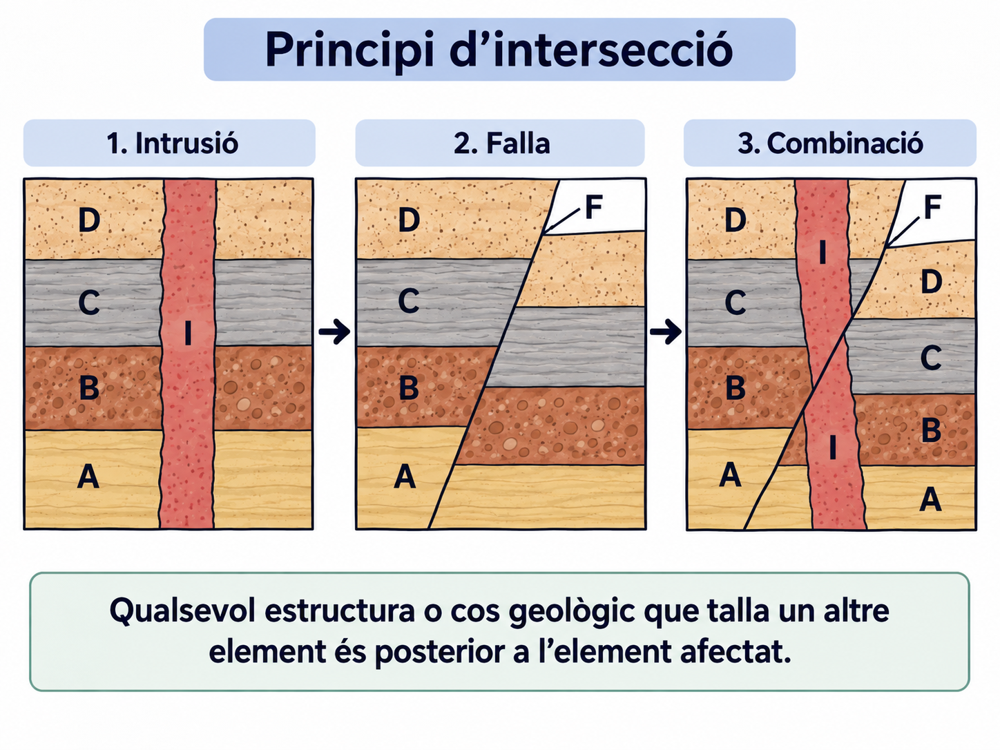
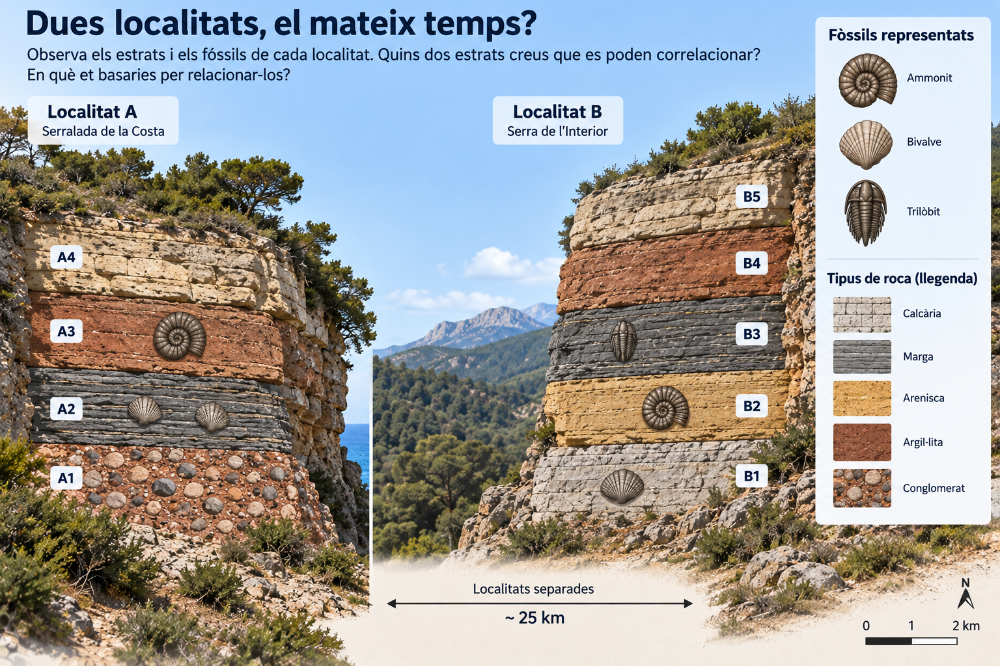

<section class="pv-seccio pv-portada" markdown>

# GEO-04 · Llegim el temps a les roques

## Com podem saber què va passar abans i què va passar després?

<!-- DOCENT: Activitat de construcció. Objectiu central: establir relacions temporals a partir d'evidències i principis geològics. Ha de preparar la sessió guiada “Com es reconstrueix un tall?”, GEO-05 i G1. -->

</section>

<section class="pv-seccio pv-visual" markdown>

# 1 · El repte: les roques tenen memòria

Observa l'aflorament abans de continuar.

  
<strong>Podem establir l'ordre d'alguns esdeveniments geològics encara que no en sapiguem l'edat en anys?</strong>

  

    <button type="button" class="pv-opcio" data-feedback="repte-a" aria-pressed="false">A · No. Sense una edat numèrica no podem ordenar-los.</button>
    <button type="button" class="pv-opcio" data-feedback="repte-b" aria-pressed="false">B · Sí. Algunes relacions ens permeten saber què és anterior i què és posterior.</button>
  

  

    <strong>Revisau-ho.</strong> Si una estructura travessa una roca, aquella roca havia d'existir abans de poder ser travessada. Aquesta relació ja ens dona informació temporal.
  

  

    <strong>Exacte.</strong> Podem ordenar materials i esdeveniments sense saber necessàriament quants anys tenen.
  

**Datació relativa** significa establir l'ordre dels materials i dels esdeveniments: què és més antic, què és més modern i què va passar abans o després.

> La datació relativa **no ens dona necessàriament una edat en anys**.

<!-- DOCENT: No convertir aquesta entrada en una explicació de datació absoluta. La distinció només serveix per situar el tipus de raonament que farem. -->

</section>

<section class="pv-seccio pv-visual" markdown>

# 2 · Apilar el temps

Mira els quatre estrats A, B, C i D.

  
<strong>Quin estrat s'havia de formar primer?</strong>

  

    <button type="button" class="pv-opcio" data-feedback="sup-a" aria-pressed="false">A</button>
    <button type="button" class="pv-opcio" data-feedback="sup-b" aria-pressed="false">B</button>
    <button type="button" class="pv-opcio" data-feedback="sup-c" aria-pressed="false">C</button>
    <button type="button" class="pv-opcio" data-feedback="sup-d" aria-pressed="false">D</button>
  

  

    <strong>Correcte.</strong> B només es podia dipositar damunt A si A ja existia.
  

  
<strong>No.</strong> Hi ha un estrat situat davall B que s'havia d'haver format abans.

  
<strong>No.</strong> C reposa damunt materials que ja havien de ser presents.

  
<strong>No.</strong> D és l'estrat superior i, en aquesta successió no deformada, és el més modern.

## Principi de superposició

En una successió d'estrats que conserva la seva disposició original, **els estrats inferiors són més antics que els situats damunt seu**.

<strong>Ordena mentalment A, B, C i D del més antic al més modern abans de continuar.</strong>

<!-- DOCENT: Fer verbalitzar “més antic que / més modern que”. No basta recitar el nom del principi. -->

</section>

<section class="pv-seccio pv-visual" markdown>

# 3 · Si ara estan inclinats...

La figura mostra una seqüència: sedimentació, estrats horitzontals i deformació posterior.

  
<strong>Què va passar primer?</strong>

  

    <button type="button" class="pv-opcio" data-feedback="hor-a" aria-pressed="false">A · La formació dels estrats</button>
    <button type="button" class="pv-opcio" data-feedback="hor-b" aria-pressed="false">B · La inclinació o el plegament</button>
  

  

    <strong>Correcte.</strong> Primer es varen formar les capes i després varen ser deformades.
  

  

    <strong>Revisau-ho.</strong> La deformació afecta estrats que ja existien.
  

## Principi d'horitzontalitat original

Els sediments es dipositen originàriament en capes **aproximadament horitzontals**. Si avui trobam estrats inclinats o plegats, la deformació és posterior a la seva formació.

> Veure estrats deformats ens permet deduir **un esdeveniment posterior** a la sedimentació.

</section>

<section class="pv-seccio pv-visual" markdown>

# 4 · Qui talla a qui?

Observa els tres casos: una intrusió, una falla i una combinació de totes dues.

  
<strong>En el primer cas, què és posterior?</strong>

  

    <button type="button" class="pv-opcio" data-feedback="int1-a" aria-pressed="false">A · Els estrats</button>
    <button type="button" class="pv-opcio" data-feedback="int1-b" aria-pressed="false">B · La intrusió</button>
  

  
<strong>No.</strong> La intrusió travessa els estrats; per tant, els estrats ja existien.

  
<strong>Correcte.</strong> La intrusió és posterior als materials que travessa.

## Principi d'intersecció

Una estructura o cos geològic que **talla un altre element és posterior** a l'element tallat.

  
<strong>En el cas 3, quina seqüència és compatible amb la figura?</strong>

  

    <button type="button" class="pv-opcio" data-feedback="int2-a" aria-pressed="false">A · falla → intrusió → estrats</button>
    <button type="button" class="pv-opcio" data-feedback="int2-b" aria-pressed="false">B · estrats → intrusió → falla</button>
    <button type="button" class="pv-opcio" data-feedback="int2-c" aria-pressed="false">C · intrusió → estrats → falla</button>
  

  
<strong>No.</strong> Tant la intrusió com la falla afecten materials que ja existien.

  
<strong>Exacte.</strong> La intrusió talla els estrats i la falla talla també la intrusió.

  
<strong>No.</strong> La intrusió no pot ser anterior als estrats que travessa.

<!-- DOCENT: Aquest és el primer encadenament temporal explícit de tres esdeveniments. -->

</section>

<section class="pv-seccio pv-visual" markdown>

# 5 · Dues localitats, el mateix temps?

Els dos afloraments són de **localitats diferents** i no hi ha continuïtat lateral entre ells.

<strong>Quins dos estrats creus que es poden correlacionar? En quina evidència et bases?</strong>

Abans de comprovar la idea, fixa't que els estrats correlacionables **no tenen per què ocupar la mateixa posició** dins cada successió ni estar formats per la mateixa roca.

  
<strong>Si dos estrats de localitats diferents contenen el mateix fòssil guia, però tenen litologies diferents, poden correspondre al mateix interval de temps?</strong>

  

    <button type="button" class="pv-opcio" data-feedback="fos-a" aria-pressed="false">A · Sí</button>
    <button type="button" class="pv-opcio" data-feedback="fos-b" aria-pressed="false">B · No</button>
  

  

    <strong>Correcte.</strong> En un mateix moment es poden dipositar sediments diferents en ambients diferents. La litologia no ha de coincidir.
  

  

    <strong>Revisau-ho.</strong> “Mateixa edat” no significa necessàriament “mateixa roca”. Dos ambients sedimentaris diferents poden produir litologies diferents al mateix temps.
  

## Principi de successió faunística

Els organismes que han viscut a la Terra han anat canviant al llarg del temps. Per això, determinats fòssils característics ens permeten **ordenar i correlacionar estrats** de localitats diferents.

**Fòssil guia:** fòssil especialment útil per correlacionar estrats perquè correspon a un interval temporal relativament curt i té una distribució geogràfica prou àmplia.

<!-- DOCENT: En aquesta activitat el fòssil compartit funciona com a fòssil guia. Evitar transmetre que qualsevol ammonit o qualsevol trilobit, com a grup complet, és automàticament un fòssil guia. -->

</section>

<section class="pv-seccio" markdown>

# 6 · El present ens ajuda a llegir el passat

Imagina que avui observes un torrent que transporta fragments de roca. Durant el transport, els fragments xoquen, es desgasten i poden acabar més arrodonits.

Milers o milions d'anys després, un geòleg troba una roca formada per **còdols arrodonits cimentats**.

  
<strong>Quina interpretació és més raonable?</strong>

  

    <button type="button" class="pv-opcio" data-feedback="act-a" aria-pressed="false">A · Processos semblants als que observam avui poden ajudar a explicar com es va formar la roca.</button>
    <button type="button" class="pv-opcio" data-feedback="act-b" aria-pressed="false">B · Els processos actuals no ens poden dir res sobre les roques del passat.</button>
  

  

    <strong>Exacte.</strong> Observant processos actuals podem interpretar moltes empremtes conservades a les roques.
  

  

    <strong>No.</strong> Una part essencial del raonament geològic consisteix precisament a utilitzar processos observables avui per interpretar el registre del passat.
  

## Principi d'actualisme

Els processos geològics que observam avui ens ajuden a interpretar els materials i les estructures formats en el passat.

> Això **no significa** que tots els processos hagin actuat sempre amb la mateixa intensitat ni que les condicions de la Terra no hagin canviat.

<!-- DOCENT: No presentar l'actualisme com “tot ha estat sempre igual”. El que es conserva és la possibilitat d'utilitzar processos coneguts per interpretar evidències antigues. -->

</section>

<section class="pv-seccio" markdown>

# 7 · Cinc eines per ordenar el passat

| Si observes... | Principi que et pot ajudar |
|---|---|
| Estrats situats uns damunt els altres | **Superposició** |
| Estrats inclinats o plegats | **Horitzontalitat original** |
| Una estructura que talla una altra | **Intersecció** |
| Fòssils característics en estrats de llocs diferents | **Successió faunística** |
| Empremtes d'un procés semblant a un procés actual | **Actualisme** |

<strong>No es tracta de memoritzar cinc definicions: es tracta de saber quin principi et permet justificar una relació temporal.</strong>

</section>

<section class="pv-seccio" markdown>

# 8 · Consolida: llegim un tall geològic

Ara aplica els principis que has treballat en una **fitxa de consolidació**. Hi practicaràs la lectura d'un tall, la datació relativa, l'ús de fòssils i la reconstrucció d'una història geològica abans de passar a **UD01-A7**.

[**Baixa la fitxa de consolidació (PDF)**](UD01_A6_fitxa_consolidacio.pdf){ .md-button .md-button--primary }

</section>

