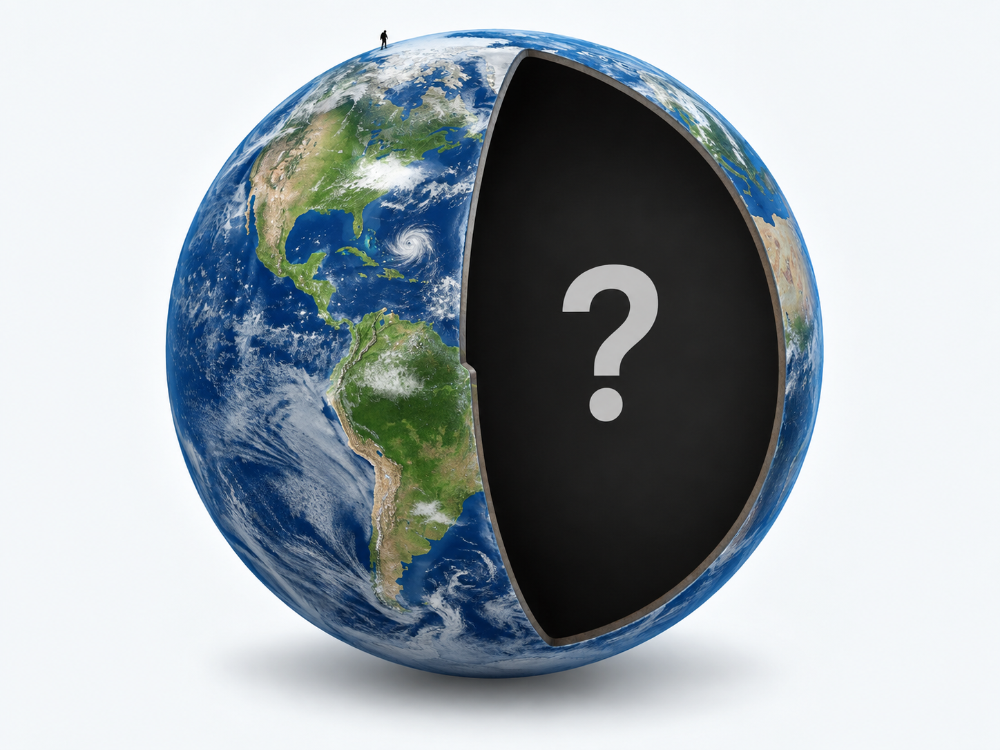

<section class="pv-seccio pv-portada" markdown>

# Com sabem què hi ha dins la Terra?

## Una investigació sobre allò que no podem veure directament

<!-- DOCENT: Sessió 4 de construcció. Idea rectora: l'estructura interna de la Terra no s'observa directament; es construeix a partir d'evidències. No mostrar encara els models geoquímic o geodinàmic. -->

</section>

<section class="pv-seccio pv-visual" markdown>

# 1 · El repte

Sabem moltes coses sobre l'interior de la Terra.

Però hi ha un problema:

<strong>no hi podem anar a mirar.</strong>

<strong>Com podem saber què hi ha dins la Terra si no ho podem observar directament?</strong>

Pensau-hi durant mig minut abans de continuar.

<!-- DOCENT: No donar encara cap mètode. L'objectiu és convertir “com és la Terra per dins?” en “com ho sabem?”. -->

</section>

<section class="pv-seccio" markdown>

# 1.1 · Què podríem fer?

Imaginau que encara no coneixem l'estructura interna de la Terra.

<strong>Quina d'aquestes opcions ens donaria informació més directa sobre els materials de l'interior?</strong>

  

    <button type="button" class="pv-opcio" data-feedback="repte-perforar" aria-pressed="false">A · Fer perforacions i estudiar les roques extretes</button>
    <button type="button" class="pv-opcio" data-feedback="repte-satellit" aria-pressed="false">B · Observar fotografies de la superfície des de satèl·lits</button>
    <button type="button" class="pv-opcio" data-feedback="repte-senyal" aria-pressed="false">C · Analitzar un senyal que travessi l'interior</button>
    <button type="button" class="pv-opcio" data-feedback="repte-impossible" aria-pressed="false">D · No hi ha cap manera d'obtenir informació</button>
  

  

    <strong>Sí.</strong> Si extreim una roca, podem observar-la i analitzar-la directament.
    
Però queda una qüestió: <strong>fins a quina profunditat podem arribar?</strong>

  

  

    <strong>No basta.</strong> Les fotografies de la superfície aporten molta informació, però no ens mostren què hi ha a milers de quilòmetres de profunditat.
  

  

    <strong>Aquesta és una possibilitat molt important.</strong> Si un senyal travessa l'interior i en podem estudiar els canvis, pot aportar informació sobre els materials que ha travessat.
    
Hi tornarem després.

  

  

    <strong>No necessàriament.</strong> En ciència sovint podem estudiar una cosa que no veim directament a partir de les evidències que produeix.
  

<!-- DOCENT: La pregunta demana la informació més directa, no l'únic mètode útil. C és deliberadament una pista que es recuperarà després. -->

</section>

<section class="pv-seccio" markdown>

# 1.2 · Dues maneres d'investigar

Podem obtenir informació de dues maneres generals:

### Observació directa

Estudiam **materials als quals podem accedir**.

### Informació indirecta

Mesuram **senyals, propietats o efectes** i els interpretam.

### El problema

La major part de l'interior terrestre és **inaccessible directament**.

<strong>Per tant, abans d'estudiar els senyals indirectes, convé saber fins on podem arribar realment.</strong>

</section>

<section class="pv-seccio" markdown>

# 2 · Fins on podem observar directament?

Una manera aparentment senzilla d'investigar l'interior terrestre és **perforar**.

Però la Terra és enorme.

<strong>Quina profunditat creis que ha assolit una de les perforacions més profundes fetes per humans?</strong>

  

    <button type="button" class="pv-opcio" data-feedback="prof-12" aria-pressed="false">A · Uns 12 km</button>
    <button type="button" class="pv-opcio" data-feedback="prof-120" aria-pressed="false">B · Uns 120 km</button>
    <button type="button" class="pv-opcio" data-feedback="prof-1200" aria-pressed="false">C · Uns 1.200 km</button>
    <button type="button" class="pv-opcio" data-feedback="prof-3000" aria-pressed="false">D · Més de 3.000 km</button>
  

  

    <strong>Exacte.</strong> Les perforacions més profundes han arribat a poc més de <strong>12 km</strong>.
    
Ara falta posar aquesta distància en perspectiva.

  

  

    <strong>És massa.</strong> Arribar a 120 km continua molt fora de les possibilitats actuals de perforació.
  

  

    <strong>És molt més profund del que hem aconseguit.</strong> Les perforacions reals només arriben a una petita fracció d'aquesta distància.
  

  

    <strong>No ens hi acostam.</strong> Comparau aquesta estimació amb la dada real: poc més de 12 km.
  

<!-- DOCENT: No convertir la dada de 12 km en contingut memorístic. Serveix només per construir l'escala del problema. -->

</section>

<section class="pv-seccio" markdown>

# 2.1 · Posam-ho a escala

El radi mitjà de la Terra és d'uns **6.371 km**.

Una perforació d'uns **12 km** representa només aproximadament el **0,2 % del radi terrestre**.

<strong>Si dibuixàssim la Terra a escala, com es veuria aquesta perforació?</strong>

  

    <button type="button" class="pv-opcio" data-feedback="escala-quart" aria-pressed="false">A · Arribaria aproximadament a una quarta part del radi</button>
    <button type="button" class="pv-opcio" data-feedback="escala-prima" aria-pressed="false">B · Seria una marca gairebé imperceptible a la superfície</button>
    <button type="button" class="pv-opcio" data-feedback="escala-centre" aria-pressed="false">C · Arribaria gairebé fins al centre</button>
  

  

    <strong>No.</strong> Una quarta part del radi serien més de 1.500 km, molt lluny dels aproximadament 12 km assolits.
  

  

    <strong>Exacte.</strong> A escala planetària, les perforacions humanes només han <strong>gratat una fracció minúscula de la superfície</strong>.
  

  

    <strong>No.</strong> El centre és a uns 6.371 km de profunditat; una perforació de 12 km n'és una fracció ínfima.
  

**12 km de perforació → aproximadament 0,2 % del radi terrestre**

<!-- DOCENT: Fer notar que una perforació dibuixada amb gruix visible sobre una Terra sencera no estaria a escala. La desproporció és el contingut. -->

</section>

<section class="pv-seccio" markdown>

# 2.2 · Perforar no és l'única observació directa

També podem estudiar materials terrestres que són accessibles per altres vies.

### Perforacions

Permeten extreure i analitzar **mostres del subsòl**.

### Mines i afloraments

Permeten observar **roques accessibles** directament.

### Materials transportats

Alguns processos geològics duen fins a la superfície **fragments originats a més profunditat**.

<strong>Quina d'aquestes observacions NO és una mostra directa d'un material terrestre?</strong>

  

    <button type="button" class="pv-opcio" data-feedback="directe-perforacio" aria-pressed="false">A · Una roca extreta d'una perforació</button>
    <button type="button" class="pv-opcio" data-feedback="directe-mina" aria-pressed="false">B · Una roca recollida en una mina</button>
    <button type="button" class="pv-opcio" data-feedback="directe-sisme" aria-pressed="false">C · Un senyal detectat després d'un terratrèmol</button>
    <button type="button" class="pv-opcio" data-feedback="directe-fragment" aria-pressed="false">D · Un fragment de roca profunda transportat fins a la superfície</button>
  

  

    <strong>Sí que és directa.</strong> Podem observar i analitzar físicament la mostra extreta.
  

  

    <strong>Sí que és directa.</strong> La roca és accessible i la podem estudiar directament.
  

  

    <strong>Exacte.</strong> El senyal sísmic no és una mostra de roca. L'haurem d'interpretar per deduir com és el medi que ha travessat.
  

  

    <strong>És una mostra directa, però cal interpretar-la amb precaució.</strong> Podem estudiar el fragment físicament, encara que després hàgim de determinar d'on procedeix i què representa.
  

<!-- DOCENT: Evitar presentar la lava com una mostra intacta de qualsevol zona profunda. La idea és distingir “tenir material a les mans” de “inferir propietats a partir d'un senyal”. -->

</section>

<section class="pv-seccio" markdown>

# 2.3 · Directe no significa profund

Els mètodes directes tenen un gran avantatge:

**podem observar, mesurar i analitzar materials reals.**

Però tenen una limitació decisiva:

**la immensa majoria de l'interior terrestre queda fora del nostre abast.**

<strong>Podríem construir un model de tot l'interior terrestre només amb les mostres directes?</strong>

  

    <button type="button" class="pv-opcio" data-feedback="nomes-si" aria-pressed="false">Sí</button>
    <button type="button" class="pv-opcio" data-feedback="nomes-no" aria-pressed="false">No</button>
  

  

    <strong>No basta.</strong> Les mostres directes són molt valuoses, però provenen només d'una part molt petita de la Terra o de materials que han estat transportats.
  

  

    <strong>Exacte.</strong> Per estudiar l'interior profund necessitam dades que puguem obtenir <strong>sense haver-hi d'arribar</strong>.
  

</section>

<section class="pv-seccio" markdown>

# 2.4 · Posam nom al que hem descobert

### Mètodes directes

Estudiam **materials als quals podem accedir**.

Perforacions, mines, afloraments i determinats materials procedents de zones més profundes.

### Mètodes indirectes

Mesuram **propietats, senyals o efectes** i els utilitzam per deduir com deu ser l'interior.

### Conseqüència

Per conèixer la major part de la Terra haurem de treballar sobretot amb **evidències indirectes**.

<!-- DOCENT: Formalitzar aquí els termes “mètodes directes” i “mètodes indirectes”, després que l'alumnat ja n'hagi construït la diferència. -->

</section>

<section class="pv-seccio" markdown>

# 2.5 · Necessitam una sonda que no hàgim de construir

Si nosaltres no podem arribar a l'interior...

<strong>necessitam alguna cosa que sí que el travessi.</strong>

  
<strong>Quin tipus d'informació seria més útil?</strong>

  

    <button type="button" class="pv-opcio" data-feedback="sonda-superficie" aria-pressed="false">A · Un senyal que només recorregués la superfície</button>
    <button type="button" class="pv-opcio" data-feedback="sonda-interior" aria-pressed="false">B · Un senyal que travessàs l'interior i que poguéssim detectar després</button>
    <button type="button" class="pv-opcio" data-feedback="sonda-foto" aria-pressed="false">C · Una fotografia de la superfície terrestre</button>
  

  

    <strong>Ens aportaria sobretot informació superficial.</strong> Necessitam alguna cosa que hagi interaccionat amb les zones profundes que volem investigar.
  

  

    <strong>Exacte.</strong> Si un senyal travessa l'interior i el seu comportament depèn dels materials que troba, pot actuar com una <strong>sonda indirecta</strong>.
    
La Terra mateixa ens proporciona aquests senyals.

  

  

    <strong>No basta.</strong> La fotografia mostra la superfície; nosaltres cercam informació que hagi travessat l'interior.
  

<strong>Què passa durant un terratrèmol que ens pugui servir per investigar l'interior?</strong>

<!-- DOCENT: Aturar aquí i recollir hipòtesis. La pantalla següent introduirà les ones sísmiques com a dades, no com una definició a memoritzar. -->

</section>

<section class="pv-seccio" markdown>

# Queda't amb això

**Els mètodes directes ens donen mostres reals, però només d'una part molt petita de la Terra. Per investigar-ne l'interior profund necessitam evidències indirectes.**

</section>

