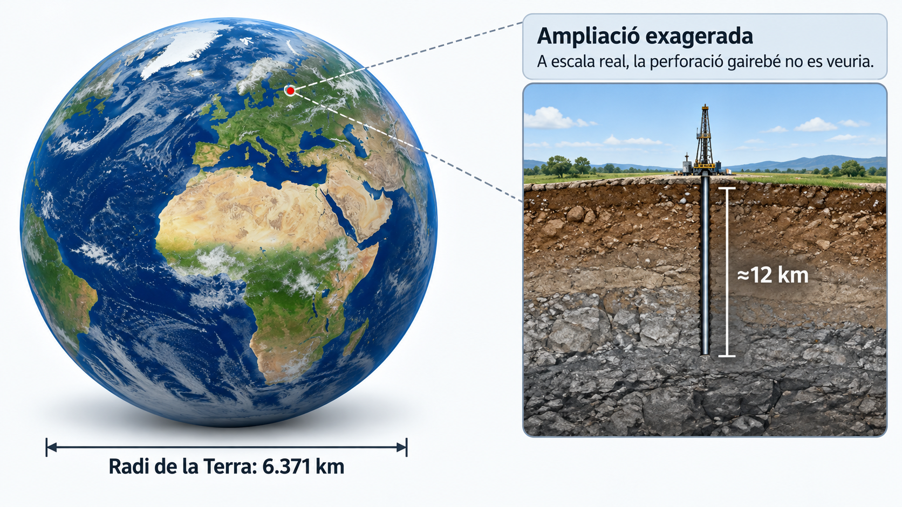
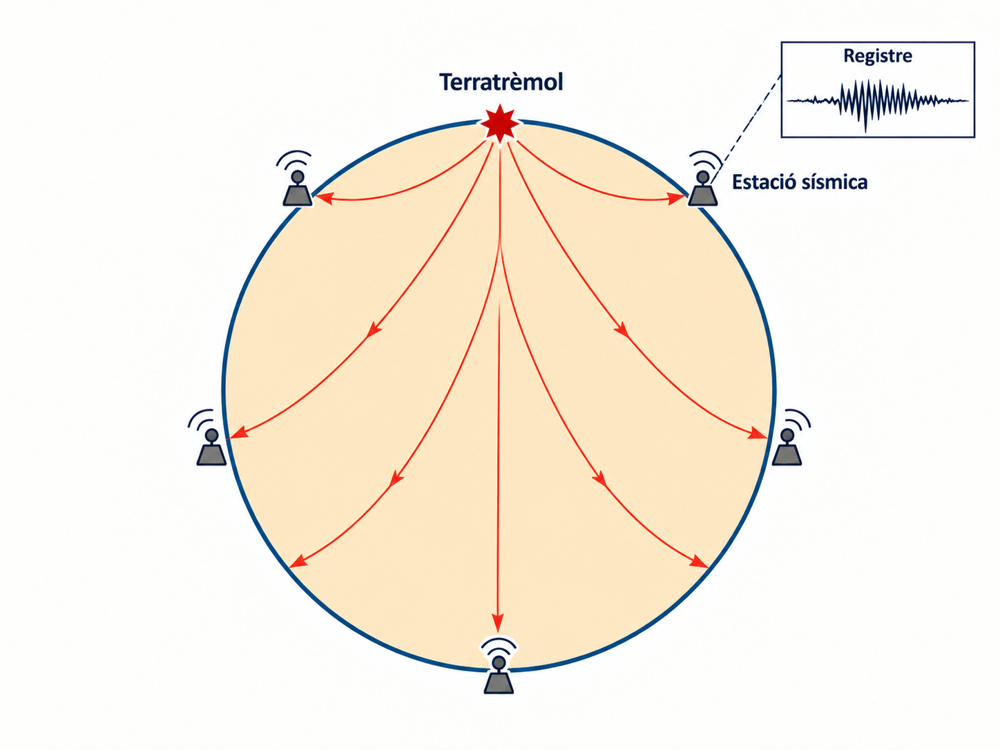
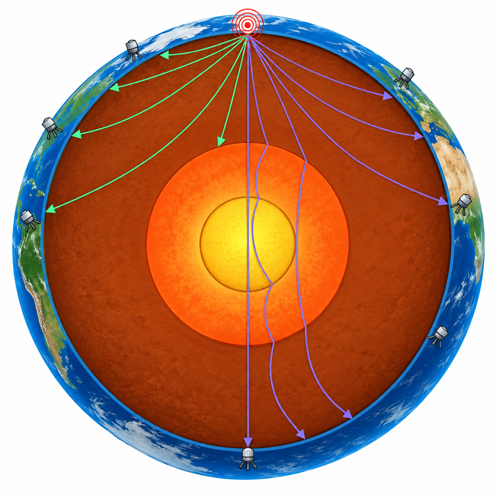
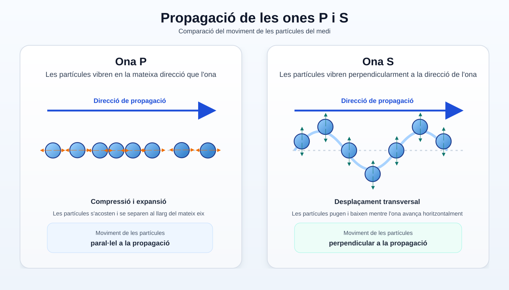
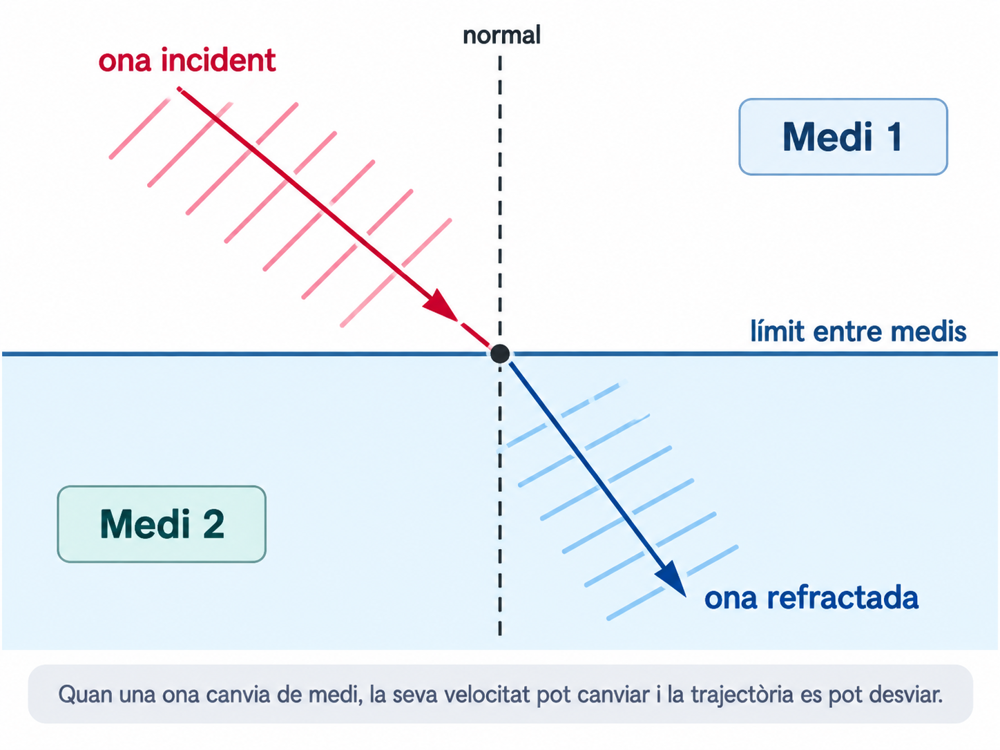
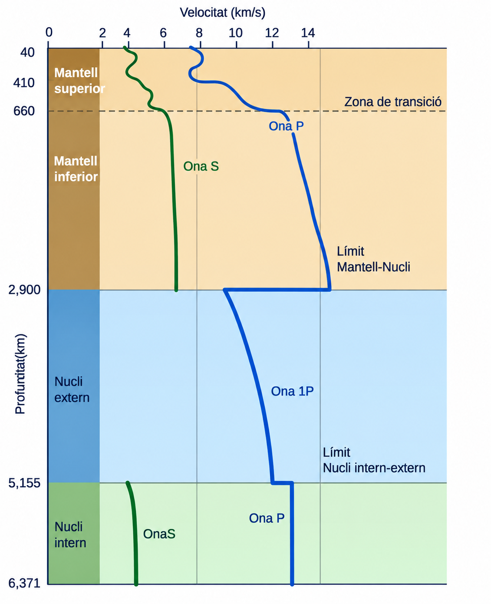
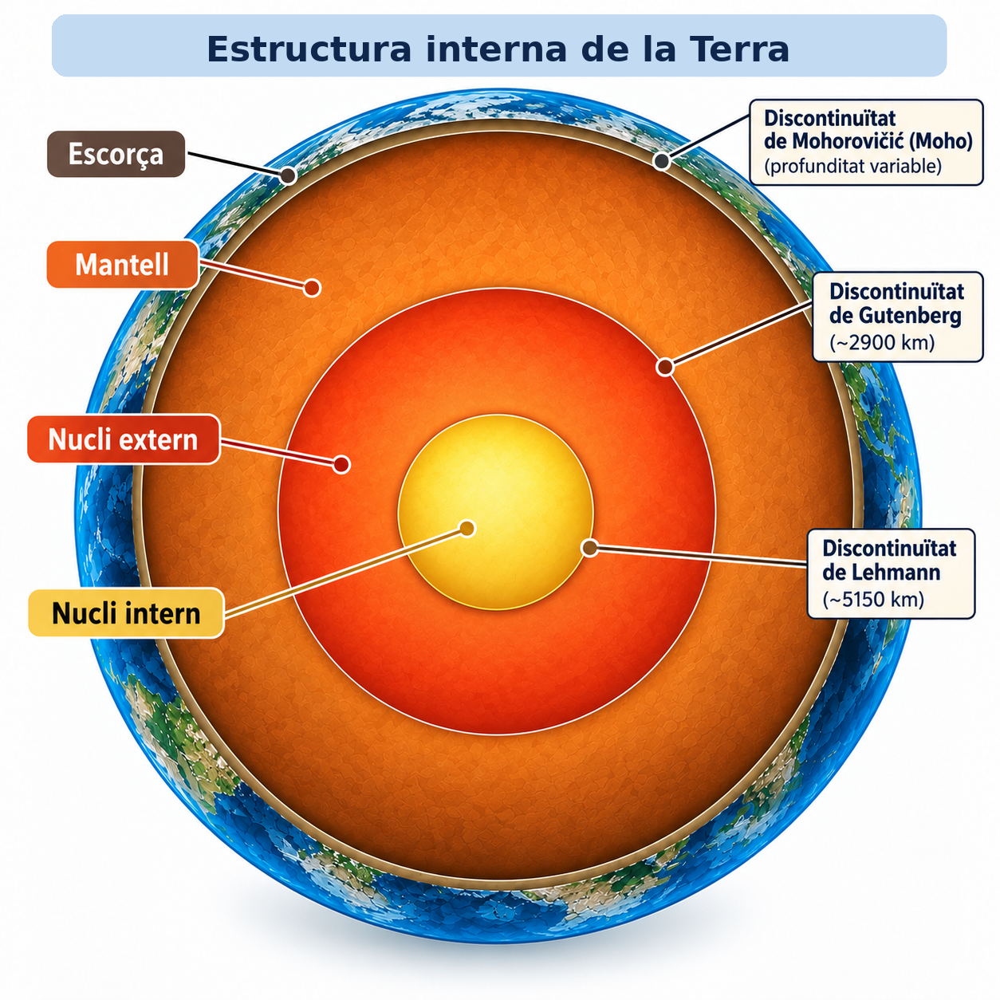

<section class="pv-seccio pv-portada" markdown>

# Com sabem què hi ha dins la Terra?

## Una investigació sobre allò que no podem veure directament

<!-- DOCENT: Sessió 4 de construcció. Idea rectora: l'estructura interna de la Terra no s'observa directament; es construeix a partir d'evidències. No mostrar encara els models geoquímic o geodinàmic. -->

</section>

<section class="pv-seccio pv-visual" markdown>

# 1 · El repte

Sabem moltes coses sobre l'interior de la Terra.

Però hi ha un problema:

<strong>no hi podem anar a mirar.</strong>

<strong>Com podem saber què hi ha dins la Terra si no ho podem observar directament?</strong>

Pensau-hi durant mig minut abans de continuar.

<!-- DOCENT: No donar encara cap mètode. L'objectiu és convertir “com és la Terra per dins?” en “com ho sabem?”. -->

</section>

<section class="pv-seccio" markdown>

# 1.1 · Què podríem fer?

Imaginau que encara no coneixem l'estructura interna de la Terra.

<strong>Quina d'aquestes opcions ens donaria informació més directa sobre els materials de l'interior?</strong>

  

    <button type="button" class="pv-opcio" data-feedback="repte-perforar" aria-pressed="false">A · Fer perforacions i estudiar les roques extretes</button>
    <button type="button" class="pv-opcio" data-feedback="repte-satellit" aria-pressed="false">B · Observar fotografies de la superfície des de satèl·lits</button>
    <button type="button" class="pv-opcio" data-feedback="repte-senyal" aria-pressed="false">C · Analitzar un senyal que travessi l'interior</button>
    <button type="button" class="pv-opcio" data-feedback="repte-impossible" aria-pressed="false">D · No hi ha cap manera d'obtenir informació</button>
  

  

    <strong>Sí.</strong> Si extreim una roca, podem observar-la i analitzar-la directament.
    
Però queda una qüestió: <strong>fins a quina profunditat podem arribar?</strong>

  

  

    <strong>No basta.</strong> Les fotografies de la superfície aporten molta informació, però no ens mostren què hi ha a milers de quilòmetres de profunditat.
  

  

    <strong>Aquesta és una possibilitat molt important.</strong> Si un senyal travessa l'interior i en podem estudiar els canvis, pot aportar informació sobre els materials que ha travessat.
    
Hi tornarem després.

  

  

    <strong>No necessàriament.</strong> En ciència sovint podem estudiar una cosa que no veim directament a partir de les evidències que produeix.
  

<!-- DOCENT: La pregunta demana la informació més directa, no l'únic mètode útil. C és deliberadament una pista que es recuperarà després. -->

</section>

<section class="pv-seccio" markdown>

# 1.2 · Dues maneres d'investigar

Podem obtenir informació de dues maneres generals:

### Observació directa

Estudiam **materials als quals podem accedir**.

### Informació indirecta

Mesuram **senyals, propietats o efectes** i els interpretam.

### El problema

La major part de l'interior terrestre és **inaccessible directament**.

<strong>Per tant, abans d'estudiar els senyals indirectes, convé saber fins on podem arribar realment.</strong>

</section>

<section class="pv-seccio" markdown>

# 2 · Fins on podem observar directament?

Una manera aparentment senzilla d'investigar l'interior terrestre és **perforar**.

Però la Terra és enorme.

<strong>Quina profunditat creis que ha assolit una de les perforacions més profundes fetes per humans?</strong>

  

    <button type="button" class="pv-opcio" data-feedback="prof-12" aria-pressed="false">A · Uns 12 km</button>
    <button type="button" class="pv-opcio" data-feedback="prof-120" aria-pressed="false">B · Uns 120 km</button>
    <button type="button" class="pv-opcio" data-feedback="prof-1200" aria-pressed="false">C · Uns 1.200 km</button>
    <button type="button" class="pv-opcio" data-feedback="prof-3000" aria-pressed="false">D · Més de 3.000 km</button>
  

  

    <strong>Exacte.</strong> Les perforacions més profundes han arribat a poc més de <strong>12 km</strong>.
    
Ara falta posar aquesta distància en perspectiva.

  

  

    <strong>És massa.</strong> Arribar a 120 km continua molt fora de les possibilitats actuals de perforació.
  

  

    <strong>És molt més profund del que hem aconseguit.</strong> Les perforacions reals només arriben a una petita fracció d'aquesta distància.
  

  

    <strong>No ens hi acostam.</strong> Comparau aquesta estimació amb la dada real: poc més de 12 km.
  

<!-- DOCENT: No convertir la dada de 12 km en contingut memorístic. Serveix només per construir l'escala del problema. -->

</section>

<section class="pv-seccio" markdown>

# 2.1 · Posam-ho a escala

El radi mitjà de la Terra és d'uns **6.371 km**.

Una perforació d'uns **12 km** representa només aproximadament el **0,2 % del radi terrestre**.

<strong>Si dibuixàssim la Terra a escala, com es veuria aquesta perforació?</strong>

  

    <button type="button" class="pv-opcio" data-feedback="escala-quart" aria-pressed="false">A · Arribaria aproximadament a una quarta part del radi</button>
    <button type="button" class="pv-opcio" data-feedback="escala-prima" aria-pressed="false">B · Seria una marca gairebé imperceptible a la superfície</button>
    <button type="button" class="pv-opcio" data-feedback="escala-centre" aria-pressed="false">C · Arribaria gairebé fins al centre</button>
  

  

    <strong>No.</strong> Una quarta part del radi serien més de 1.500 km, molt lluny dels aproximadament 12 km assolits.
  

  

    <strong>Exacte.</strong> A escala planetària, les perforacions humanes només han <strong>gratat una fracció minúscula de la superfície</strong>.
  

  

    <strong>No.</strong> El centre és a uns 6.371 km de profunditat; una perforació de 12 km n'és una fracció ínfima.
  

**12 km de perforació → aproximadament 0,2 % del radi terrestre**

<!-- DOCENT: Fer notar que una perforació dibuixada amb gruix visible sobre una Terra sencera no estaria a escala. La desproporció és el contingut. -->

</section>

<section class="pv-seccio" markdown>

# 2.2 · Perforar no és l'única observació directa

També podem estudiar materials terrestres que són accessibles per altres vies.

### Perforacions

Permeten extreure i analitzar **mostres del subsòl**.

### Mines i afloraments

Permeten observar **roques accessibles** directament.

### Materials transportats

Alguns processos geològics duen fins a la superfície **fragments originats a més profunditat**.

<strong>Quina d'aquestes observacions NO és una mostra directa d'un material terrestre?</strong>

  

    <button type="button" class="pv-opcio" data-feedback="directe-perforacio" aria-pressed="false">A · Una roca extreta d'una perforació</button>
    <button type="button" class="pv-opcio" data-feedback="directe-mina" aria-pressed="false">B · Una roca recollida en una mina</button>
    <button type="button" class="pv-opcio" data-feedback="directe-sisme" aria-pressed="false">C · Un senyal detectat després d'un terratrèmol</button>
    <button type="button" class="pv-opcio" data-feedback="directe-fragment" aria-pressed="false">D · Un fragment de roca profunda transportat fins a la superfície</button>
  

  

    <strong>Sí que és directa.</strong> Podem observar i analitzar físicament la mostra extreta.
  

  

    <strong>Sí que és directa.</strong> La roca és accessible i la podem estudiar directament.
  

  

    <strong>Exacte.</strong> El senyal sísmic no és una mostra de roca. L'haurem d'interpretar per deduir com és el medi que ha travessat.
  

  

    <strong>És una mostra directa, però cal interpretar-la amb precaució.</strong> Podem estudiar el fragment físicament, encara que després hàgim de determinar d'on procedeix i què representa.
  

<!-- DOCENT: Evitar presentar la lava com una mostra intacta de qualsevol zona profunda. La idea és distingir “tenir material a les mans” de “inferir propietats a partir d'un senyal”. -->

</section>

<section class="pv-seccio" markdown>

# 2.3 · Directe no significa profund

Els mètodes directes tenen un gran avantatge:

**podem observar, mesurar i analitzar materials reals.**

Però tenen una limitació decisiva:

**la immensa majoria de l'interior terrestre queda fora del nostre abast.**

<strong>Podríem construir un model de tot l'interior terrestre només amb les mostres directes?</strong>

  

    <button type="button" class="pv-opcio" data-feedback="nomes-si" aria-pressed="false">Sí</button>
    <button type="button" class="pv-opcio" data-feedback="nomes-no" aria-pressed="false">No</button>
  

  

    <strong>No basta.</strong> Les mostres directes són molt valuoses, però provenen només d'una part molt petita de la Terra o de materials que han estat transportats.
  

  

    <strong>Exacte.</strong> Per estudiar l'interior profund necessitam dades que puguem obtenir <strong>sense haver-hi d'arribar</strong>.
  

</section>

<section class="pv-seccio" markdown>

# 2.4 · Posam nom al que hem descobert

### Mètodes directes

Estudiam **materials als quals podem accedir**.

Perforacions, mines, afloraments i determinats materials procedents de zones més profundes.

### Mètodes indirectes

Mesuram **propietats, senyals o efectes** i els utilitzam per deduir com deu ser l'interior.

### Conseqüència

Per conèixer la major part de la Terra haurem de treballar sobretot amb **evidències indirectes**.

<!-- DOCENT: Formalitzar aquí els termes “mètodes directes” i “mètodes indirectes”, després que l'alumnat ja n'hagi construït la diferència. -->

</section>

<section class="pv-seccio" markdown>

# 2.5 · Necessitam una sonda que no hàgim de construir

Si nosaltres no podem arribar a l'interior...

<strong>necessitam alguna cosa que sí que el travessi.</strong>

  
<strong>Quin tipus d'informació seria més útil?</strong>

  

    <button type="button" class="pv-opcio" data-feedback="sonda-superficie" aria-pressed="false">A · Un senyal que només recorregués la superfície</button>
    <button type="button" class="pv-opcio" data-feedback="sonda-interior" aria-pressed="false">B · Un senyal que travessàs l'interior i que poguéssim detectar després</button>
    <button type="button" class="pv-opcio" data-feedback="sonda-foto" aria-pressed="false">C · Una fotografia de la superfície terrestre</button>
  

  

    <strong>Ens aportaria sobretot informació superficial.</strong> Necessitam alguna cosa que hagi interaccionat amb les zones profundes que volem investigar.
  

  

    <strong>Exacte.</strong> Si un senyal travessa l'interior i el seu comportament depèn dels materials que troba, pot actuar com una <strong>sonda indirecta</strong>.
    
La Terra mateixa ens proporciona aquests senyals.

  

  

    <strong>No basta.</strong> La fotografia mostra la superfície; nosaltres cercam informació que hagi travessat l'interior.
  

<strong>Què passa durant un terratrèmol que ens pugui servir per investigar l'interior?</strong>

<!-- DOCENT: Aturar aquí i recollir hipòtesis. La pantalla següent introduirà les ones sísmiques com a dades, no com una definició a memoritzar. -->

</section>

<section class="pv-seccio" markdown>

# Queda't amb això

**Els mètodes directes ens donen mostres reals, però només d'una part molt petita de la Terra. Per investigar-ne l'interior profund necessitam evidències indirectes.**

</section>

<section class="pv-seccio pv-visual" markdown>

# 3 · Un terratrèmol ens envia informació

Quan es produeix un **terratrèmol**, s'originen vibracions que es propaguen per la Terra.

Aquestes vibracions són les **ones sísmiques**.

<strong>Què detecta una estació sísmica situada lluny del terratrèmol?</strong>

  

    <button type="button" class="pv-opcio" data-feedback="sisme-roques" aria-pressed="false">A · Roques procedents del lloc del terratrèmol</button>
    <button type="button" class="pv-opcio" data-feedback="sisme-ones" aria-pressed="false">B · Vibracions que s'han propagat per la Terra</button>
    <button type="button" class="pv-opcio" data-feedback="sisme-foto" aria-pressed="false">C · Una imatge directa de l'interior terrestre</button>
    <button type="button" class="pv-opcio" data-feedback="sisme-superficie" aria-pressed="false">D · Només el moviment de la zona situada damunt del terratrèmol</button>
  

  

    <strong>No.</strong> L'estació no rep materials procedents del lloc del terratrèmol.
  

  

    <strong>Exacte.</strong> L'estació registra <strong>vibracions que han viatjat per la Terra</strong>.
    
Aquestes ones poden haver recorregut grans distàncies abans d'arribar-hi.

  

  

    <strong>No.</strong> Un sismòmetre no obté una fotografia de l'interior. Registra el moviment del terreny.
  

  

    <strong>No.</strong> Les ones sísmiques es poden detectar molt lluny del lloc on s'ha produït el terratrèmol.
  

<!-- DOCENT: Idea clau: el terratrèmol funciona com una font natural de senyals que poden travessar la Terra. Encara no explicar P i S ni l'estructura interna. -->

</section>

<section class="pv-seccio" markdown>

# 3.1 · Del senyal a la dada

Una estació sísmica mesura el moviment del terreny al llarg del temps.

El resultat és un **registre sísmic**.

<strong>Quina d'aquestes informacions podem obtenir directament del registre?</strong>

  

    <button type="button" class="pv-opcio" data-feedback="registre-arribada" aria-pressed="false">A · Quan arriben les vibracions a l'estació</button>
    <button type="button" class="pv-opcio" data-feedback="registre-color" aria-pressed="false">B · El color de les roques que han travessat</button>
    <button type="button" class="pv-opcio" data-feedback="registre-capes" aria-pressed="false">C · El nombre exacte de capes de la Terra</button>
    <button type="button" class="pv-opcio" data-feedback="registre-composicio" aria-pressed="false">D · La composició exacta de tot l'interior terrestre</button>
  

  

    <strong>Exacte.</strong> El registre ens permet observar <strong>quan arriba un senyal i com varia el moviment del terreny</strong>.
    
Això és una <strong>dada</strong>. Per saber què significa, l'haurem d'interpretar.

  

  

    <strong>No.</strong> El registre mostra vibracions, no les característiques visuals de les roques.
  

  

    <strong>No directament.</strong> L'existència de regions internes diferents serà una interpretació construïda a partir de les dades.
  

  

    <strong>No.</strong> El registre no ens dona directament la composició de l'interior.
  

<!-- DOCENT: Separar explícitament dada i interpretació. Aquesta distinció serà necessària quan apareguin discontinuïtats i zones d'ombra. -->

</section>

<section class="pv-seccio" markdown>

# 3.2 · Observar no és el mateix que inferir

Suposau que, després d'un terratrèmol, obtenim registres de moltes estacions repartides per la superfície terrestre.

<strong>Quina d'aquestes afirmacions és una inferència i no una observació directa?</strong>

  

    <button type="button" class="pv-opcio" data-feedback="infer-arribada" aria-pressed="false">A · Una vibració arriba a una estació en un moment determinat</button>
    <button type="button" class="pv-opcio" data-feedback="infer-absencia" aria-pressed="false">B · Una estació no registra un determinat senyal</button>
    <button type="button" class="pv-opcio" data-feedback="infer-interior" aria-pressed="false">C · A l'interior hi ha regions amb propietats diferents</button>
    <button type="button" class="pv-opcio" data-feedback="infer-dues" aria-pressed="false">D · En un registre apareixen dues arribades separades</button>
  

  

    <strong>Això és una observació.</strong> Podem mesurar directament el moment d'arribada al registre.
  

  

    <strong>Això és una observació.</strong> Podem comprovar si l'estació ha registrat o no un senyal.
  

  

    <strong>Exacte.</strong> No observam directament aquestes regions.
    
La seva existència s'haurà de <strong>deduir a partir del comportament de les ones</strong>.

  

  

    <strong>Això és una observació.</strong> Les dues arribades són visibles en el registre.
  

**Observació → interpretació de les dades → inferència sobre l'interior**

<!-- DOCENT: Aquest esquema és central en tota la sessió. No presentar el model terrestre com una fotografia de l'interior, sinó com una construcció basada en evidències. -->

</section>

<section class="pv-seccio pv-visual" markdown>

# 3.3 · No totes les ones fan el mateix recorregut

Quan analitzam els registres sísmics amb més detall, podem distingir **diferents tipus d'ones**.

Observau les dues famílies de trajectòries representades a la figura.

<strong>Quina diferència important observau entre les dues famílies d'ones?</strong>

  

    <button type="button" class="pv-opcio" data-feedback="families-igual" aria-pressed="false">A · Les dues segueixen exactament els mateixos recorreguts</button>
    <button type="button" class="pv-opcio" data-feedback="families-diferent" aria-pressed="false">B · Una família travessa les regions centrals i l'altra no</button>
    <button type="button" class="pv-opcio" data-feedback="families-centre" aria-pressed="false">C · Les dues desapareixen quan arriben a les regions centrals</button>
    <button type="button" class="pv-opcio" data-feedback="families-superficie" aria-pressed="false">D · Cap de les dues entra a l'interior terrestre</button>
  

  

    <strong>No.</strong> Seguiu les trajectòries verdes i violetes cap a les zones més profundes.
  

  

    <strong>Exacte.</strong> Les dues famílies <strong>no es propaguen de la mateixa manera</strong>.
    
Les trajectòries violetes poden travessar regions que les verdes no travessen.

  

  

    <strong>No.</strong> Una de les dues famílies continua propagant-se per les regions centrals.
  

  

    <strong>No.</strong> Les dues famílies recorren l'interior, encara que no ho fan de la mateixa manera.
  

<!-- DOCENT: Primer fer descriure només el patró visual. No explicar encara per què passa. L'objectiu és que la diferència de comportament aparegui com una dada que necessita explicació. -->

</section>

<section class="pv-seccio" markdown>

# 3.4 · Posam nom a les dues famílies

Les dues famílies d'ones que acabam d'observar són:

### Ones P

En la figura anterior són les trajectòries **violetes**.

Poden arribar a regions que les altres ones no travessen.

### Ones S

En la figura anterior són les trajectòries **verdes**.

El seu recorregut queda limitat en arribar a determinades regions internes.

### La nova pregunta

**Per què P i S no es propaguen de la mateixa manera?**

<strong>Quina seria ara la pregunta més útil per continuar la investigació?</strong>

  

    <button type="button" class="pv-opcio" data-feedback="seguent-color" aria-pressed="false">A · De quin color són realment les ones P i S?</button>
    <button type="button" class="pv-opcio" data-feedback="seguent-material" aria-pressed="false">B · Com es comporten les ones P i S en materials diferents?</button>
    <button type="button" class="pv-opcio" data-feedback="seguent-nom" aria-pressed="false">C · Qui va posar nom a les ones P i S?</button>
  

  

    <strong>No.</strong> Els colors de la figura només serveixen per distingir visualment les dues famílies.
  

  

    <strong>Exacte.</strong> Si volem utilitzar les ones per investigar l'interior, necessitam saber <strong>com respon cada tipus d'ona davant medis diferents</strong>.
  

  

    <strong>No és la pregunta que ens ajudarà a interpretar les dades.</strong> Necessitam entendre el seu comportament físic.
  

**QUEDA'T AMB AIXÒ**

Un terratrèmol genera ones sísmiques que podem registrar a distància.  
Les ones **P i S no es propaguen de la mateixa manera**, i aquesta diferència pot donar-nos informació sobre l'interior de la Terra.

<!-- DOCENT: Tancament del punt 3. El següent bloc ha d'estudiar les propietats de P i S abans d'utilitzar-les per inferir l'estat físic i les discontinuïtats de l'interior. -->

</section>

<section class="pv-seccio pv-visual" markdown>

# 4 · Per què les ones P i S es comporten diferent?

Per interpretar les trajectòries de les ones sísmiques, primer hem d'entendre **com es mou el material quan passa cada tipus d'ona**.

<strong>Quina diferència fonamental hi ha entre el moviment de les partícules en una ona P i en una ona S?</strong>

  

    <button type="button" class="pv-opcio" data-feedback="moviment-correcte" aria-pressed="false">A · En les P el moviment és paral·lel a la propagació; en les S és perpendicular</button>
    <button type="button" class="pv-opcio" data-feedback="moviment-igual" aria-pressed="false">B · En les dues ones les partícules es mouen exactament igual</button>
    <button type="button" class="pv-opcio" data-feedback="moviment-s-quietes" aria-pressed="false">C · En les ones S les partícules no es mouen</button>
  

  

    <strong>Exacte.</strong> Les ones P produeixen sobretot <strong>compressions i expansions</strong>; les ones S produeixen una deformació transversal o de <strong>cisallament</strong>.
  

  

    <strong>No.</strong> Fixau-vos en les fletxes que indiquen el moviment de les partícules respecte de la direcció de propagació.
  

  

    <strong>No.</strong> En una ona S les partícules sí que vibren, però ho fan perpendicularment a la direcció en què avança l'ona.
  

<!-- DOCENT: No convertir “longitudinal/transversal” en l'objectiu memorístic. La diferència necessària és compressió versus cisallament, perquè permetrà predir el comportament en sòlids i líquids. -->

</section>

<section class="pv-seccio" markdown>

# 4.1 · Què passa en un sòlid?

En un **sòlid**, les partícules mantenen una posició relativa i el material pot transmetre tant una compressió com una deformació lateral.

<strong>Quines ones poden propagar-se per un material sòlid?</strong>

  

    <button type="button" class="pv-opcio" data-feedback="solid-p" aria-pressed="false">A · Només les ones P</button>
    <button type="button" class="pv-opcio" data-feedback="solid-s" aria-pressed="false">B · Només les ones S</button>
    <button type="button" class="pv-opcio" data-feedback="solid-ps" aria-pressed="false">C · Les ones P i les ones S</button>
  

  

    <strong>No.</strong> Un sòlid també pot transmetre deformacions de cisallament, de manera que les ones S s'hi poden propagar.
  

  

    <strong>No.</strong> Els sòlids poden transmetre tant compressions com deformacions de cisallament.
  

  

    <strong>Exacte.</strong> En els sòlids es poden propagar <strong>tant les ones P com les ones S</strong>.
  

</section>

<section class="pv-seccio" markdown>

# 4.2 · I en un líquid?

Un líquid pot transmetre **compressions**, però no manté una deformació lateral de cisallament com ho fa un sòlid.

<strong>Què prediries que passarà amb les ones P i S quan arribin a un líquid?</strong>

  

    <button type="button" class="pv-opcio" data-feedback="liquid-dues" aria-pressed="false">A · Les P i les S travessaran el líquid</button>
    <button type="button" class="pv-opcio" data-feedback="liquid-p" aria-pressed="false">B · Les P el travessaran, però les S no</button>
    <button type="button" class="pv-opcio" data-feedback="liquid-cap" aria-pressed="false">C · Cap de les dues podrà travessar-lo</button>
  

  

    <strong>No.</strong> Per propagar-se, una ona S necessita que el medi pugui transmetre deformacions de cisallament.
  

  

    <strong>Exacte.</strong> Les <strong>ones P</strong> es poden propagar per sòlids i líquids; les <strong>ones S</strong> només es propaguen per sòlids.
  

  

    <strong>No.</strong> Les compressions sí que es poden transmetre a través d'un líquid, i per això les ones P hi poden continuar propagant-se.
  

**Sòlid → P i S**  
**Líquid → P sí · S no**

<!-- DOCENT: Aquesta és la propietat física decisiva per interpretar l'absència d'ones S en determinades regions. -->

</section>

<section class="pv-seccio pv-visual" markdown>

# 4.3 · Tornam a les dades

Ara recuperam les trajectòries que havíem observat abans.

Recordau:

- les trajectòries **violetes** representen ones P;
- les trajectòries **verdes** representen ones S.

<strong>Si les ones S no es propaguen per líquids, quina hipòtesi és compatible amb el fet que deixin de travessar una determinada regió interna?</strong>

  

    <button type="button" class="pv-opcio" data-feedback="infer-liquid-buit" aria-pressed="false">A · La regió ha d'estar completament buida</button>
    <button type="button" class="pv-opcio" data-feedback="infer-liquid-freda" aria-pressed="false">B · La regió ha de ser necessàriament més freda</button>
    <button type="button" class="pv-opcio" data-feedback="infer-liquid-correcte" aria-pressed="false">C · La regió podria estar en estat líquid</button>
    <button type="button" class="pv-opcio" data-feedback="infer-liquid-distancia" aria-pressed="false">D · Les ones S desapareixen simplement perquè han recorregut molta distància</button>
  

  

    <strong>No.</strong> L'absència d'ones S no implica que la regió sigui buida.
  

  

    <strong>No.</strong> Aquesta observació no ens permet deduir directament la temperatura.
  

  

    <strong>Exacte.</strong> La dada és <strong>compatible amb l'existència d'una regió líquida</strong> a l'interior de la Terra.
    
No l'hem observada directament: és una inferència construïda a partir del comportament de les ones.

  

  

    <strong>No.</strong> El patró depèn del recorregut per l'interior, no simplement de la distància total recorreguda.
  

<!-- DOCENT: Insistir en “compatible amb”, no en “demostra per si sola”. La inferència es basa en combinar la dada amb una propietat coneguda de les ones S. -->

</section>

<section class="pv-seccio" markdown>

# 4.4 · De la dada a la inferència

### OBSERVAM

Les ones **S no travessen** una determinada regió interna.

### SABEM

Les ones **S no es propaguen pels líquids**.

### INFERIM

Aquesta regió interna **podria estar en estat líquid**.

<strong>Quina part d'aquest raonament és una observació directa?</strong>

  

    <button type="button" class="pv-opcio" data-feedback="cadena-observacio" aria-pressed="false">A · Que les ones S no arriben a determinades zones</button>
    <button type="button" class="pv-opcio" data-feedback="cadena-inferencia" aria-pressed="false">B · Que existeix una regió interna líquida</button>
  

  

    <strong>Exacte.</strong> Això és allò que podem detectar amb els registres sísmics. L'estat líquid de la regió és una <strong>inferència</strong>.
  

  

    <strong>No.</strong> No observam directament aquesta regió. En deduïm l'estat físic a partir de les dades sísmiques.
  

**QUEDA'T AMB AIXÒ**

Les ones **P** poden propagar-se per sòlids i líquids. Les ones **S** només es propaguen per sòlids.  
Aquesta diferència ens permet utilitzar les ones sísmiques per inferir l'estat físic de materials que no podem observar directament.

<strong>Però les ones P també canvien de direcció en determinats punts. Què ens pot indicar això?</strong>

<!-- DOCENT: Aquesta pregunta obre el punt 5: canvi de velocitat, refracció i discontinuïtats. -->

</section>

<section class="pv-seccio pv-visual" markdown>

# 5 · Quan una ona canvia de medi

Les ones sísmiques no es propaguen necessàriament a la mateixa velocitat en tots els materials.

Quan una ona passa d'un medi a un altre, **la seva velocitat pot canviar** i, com a conseqüència, la seva trajectòria es pot desviar.

<strong>Què pot passar amb la trajectòria d'una ona quan entra en un medi on es propaga a una velocitat diferent?</strong>

  

    <button type="button" class="pv-opcio" data-feedback="refraccio-recta" aria-pressed="false">A · Sempre continua exactament en línia recta</button>
    <button type="button" class="pv-opcio" data-feedback="refraccio-desvia" aria-pressed="false">B · Pot canviar de direcció</button>
    <button type="button" class="pv-opcio" data-feedback="refraccio-desapareix" aria-pressed="false">C · Necessàriament desapareix</button>
  

  

    <strong>No.</strong> Si la velocitat de propagació canvia en passar d'un medi a un altre, la trajectòria també es pot desviar.
  

  

    <strong>Exacte.</strong> Aquest canvi de direcció quan una ona passa d'un medi a un altre s'anomena <strong>refracció</strong>.
  

  

    <strong>No necessàriament.</strong> Una ona pot continuar propagant-se en el nou medi, però amb una velocitat i una direcció diferents.
  

<!-- DOCENT: No introduir la llei de Snell ni càlculs d'angles. Només necessitam la relació qualitativa canvi de medi → canvi de velocitat → possible refracció. -->

</section>

<section class="pv-seccio" markdown>

# 5.1 · Què ens diu una desviació?

Suposau que una ona sísmica canvia bruscament de velocitat i de direcció a una determinada profunditat.

<strong>Quina explicació és més raonable?</strong>

  

    <button type="button" class="pv-opcio" data-feedback="desviacio-atzar" aria-pressed="false">A · L'ona canvia de recorregut a l'atzar</button>
    <button type="button" class="pv-opcio" data-feedback="desviacio-medi" aria-pressed="false">B · Han canviat les propietats del medi que travessa</button>
    <button type="button" class="pv-opcio" data-feedback="desviacio-buit" aria-pressed="false">C · Necessàriament hi ha un espai buit</button>
  

  

    <strong>No.</strong> Els canvis sistemàtics que detectam en moltes ones tenen una causa física.
  

  

    <strong>Exacte.</strong> El canvi de propagació és una evidència que l'ona ha entrat en una regió amb <strong>propietats diferents</strong>.
  

  

    <strong>No.</strong> Un canvi de velocitat o direcció no implica que hi hagi un buit; pot indicar un canvi de composició, densitat, rigidesa o estat físic.
  

<!-- DOCENT: Evitar identificar automàticament “propietats diferents” amb “composició diferent”. El canvi pot ser composicional, físic o una combinació dels dos. -->

</section>

<section class="pv-seccio pv-visual" markdown>

# 5.2 · Tornam a les trajectòries

Ara podem interpretar millor algunes de les trajectòries de les ones P que havíem observat.

<strong>Què passa amb algunes ones P quan travessen el límit entre dues regions internes?</strong>

  

    <button type="button" class="pv-opcio" data-feedback="p-desapareixen" aria-pressed="false">A · Desapareixen totes</button>
    <button type="button" class="pv-opcio" data-feedback="p-refracten" aria-pressed="false">B · Canvien de direcció</button>
    <button type="button" class="pv-opcio" data-feedback="p-transformen" aria-pressed="false">C · Es converteixen totes en ones S</button>
  

  

    <strong>No.</strong> Les ones P es poden continuar propagant per les regions representades.
  

  

    <strong>Exacte.</strong> Quan canvia el medi, canvia la velocitat de propagació i la trajectòria es pot <strong>refractar</strong>.
  

  

    <strong>No.</strong> La figura mostra sobretot un canvi en la trajectòria de les ones P, no una transformació general en ones S.
  

</section>

<section class="pv-seccio pv-visual" markdown>

# 5.3 · Miram la velocitat amb la profunditat

Podem representar d'una altra manera les dades sísmiques: mesurant **a quina velocitat es poden propagar les ones P i S en els materials de cada profunditat**.

<strong>On observau els canvis més bruscs en el comportament de les ones?</strong>

  

    <button type="button" class="pv-opcio" data-feedback="grafica-superficie" aria-pressed="false">A · Només a la superfície</button>
    <button type="button" class="pv-opcio" data-feedback="grafica-limits" aria-pressed="false">B · Al voltant dels 2.900 km i dels 5.155 km</button>
    <button type="button" class="pv-opcio" data-feedback="grafica-cap" aria-pressed="false">C · No hi ha cap canvi brusc</button>
  

  

    <strong>No.</strong> Fixau-vos especialment en els límits entre el mantell i el nucli, i entre el nucli extern i l'intern.
  

  

    <strong>Exacte.</strong> A aquestes profunditats les corbes mostren canvis bruscs: són evidències que les propietats del medi també canvien.
  

  

    <strong>Sí que n'hi ha.</strong> Les corbes no evolucionen sempre de manera gradual: presenten canvis molt marcats en determinades profunditats.
  

**Important:** el tram d'ones S representat al nucli intern indica que el **material del nucli intern sòlid pot transmetre ones de cisallament**. No significa que una mateixa ona S hagi travessat el nucli extern líquid.

<!-- DOCENT: Aquesta precisió evita una contradicció aparent amb el punt 4. La gràfica representa propietats de propagació dels materials a cada profunditat, no necessàriament el recorregut continu d'una mateixa ona. -->

</section>

<section class="pv-seccio" markdown>

# 5.4 · Una frontera que no podem veure

Quan les dades sísmiques indiquen un **canvi brusc de propietats** a una determinada profunditat, podem inferir que hi ha un límit entre dues regions internes.

Aquest límit s'anomena **discontinuïtat sísmica**.

**Discontinuïtat sísmica:** frontera interna on les propietats del medi canvien prou perquè també canviï el comportament de les ones sísmiques.

<strong>Una discontinuïtat és una línia que els científics han observat directament dins la Terra?</strong>

  

    <button type="button" class="pv-opcio" data-feedback="discontinuitat-si" aria-pressed="false">Sí</button>
    <button type="button" class="pv-opcio" data-feedback="discontinuitat-no" aria-pressed="false">No</button>
  

  

    <strong>No.</strong> No podem observar directament aquests límits a milers de quilòmetres de profunditat.
  

  

    <strong>Exacte.</strong> Les discontinuïtats són <strong>fronteres inferides a partir de les dades sísmiques</strong>: canvis de velocitat, trajectòria o propagació.
  

</section>

<section class="pv-seccio" markdown>

# 5.5 · De les dades al model

### OBSERVAM

Les ones canvien bruscament de **velocitat, direcció o propagació**.

### SABEM

El comportament de les ones depèn de les **propietats del medi**.

### INFERIM

A aquella profunditat hi ha un **canvi de propietats** i, per tant, una frontera interna.

<strong>Quina afirmació descriu millor el que ens aporten les ones sísmiques?</strong>

  

    <button type="button" class="pv-opcio" data-feedback="model-foto" aria-pressed="false">A · Ens proporcionen una fotografia directa de les capes terrestres</button>
    <button type="button" class="pv-opcio" data-feedback="model-inferencia" aria-pressed="false">B · Ens permeten inferir fronteres entre regions amb propietats diferents</button>
    <button type="button" class="pv-opcio" data-feedback="model-mineral" aria-pressed="false">C · Cada canvi de velocitat identifica directament un mineral concret</button>
  

  

    <strong>No.</strong> Les dades sísmiques són mesures indirectes que necessiten interpretació.
  

  

    <strong>Exacte.</strong> Els canvis en la propagació de les ones ens permeten construir un <strong>model de regions internes separades per discontinuïtats</strong>.
  

  

    <strong>No.</strong> Un canvi de velocitat indica un canvi de propietats, però no identifica per si sol un mineral concret.
  

**QUEDA'T AMB AIXÒ**

Quan una ona sísmica entra en un medi amb propietats diferents, la seva velocitat pot canviar i la trajectòria es pot **refractar**.  
Els canvis bruscs en la propagació ens permeten inferir **discontinuïtats** a l'interior terrestre.

<strong>Amb totes aquestes evidències, quin model de l'interior de la Terra podem construir?</strong>

<!-- DOCENT: Aquesta pregunta obre el punt següent, on es sintetitzaran les evidències en un model de l'estructura interna. -->

</section>

<section class="pv-seccio" markdown>

# 6 · De les evidències a una estructura interna

Durant aquesta investigació **no hem observat directament l'interior de la Terra**.

Però les ones sísmiques ens han deixat diverses pistes:

### Canvis de velocitat

Les ones no es propaguen igual a totes les profunditats.

### Refraccions

Les trajectòries canvien quan les ones entren en medis amb propietats diferents.

### P i S no fan el mateix

Les ones S no es propaguen pel nucli extern, mentre que les P sí.

<strong>Quina conclusió general és compatible amb totes aquestes dades?</strong>

  

    <button type="button" class="pv-opcio" data-feedback="estructura-homogenia" aria-pressed="false">A · L'interior de la Terra és homogeni</button>
    <button type="button" class="pv-opcio" data-feedback="estructura-regions" aria-pressed="false">B · L'interior està format per regions amb propietats diferents</button>
    <button type="button" class="pv-opcio" data-feedback="estructura-liquid" aria-pressed="false">C · Tot l'interior de la Terra és líquid</button>
  

  

    <strong>No.</strong> Si l'interior fos homogeni, no esperaríem canvis bruscs i sistemàtics en la velocitat i la trajectòria de les ones.
  

  

    <strong>Exacte.</strong> Les dades indiquen que l'interior terrestre està format per <strong>regions amb propietats diferents</strong>.
  

  

    <strong>No.</strong> Les dades només indiquen una gran regió interna líquida; altres regions transmeten ones de cisallament i, per tant, són compatibles amb materials sòlids.
  

<!-- DOCENT: Aquesta és la síntesi de les evidències construïdes als punts 3, 4 i 5. No desenvolupam aquí els models geoquímic i geodinàmic: la sessió tanca la inferència de l'estructura interna. -->

</section>

<section class="pv-seccio pv-visual" markdown>

# 6.1 · Posam nom a les grans fronteres

Recuperau la gràfica de velocitat de les ones amb la profunditat.

Els canvis bruscs permeten situar **discontinuïtats**, és a dir, fronteres entre regions internes amb propietats diferents.

### Moho

**Discontinuïtat de Mohorovičić**

Separa l'**escorça** del **mantell**.

La seva profunditat és variable.

### Gutenberg

Se situa aproximadament a **2.900 km** de profunditat.

Separa el **mantell** del **nucli extern**.

### Lehmann

Se situa aproximadament a **5.150 km** de profunditat.

Separa el **nucli extern** del **nucli intern**.

<strong>Per què no podem assignar al Moho una única profunditat exacta per a tot el planeta?</strong>

  

    <button type="button" class="pv-opcio" data-feedback="moho-variable" aria-pressed="false">A · Perquè el gruix de l'escorça varia segons la zona</button>
    <button type="button" class="pv-opcio" data-feedback="moho-sense" aria-pressed="false">B · Perquè en algunes zones no existeix mantell</button>
    <button type="button" class="pv-opcio" data-feedback="moho-p" aria-pressed="false">C · Perquè les ones P no poden travessar l'escorça</button>
  

  

    <strong>Exacte.</strong> El gruix de l'escorça no és igual a tot arreu, i per això la profunditat del Moho també varia.
  

  

    <strong>No.</strong> El mantell es troba sota l'escorça a tot el planeta.
  

  

    <strong>No.</strong> Les ones P travessen l'escorça; de fet, els canvis en la seva propagació ens ajuden a detectar el límit amb el mantell.
  

<!-- DOCENT: Els noms de les discontinuïtats es formalitzen ara, després que l'alumnat ja hagi construït el concepte de discontinuïtat al punt 5. -->

</section>

<section class="pv-seccio pv-visual" markdown>

# 6.2 · Una representació de l'interior

Si combinam totes les evidències, podem representar l'interior de la Terra com un conjunt de grans regions separades per discontinuïtats.

<strong>Quina d'aquestes afirmacions descriu millor aquesta figura?</strong>

  

    <button type="button" class="pv-opcio" data-feedback="representacio-foto" aria-pressed="false">A · És una fotografia directa de l'interior terrestre</button>
    <button type="button" class="pv-opcio" data-feedback="representacio-model" aria-pressed="false">B · És una representació construïda a partir d'evidències</button>
    <button type="button" class="pv-opcio" data-feedback="representacio-atzar" aria-pressed="false">C · És un dibuix arbitrari sense relació amb dades</button>
  

  

    <strong>No.</strong> No podem observar directament aquestes profunditats.
  

  

    <strong>Exacte.</strong> La figura resumeix <strong>inferències construïdes a partir de dades</strong>, especialment del comportament de les ones sísmiques.
  

  

    <strong>No.</strong> Les fronteres representades corresponen a canvis detectats en les propietats i la propagació de les ones.
  

</section>

<section class="pv-seccio" markdown>

# 6.3 · Què podem dir sobre l'estat físic?

Les dades sísmiques també ens permeten inferir l'estat físic de les grans regions internes.

### Escorça i mantell

Són materials **majoritàriament sòlids**.

El mantell, però, pot deformar-se molt lentament a escala geològica.

### Nucli extern

És **líquid**.

Les ones S no s'hi propaguen.

### Nucli intern

És **sòlid**.

El material torna a poder transmetre deformacions de cisallament.

<strong>Quina afirmació és correcta?</strong>

  

    <button type="button" class="pv-opcio" data-feedback="estat-magma" aria-pressed="false">A · El mantell és una gran capa de magma líquid</button>
    <button type="button" class="pv-opcio" data-feedback="estat-mantell" aria-pressed="false">B · El mantell és majoritàriament sòlid, encara que es pot deformar lentament</button>
    <button type="button" class="pv-opcio" data-feedback="estat-nucli" aria-pressed="false">C · El nucli extern és sòlid i el nucli intern és líquid</button>
  

  

    <strong>No.</strong> El mantell és majoritàriament sòlid. Que alguns materials es deformin o flueixin lentament no significa que siguin una capa de magma líquid.
  

  

    <strong>Exacte.</strong> Aquesta distinció serà important quan estudieu com es poden organitzar les capes terrestres segons diferents criteris.
  

  

    <strong>No.</strong> Les dades sísmiques són compatibles amb un <strong>nucli extern líquid</strong> i un <strong>nucli intern sòlid</strong>.
  

<!-- DOCENT: Evitar explícitament la idea “mantell = magma”. Aquesta precisió serà útil per entendre la dinàmica interna de la Terra sense confondre deformació lenta amb estat líquid. -->

</section>

<section class="pv-seccio" markdown>

# 6.4 · De la dada a la representació

### DADA

Les ones canvien de velocitat, trajectòria i capacitat de propagació amb la profunditat.

### INFERÈNCIA

L'interior presenta regions amb propietats i estats físics diferents.

### REPRESENTACIÓ

Dibuixam fronteres i regions internes per sintetitzar allò que indiquen les evidències.

<strong>Què és el més important d'aquesta cadena?</strong>

  

    <button type="button" class="pv-opcio" data-feedback="cadena6-memoria" aria-pressed="false">A · Memoritzar el dibuix sense saber d'on prové</button>
    <button type="button" class="pv-opcio" data-feedback="cadena6-evidencia" aria-pressed="false">B · Entendre que la representació es justifica amb evidències</button>
    <button type="button" class="pv-opcio" data-feedback="cadena6-directe" aria-pressed="false">C · Pensar que les capes s'han observat directament</button>
  

  

    <strong>No.</strong> El valor científic del model és que explica dades observables, no que el dibuix es pugui memoritzar.
  

  

    <strong>Exacte.</strong> El fil de tota la investigació és <strong>dada → interpretació → inferència → representació</strong>.
  

  

    <strong>No.</strong> Les zones profundes no s'han observat directament; les inferim a partir de dades geofísiques.
  

**QUEDA'T AMB AIXÒ**

No coneixem l'interior terrestre perquè l'hàgim observat directament.  
Els canvis en el comportament de les ones sísmiques ens permeten inferir **discontinuïtats, regions internes i diferències d'estat físic**.

<strong>Ja sabem que l'interior de la Terra no és homogeni i que algunes de les seves regions es comporten de manera diferent. Però això encara no explica una cosa fonamental: per què la superfície terrestre està en moviment?</strong>

<!-- DOCENT: Aquesta pregunta obre la sessió següent, “Una Terra fragmentada”, i desplaça el focus de l'estructura interna cap a la dinàmica de la superfície. -->

</section>

<section class="pv-seccio" markdown>

# Tiquet de sortida · Al quadern

**AL QUADERN · 5 MINUTS**

Respon de manera breu, amb frases completes. No cal copiar els enunciats sencers.

1. **Dada o inferència?** Indica què és cada afirmació i justifica una de les dues.
   - a) En determinades estacions no es registren ones S procedents d'un terratrèmol.
   - b) A l'interior de la Terra hi ha una regió en estat líquid.

2. **Construeix la inferència.** Els registres mostren que les ones S no arriben a determinades zones de la superfície i sabem que les ones S no es propaguen pels líquids. Quina hipòtesi sobre l'interior és compatible amb aquestes dades?

3. **Per què sabem que l'interior no és homogeni?** Justifica-ho utilitzant almenys una evidència sísmica: un canvi de velocitat, una refracció o una diferència entre el comportament de les ones P i S.

4. **Model o fotografia?** Explica per què el dibuix de les capes internes de la Terra és un model científic i no una observació directa.

<!-- DOCENT: Tiquet de sortida al quadern, 4–5 minuts. Serveix com a comprovació diagnòstica abans de la sessió “Una Terra fragmentada”; no és una evidència formal. No donar retroacció automàtica a la web: interessa veure què poden reconstruir per escrit al final de la sessió. -->

</section>

