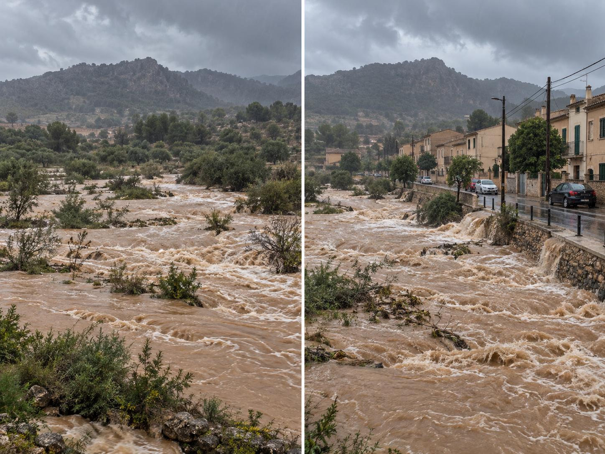

<section class="pv-seccio pv-portada" markdown>

# S15 · Quan un procés natural esdevé risc?

## Del procés natural al risc

Avui no començarem memoritzant definicions. Compararem situacions i intentarem descobrir **què fa que un procés natural pugui convertir-se en un risc**.

<!-- DOCENT: Sessió guiada. Objectiu: construir processos interns/externs, perill, exposició, vulnerabilitat, risc i prevenció, integrant litologia, relleu, vegetació, usos del territori, infraestructures i factors socioeconòmics. -->

</section>

<section class="pv-seccio pv-visual" markdown>

# 1 · El mateix procés, el mateix risc?

Observa les dues escenes.

<strong>Què és pràcticament igual en totes dues? Què canvia?</strong>

No cerquis encara paraules tècniques. Descriu simplement:

- què està passant;
- què podria quedar afectat;
- en quina de les dues situacions esperaries conseqüències més greus.

> **Idea clau:** que es produeixi un procés natural no significa necessàriament que hi hagi el mateix risc.

<!-- DOCENT: No introduir encara perill, exposició i vulnerabilitat. Fer que aparegui espontàniament la diferència entre el procés i allò que pot resultar afectat. -->

</section>

<section class="pv-seccio" markdown>

# 2 · La Terra està activa

Alguns processos geològics tenen l'origen principalment **a l'interior de la Terra**:

**terratrèmols · vulcanisme · deformació tectònica**

Altres actuen principalment **sobre la superfície**:

**erosió · inundacions · despreniments · transport i sedimentació**

Tots formen part del funcionament natural de la Terra.

<strong>Un despreniment en una zona sense persones, edificis ni infraestructures és necessàriament un desastre?</strong>

No.

El procés existeix, però per parlar de **risc** necessitam saber alguna cosa més.

</section>

<section class="pv-seccio pv-visual" markdown>

# 3 · Què pot passar aquí?

## Sant Llorenç des Cardassar

Ara passam a un territori real.

Apropa't al nucli urbà i segueix el traçat del torrent.

**Observa abans d'interpretar.**

<strong>On passa el torrent? Com és el seu llit dins el poble? Què hi ha a tocar seu?</strong>

Cerca especialment habitatges, carrers, carreteres, ponts, equipaments o altres infraestructures.

<!-- DOCENT: Separar observació i inferència. De l'ortofoto podem observar el traçat, la urbanització, la proximitat d'edificis i les modificacions del llit. No podem deduir només de l'ortofoto la probabilitat exacta d'una inundació ni afirmar els efectes hidràulics de l'encimentat. -->

</section>

<section class="pv-seccio" markdown>

# 4 · Posem nom a coses diferents

Ara podem separar tres idees que sovint es confonen.

## Perill

És la possibilitat que es produeixi un fenomen potencialment perjudicial en un lloc determinat.

En aquest cas ens podria interessar, per exemple, una **avinguda o inundació associada a pluges intenses**.

## Exposició

És tot allò que es troba en una zona que podria resultar afectada:

**persones · habitatges · vehicles · carreteres · serveis · activitats econòmiques**

A l'ortofoto de Sant Llorenç podem identificar directament molts d'aquests elements.

## Vulnerabilitat

No tots els elements exposats patirien el mateix dany.

La vulnerabilitat depèn de **com de susceptible és allò que està exposat**: tipus de construcció, ubicació, mesures de protecció, capacitat de resposta, característiques de la població, etc.

**perill + exposició + vulnerabilitat → risc**

> No és una fórmula per calcular. És una manera d'ordenar el raonament.

</section>

<section class="pv-seccio pv-visual" markdown>

# 5 · Tornam a la primera imatge

El procés és semblant.

<strong>Quin component canvia més clarament entre les dues escenes?</strong>

En la segona hi ha molts més elements que poden resultar afectats.

Per tant, augmenta sobretot **l'exposició**.

Ara imagina dues cases igualment exposades a una inundació:

**Casa A:** planta baixa oberta al carrer, sense cap mesura de protecció.  
**Casa B:** accessos protegits, mesures preventives i un pla d'evacuació.

El **perill** pot ser el mateix i l'**exposició** també.

Però la **vulnerabilitat** no és igual.

> Un mateix fenomen natural pot generar riscos molt diferents segons el territori i segons allò que hi hem construït.

</section>

<section class="pv-seccio" markdown>

# 6 · El territori modifica el problema

Per valorar un risc no basta saber quin fenomen es pot produir.

També hem de preguntar-nos **com és el lloc**.

| Factor | Per què pot importar? |
|---|---|
| **Relleu** | El pendent condiciona el moviment de l'aigua i dels materials. |
| **Litologia** | Els materials poden tenir comportaments diferents davant l'aigua, l'erosió o la inestabilitat. |
| **Vegetació** | Pot influir sobre l'escorrentia, l'erosió i l'estabilitat del sòl. |
| **Usos del territori** | No és el mateix una zona agrícola que una zona densament urbanitzada. |
| **Infraestructures** | Carreteres, ponts, edificis i serveis poden quedar exposats. |
| **Factors socioeconòmics** | La capacitat de prevenció, resposta i recuperació també modifica les conseqüències. |

> El relleu i la litologia que hem estudiat durant la unitat ara deixen de ser només coses que descrivim: **ens serveixen per prendre decisions.**

</section>

<section class="pv-seccio pv-visual" markdown>

# 7 · I les modificacions humanes?

Torna al visor de Sant Llorenç.

El torrent no presenta el mateix aspecte dins el nucli que fora d'ell.

<strong>Quines modificacions humanes hi observes?</strong>

Aquí podem formular una hipòtesi:

> Si modificam la forma, la superfície o el traçat d'un torrent, **podem modificar també el comportament de l'aigua?**

Sí, és possible. Però una ortofoto per si sola **no ens permet determinar quant ni en quin sentit**.

Per comprovar-ho necessitaríem altres dades: pendent, secció del canal, materials, cabals, velocitat de l'aigua, pluviometria...

<!-- DOCENT: Evitar convertir «llit encimentat = més risc» en una regla automàtica. L'observació genera una hipòtesi; demostrar-la requeriria dades hidrològiques. -->

</section>

<section class="pv-seccio" markdown>

# 8 · Podem reduir el risc?

No podem impedir que plogui intensament.

Tampoc podem impedir un terratrèmol.

Però això no significa que no puguem actuar.

Podem reduir el risc actuant sobre diferents parts del problema:

**Reduir l'exposició**  
Evitant determinats usos en zones perilloses.

**Reduir la vulnerabilitat**  
Adaptant edificis i infraestructures, establint sistemes d'alerta o millorant la capacitat de resposta.

**Reduir els efectes del fenomen quan sigui possible**  
Mitjançant mesures de gestió, protecció o enginyeria adequades.

Això és **prevenció**.

</section>

<section class="pv-seccio" markdown>

# 9 · Ara analitza tu

Una carretera passa pel peu d'un vessant molt inclinat format per roca fracturada. Després de pluges intenses s'hi poden produir caigudes de blocs.

Respon mentalment o amb un company:

1. **Quin és el perill?**
2. **Què està exposat?**
3. **De què podria dependre la vulnerabilitat?**
4. **Quina mesura podria reduir el risc?**

No basta dir «hi ha risc de despreniments».

Una explicació completa ha de relacionar:

**procés + territori + elements exposats + vulnerabilitat + possibles mesures**

</section>

<section class="pv-seccio" markdown>

# 10 · De comprendre el risc a prendre una decisió

Ja podem formular una pregunta molt més completa que al principi:

> **Quin procés es pot produir, què podria afectar, per què pot patir danys i què podem fer per reduir el risc?**

A la sessió següent no estudiarem una definició nova.

Haurem de prendre una **decisió territorial** utilitzant informació sobre:

**relleu · litologia · vegetació · infraestructures · risc**

I no totes les dades apuntaran necessàriament cap a la mateixa opció.

<!-- DOCENT: Pont directe cap a G2 convertida en pràctica aplicada per estacions. No anticipar quina alternativa és preferible ni mostrar encara els mapes de risc que s'introduiran posteriorment. -->

</section>

