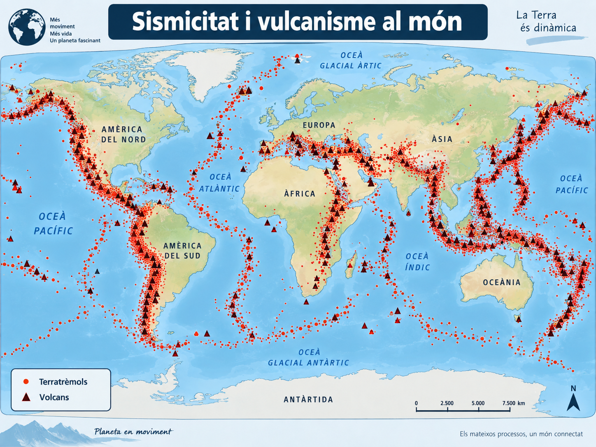
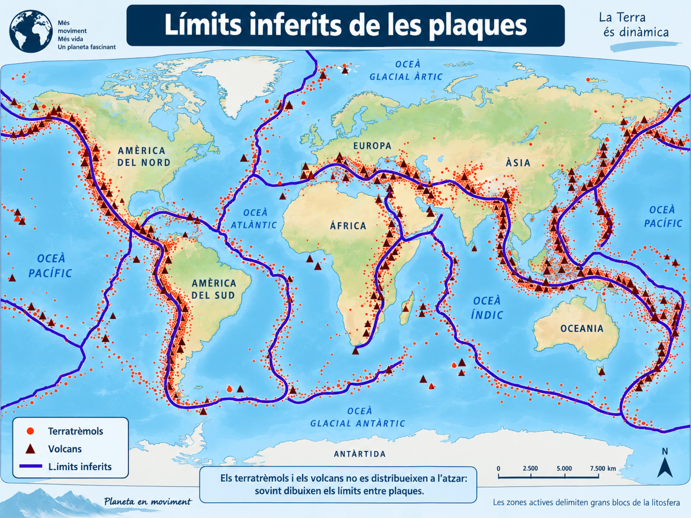
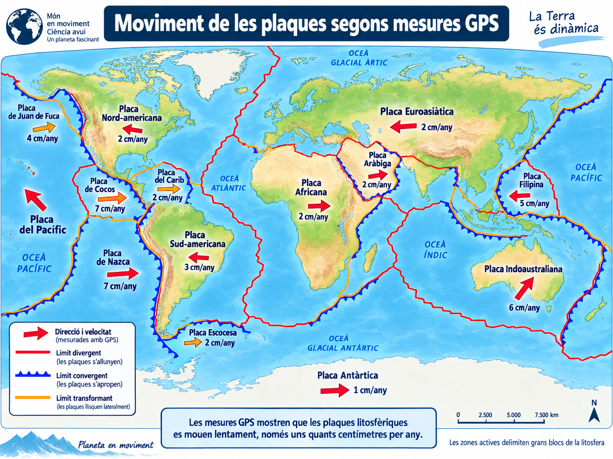
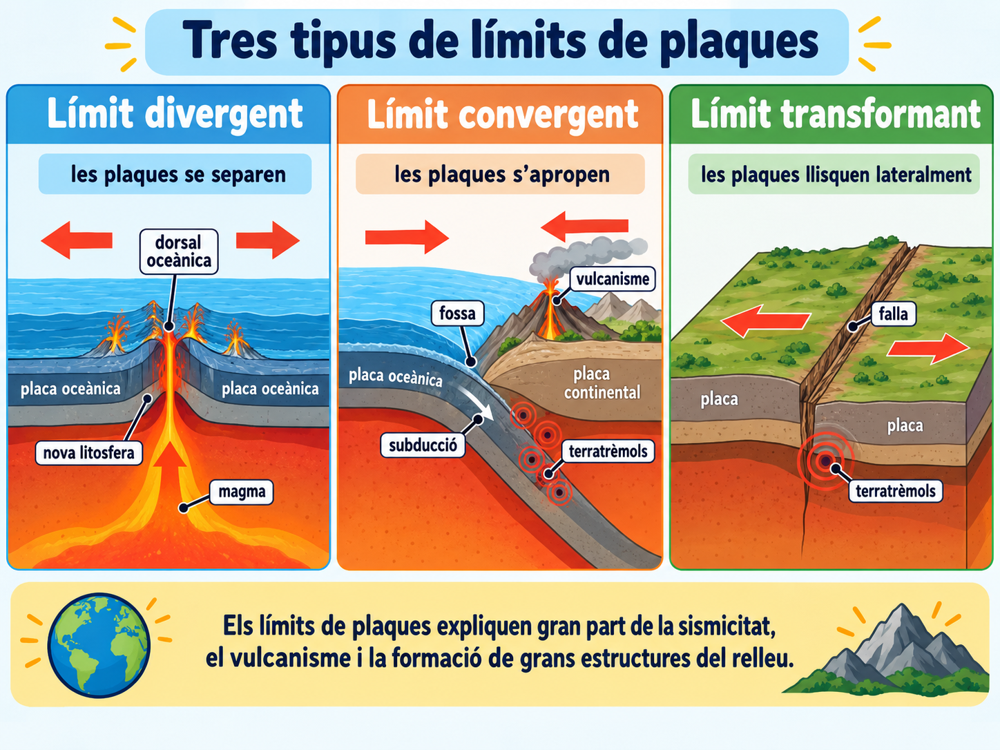

<section class="pv-seccio pv-portada" markdown>

# Una Terra fragmentada

## De patrons a la superfície a un model de plaques en moviment

<!-- DOCENT: Sessió de construcció posterior a “Com sabem què hi ha dins la Terra?”. Idea rectora: partir de patrons observables a la superfície i arribar progressivament al model de tectònica de plaques. No començar donant la definició de placa. -->

</section>

<section class="pv-seccio pv-visual" markdown>

# 1 · Un planeta amb zones molt actives

A la sessió anterior vàrem utilitzar els terratrèmols per investigar **l'interior** de la Terra.

Ara els mirarem des d'un altre punt de vista: **on es produeixen**.

Observau el mapa. Els punts representen terratrèmols i els triangles, volcans.

<strong>Com es distribueixen els terratrèmols i els volcans a escala mundial?</strong>

  

    <button type="button" class="pv-opcio" data-feedback="patro-atzar" aria-pressed="false">A · De manera pràcticament aleatòria</button>
    <button type="button" class="pv-opcio" data-feedback="patro-franges" aria-pressed="false">B · Es concentren sobretot en determinades franges</button>
    <button type="button" class="pv-opcio" data-feedback="patro-continents" aria-pressed="false">C · Només apareixen als continents</button>
  

  

    <strong>No.</strong> Hi ha grans zones amb poca activitat i unes altres on els punts i els volcans formen alineacions molt marcades.
  

  

    <strong>Exacte.</strong> Terratrèmols i volcans es concentren en <strong>franges llargues i relativament estretes</strong> del planeta.
  

  

    <strong>No.</strong> Una part molt important de l'activitat també se situa als oceans, per exemple al centre de l'Atlàntic o al voltant del Pacífic.
  

<!-- DOCENT: El mapa és una representació didàctica del patró global, no un catàleg exhaustiu d'esdeveniments. Fer descriure primer el patró abans d'explicar-lo. -->

</section>

<section class="pv-seccio" markdown>

# 1.1 · Un patró necessita una explicació

Fixau-vos en algunes zones especialment actives:

- el contorn de gran part de l'**oceà Pacífic**;
- una franja que recorre el centre de l'**oceà Atlàntic**;
- la regió **Mediterrània i asiàtica**;
- la costa occidental d'**Amèrica**.

<strong>Si terratrèmols i volcans es concentren repetidament en moltes de les mateixes zones, quina explicació és més raonable?</strong>

  

    <button type="button" class="pv-opcio" data-feedback="comu-coincidencia" aria-pressed="false">A · És una coincidència sense cap patró geològic</button>
    <button type="button" class="pv-opcio" data-feedback="comu-zones" aria-pressed="false">B · Aquestes franges tenen alguna característica geològica comuna</button>
    <button type="button" class="pv-opcio" data-feedback="comu-volca" aria-pressed="false">C · Els volcans provoquen tots els terratrèmols del planeta</button>
  

  

    <strong>No sembla una bona hipòtesi.</strong> El patró es repeteix a escala mundial i afecta fenòmens geològics diferents.
  

  

    <strong>Exacte.</strong> El patró suggereix que aquestes franges corresponen a <strong>zones especials de la part externa de la Terra</strong>.
  

  

    <strong>No.</strong> Vulcanisme i sismicitat poden estar relacionats amb un mateix procés tectònic, però un volcà no és la causa de tots els terratrèmols d'una regió.
  

</section>

<section class="pv-seccio pv-visual" markdown>

# 2 · Què delimiten aquestes franges?

Si seguim moltes de les zones on es concentra l'activitat, podem dibuixar límits que separen **grans blocs** de la part externa de la Terra.

<strong>Quina hipòtesi és compatible amb aquest patró?</strong>

  

    <button type="button" class="pv-opcio" data-feedback="blocs-unica" aria-pressed="false">A · La part externa rígida de la Terra forma una única peça contínua</button>
    <button type="button" class="pv-opcio" data-feedback="blocs-fragmentada" aria-pressed="false">B · La part externa rígida està fragmentada en grans blocs</button>
    <button type="button" class="pv-opcio" data-feedback="blocs-volca" aria-pressed="false">C · Cada volcà constitueix un bloc independent</button>
  

  

    <strong>No és la hipòtesi que explica millor el patró.</strong> Les franges actives dibuixen una xarxa de límits que separa grans regions.
  

  

    <strong>Exacte.</strong> Les dades són compatibles amb una superfície rígida <strong>fragmentada en grans blocs</strong>.
  

  

    <strong>No.</strong> Els blocs inferits són enormes i poden incloure oceans i continents sencers o parts d'ells.
  

Aquests grans blocs rígids s'anomenen **plaques litosfèriques**.

<!-- DOCENT: Formalitzar el terme només després de la inferència a partir del patró. -->

</section>

<section class="pv-seccio" markdown>

# 2.1 · Què és exactament una placa?

Una **placa litosfèrica** és un fragment de **litosfera**.

### Litosfera

És la part externa **rígida** de la Terra.

Inclou l'**escorça** i la part més superficial del **mantell**.

### Per sota

Els materials del mantell continuen essent majoritàriament **sòlids**, però a escala geològica es poden deformar molt lentament.

### Important

**Escorça ≠ litosfera**

La litosfera inclou també una part del mantell superior.

<strong>Quina afirmació és correcta?</strong>

  

    <button type="button" class="pv-opcio" data-feedback="lito-escorca" aria-pressed="false">A · Una placa està formada només per escorça</button>
    <button type="button" class="pv-opcio" data-feedback="lito-correcte" aria-pressed="false">B · Una placa és un fragment rígid de litosfera, que inclou escorça i una part del mantell superior</button>
    <button type="button" class="pv-opcio" data-feedback="lito-magma" aria-pressed="false">C · Les plaques suren damunt una capa completament líquida de magma</button>
  

  

    <strong>No.</strong> L'escorça només és una part de la litosfera.
  

  

    <strong>Exacte.</strong> Aquesta distinció serà important per entendre el moviment de les plaques.
  

  

    <strong>No.</strong> El mantell és majoritàriament sòlid. Alguns materials es poden deformar i fluir molt lentament sense estar completament fosos.
  

</section>

<section class="pv-seccio pv-visual" markdown>

# 3 · Però... es mouen?

La forma dels límits ens indica que la litosfera està fragmentada. Però encara falta una pregunta:

<strong>aquests blocs estan quiets?</strong>

Avui podem mesurar moviments de la superfície terrestre amb sistemes de posicionament per satèl·lit, com el **GPS**, repetint mesures durant anys.

<strong>Quina conclusió podem extreure de mesures repetides que mostren desplaçaments de pocs centímetres cada any?</strong>

  

    <button type="button" class="pv-opcio" data-feedback="gps-passada" aria-pressed="false">A · Les plaques es movien en el passat, però avui estan quietes</button>
    <button type="button" class="pv-opcio" data-feedback="gps-actual" aria-pressed="false">B · Diferents plaques es mouen actualment en direccions diferents</button>
    <button type="button" class="pv-opcio" data-feedback="gps-magma" aria-pressed="false">C · Els continents naveguen damunt un oceà de magma líquid</button>
  

  

    <strong>No.</strong> El GPS permet detectar moviment <strong>actual</strong> de la superfície terrestre.
  

  

    <strong>Exacte.</strong> Les plaques es mouen unes respecte de les altres, habitualment a velocitats de l'ordre de <strong>centímetres per any</strong>.
  

  

    <strong>No.</strong> Mesurar moviment no implica que hi hagi un oceà de magma sota les plaques.
  

<!-- DOCENT: Els valors de la figura són orientatius i serveixen per donar escala al moviment. La idea clau és que el moviment es pot mesurar avui. -->

</section>

<section class="pv-seccio pv-visual" markdown>

# 4 · Tres maneres de trobar-se

Si les plaques es mouen, el que passa als seus límits depèn del **moviment relatiu** entre elles.

### Límit divergent

Les plaques **se separen**.

A les dorsals oceàniques es forma nova litosfera oceànica i hi ha vulcanisme i sismicitat.

### Límit convergent

Les plaques **s'aproximen**.

Pot haver-hi **subducció** o **col·lisió continental**.

### Límit transformant

Les plaques **llisquen lateralment** una respecte de l'altra.

Són freqüents els terratrèmols.

<!-- DOCENT: No convertir encara aquesta pantalla en una classificació exhaustiva de totes les combinacions de plaques. L'objectiu és relacionar moviment relatiu i processos. -->

</section>

<section class="pv-seccio" markdown>

# 4.1 · El moviment deixa una empremta

En un límit convergent, una placa oceànica pot enfonsar-se sota una altra placa. Aquest procés s'anomena **subducció**.

Sovint hi apareixen:

- una **fossa oceànica**;
- nombrosos **terratrèmols**;
- i, en moltes zones de subducció, **vulcanisme**.

<strong>Una regió presenta una fossa oceànica profunda, molts terratrèmols i una cadena de volcans. Quin límit és més compatible amb aquestes dades?</strong>

  

    <button type="button" class="pv-opcio" data-feedback="empremta-divergent" aria-pressed="false">A · Un límit divergent</button>
    <button type="button" class="pv-opcio" data-feedback="empremta-convergent" aria-pressed="false">B · Un límit convergent amb subducció</button>
    <button type="button" class="pv-opcio" data-feedback="empremta-transformant" aria-pressed="false">C · Un límit transformant</button>
  

  

    <strong>No.</strong> En un límit divergent esperaríem sobretot separació de plaques i, en els oceans, una dorsal.
  

  

    <strong>Exacte.</strong> La combinació <strong>fossa + sismicitat + vulcanisme</strong> és característica de moltes zones de subducció.
  

  

    <strong>No és la millor explicació.</strong> Els límits transformants poden generar molta sismicitat, però no expliquen aquesta combinació de fossa i arc volcànic.
  

<!-- DOCENT: Aquesta pregunta prepara directament GEO-03, on hauran d'inferir límits i processos a partir de dades i mapes. -->

</section>

<section class="pv-seccio" markdown>

# 5 · Què fa moure les plaques?

La Terra conserva molta **energia tèrmica interna**. Aquesta energia i la gravetat mantenen una dinàmica lenta a l'interior del planeta.

Els materials del mantell són majoritàriament sòlids, però durant milions d'anys poden **deformar-se i circular molt lentament**. Aquesta circulació forma part de la **convecció del mantell**.

El moviment de les plaques no depèn d'una única força. Hi intervenen, entre altres processos:

### Mantell en moviment lent

La transferència de calor està associada a moviments molt lents dels materials del mantell.

### Plaques que s'enfonsen

A les zones de subducció, la litosfera oceànica freda i densa tendeix a enfonsar-se i pot exercir una forta **tracció** sobre la placa.

### Dorsals oceàniques

La topografia elevada de les dorsals també contribueix al moviment per efecte de la **gravetat**.

<strong>Com pot participar el mantell en aquesta dinàmica si és majoritàriament sòlid?</strong>

  

    <button type="button" class="pv-opcio" data-feedback="mantell-immobil" aria-pressed="false">A · Un sòlid no es pot deformar mai, de manera que el mantell és completament immòbil</button>
    <button type="button" class="pv-opcio" data-feedback="mantell-lent" aria-pressed="false">B · Pot deformar-se i fluir molt lentament a escala geològica</button>
    <button type="button" class="pv-opcio" data-feedback="mantell-liquid" aria-pressed="false">C · Necessàriament ha d'estar completament fos</button>
  

  

    <strong>No.</strong> Alguns sòlids sotmesos a temperatures i pressions elevades es poden deformar lentament durant períodes molt llargs.
  

  

    <strong>Exacte.</strong> No hem d'imaginar el mantell com un líquid, sinó com un material sòlid capaç de deformar-se molt lentament a escala geològica.
  

  

    <strong>No.</strong> <strong>Mantell en moviment no significa mantell líquid.</strong>
  

<!-- DOCENT: Evitar el model simplista de “cintes transportadores de magma que arrosseguen les plaques”. La convecció del mantell forma part del sistema, però el moviment de les plaques resulta de diverses forces; la tracció de la placa en subducció és especialment important en moltes plaques. -->

</section>

<section class="pv-seccio" markdown>

# 6 · Un model que connecta moltes observacions

### OBSERVAM

Terratrèmols, volcans, dorsals, fosses i serralades formen **patrons** a escala mundial.

### INFERIM

La litosfera està **fragmentada en plaques** que es mouen unes respecte de les altres.

### EXPLICAM

La interacció entre les plaques explica bona part de l'**activitat geològica** de la superfície terrestre.

**QUEDA'T AMB AIXÒ**

La **tectònica de plaques** no és només un mapa de peces. És un **model explicatiu** que relaciona el moviment de la litosfera amb la distribució de terratrèmols, volcans i grans estructures del relleu.

<strong>A la pròxima activitat haureu d'utilitzar aquests patrons per interpretar dades geològiques reals o simulades i inferir què passa als límits entre plaques.</strong>

<!-- DOCENT: Tancament orientat cap a GEO-03 “Tectònica en dades”. -->

</section>

<section class="pv-seccio" markdown>

# Tiquet de sortida · Al quadern

**AL QUADERN · 5 MINUTS**

Respon de manera breu, amb frases completes. No cal copiar els enunciats sencers.

1. **Del patró a la inferència.** Per què la distribució mundial dels terratrèmols i volcans ens fa pensar que la litosfera està fragmentada?

2. **Defineix sense confondre.** Explica amb les teves paraules què és una **placa litosfèrica** i per què **litosfera** i **escorça** no són sinònims.

3. **Interpreta una zona.** Hi ha una fossa oceànica, una cadena de volcans i nombrosos terratrèmols. Quin tipus de límit hi esperaries? Justifica la resposta.

4. **Mantell sòlid i moviment.** Si el mantell és majoritàriament sòlid, com pot participar en la dinàmica que permet el moviment de les plaques?

<!-- DOCENT: Tiquet de sortida al quadern, 4–5 minuts. No donar retroacció automàtica a la web. Serveix per comprovar si l'alumnat pot passar de la descripció de patrons a una explicació basada en el model de tectònica de plaques. -->

</section>

