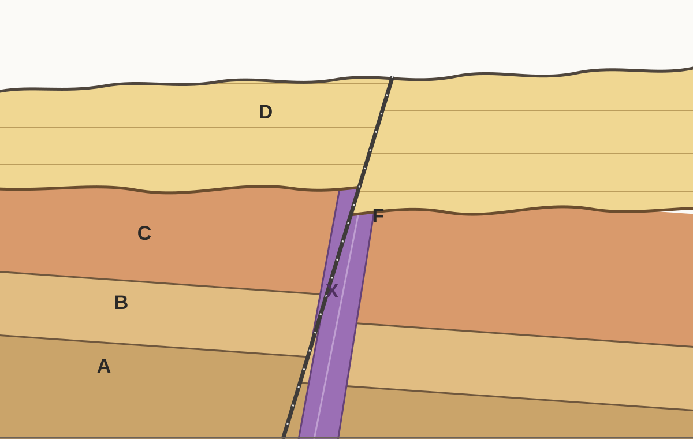

# UD1 · Com llegim la història de la Terra?

Aquesta unitat estudia com podem interpretar el relleu, obtenir informació sobre l'interior de la Terra, comprendre la tectònica de plaques, reconstruir la història geològica d'un territori i analitzar els riscs naturals.

---

## 1. El paisatge i el relleu

Quan observam un territori, veim formes del terreny, roques, vegetació, aigua, construccions i altres elements. Però **veure un paisatge no és el mateix que entendre com s'ha format**. Per interpretar-lo geològicament hem de separar primer allò que observam directament de les explicacions que proposam.

!!! note "Idea clau"
    Un paisatge és el resultat de molts factors que actuen al llarg del temps. Per explicar-lo no basta identificar una sola causa.

### 1.1. Paisatge i relleu

El **relleu** és el conjunt de formes de la superfície terrestre: muntanyes, valls, vessants, planes, penya-segats, depressions, etc.

El **paisatge** és un concepte més ampli. Inclou el relleu i també altres elements naturals o humans visibles, com la vegetació, els cursos d'aigua, els camps de conreu, les carreteres o les construccions.

> **El relleu forma part del paisatge, però relleu i paisatge no són sinònims.**

Per exemple, en un paisatge de muntanya podem observar un vessant molt inclinat, un torrent al fons d'una vall, un bosc, una carretera i diverses cases. **El vessant i la vall formen part del relleu**; el bosc, la carretera i les cases formen part del paisatge, però no són formes del relleu.

*Figura 1.1. Un paisatge conté informació sobre les formes del terreny i també sobre altres elements naturals i humans.*

#### Observar i inferir

Una **observació** descriu una característica que podem obtenir directament d'una imatge, una mesura o una altra dada.

Una **inferència** és una explicació que elaboram a partir de les observacions i dels coneixements que ja tenim.

Compareu aquestes dues afirmacions:

- **«El vessant és molt inclinat.»** És una observació: podem descriure la forma del terreny.
- **«L'aigua ha erosionat aquest vessant.»** És una inferència: proposa un procés que podria explicar la forma observada.

Una inferència pot ser raonable sense estar demostrada. Per acceptar-la necessitam **evidències compatibles amb aquella explicació** i, quan sigui possible, hem de comprovar si hi ha altres explicacions alternatives.

!!! tip "Quan interpretam una figura"
    Primer descrivim **què mostra**. Després intentam explicar **per què és així**. Barrejar observació i explicació és una font freqüent d'errors.

### 1.2. Què explica la forma del relleu?

Les formes del relleu no depenen d'un únic factor. Són el resultat de la interacció entre els **materials**, l'**estructura geològica**, els **processos geològics** i el **temps**.

#### Litologia

La **litologia** és el tipus de roca o material que forma el terreny. No tots els materials responen igual davant els mateixos processos.

Una roca molt resistent i una roca que s'altera o s'erosiona amb facilitat poden originar formes de relleu diferents encara que es trobin sota condicions semblants. Per això, saber de quin material està format un terreny pot canviar la nostra interpretació del paisatge.

#### Estructura geològica

Les roques poden estar disposades en capes horitzontals, inclinades o plegades, i poden estar tallades per fractures o falles. Aquesta **estructura** condiciona com actuen els processos sobre el terreny i quines formes poden aparèixer.

Més endavant veurem que aquesta disposició de les roques també conserva informació sobre la història geològica del territori.

#### Processos geològics interns

Els processos interns estan relacionats amb la dinàmica de l'interior terrestre. Poden **elevar, deformar, fracturar o generar nous materials** i, per tant, contribueixen a crear grans formes del relleu.

En aquesta unitat estudiarem aquests processos sobretot a través de la **tectònica de plaques**.

#### Processos geològics externs

Els processos externs actuen sobre la superfície terrestre i tendeixen a **alterar, erosionar, transportar i acumular materials**. L'aigua, la mar, el vent i la gravetat hi tenen un paper destacat.

El seu efecte depèn també de factors com el pendent, el clima, la vegetació i el temps durant el qual actuen.

Model senzill

**materials + estructura + processos geològics + temps → modelatge del relleu**

Aquest esquema és útil, però no s'ha d'interpretar com una cadena rígida. Els factors interactuen entre si i un mateix relleu pot haver estat modificat per processos diferents al llarg de la seva història.

*Figura 1.2. El relleu és el resultat de la interacció entre els materials, l'estructura geològica, els processos i el temps.*

### 1.3. Agents i processos que modelen el relleu

En geologia convé distingir entre **agent** i **procés**.

Un **agent geològic** és l'element o la força que actua sobre els materials de la superfície. Un **procés geològic** descriu què passa amb aquests materials.

| Exemples d'agents | Exemples de processos |
|---|---|
| Aigua, vent, mar, gravetat | Meteorització, erosió, transport, sedimentació |

Així, dir que **l'aigua** intervé en un paisatge identifica un agent. Dir que aquesta aigua **erosiona i transporta materials** identifica processos.

Els principals processos externs que utilitzarem en aquesta unitat són:

**Meteorització.** Alteració o fragmentació de les roques *in situ*, és a dir, sense que el material hagi estat necessàriament transportat.

**Erosió.** Arrencada o desgast dels materials de la superfície.

**Transport.** Desplaçament dels materials erosionats.

**Sedimentació.** Acumulació dels materials transportats quan disminueix la capacitat de l'agent per continuar movent-los.

A la realitat aquests processos sovint formen part d'una mateixa seqüència. Un material pot alterar-se, ser erosionat, transportar-se i acabar dipositat en un altre lloc.

!!! warning "Evita aquesta confusió"
    **Aigua, vent, mar o gravetat** no són processos. Són agents o forces que poden provocar processos com l'erosió, el transport o la sedimentació.

*Figura 1.3. Els agents geològics actuen sobre els materials i poden produir processos com la meteorització, l'erosió, el transport i la sedimentació.*

### 1.4. Com llegim un paisatge?

Interpretar un paisatge geològicament és construir una explicació a partir d'evidències. Un procediment útil és el següent:

1. **Descriure les observacions.** Identificam les formes del relleu i altres elements visibles sense explicar encara com s'han originat.
2. **Seleccionar les dades rellevants.** Ens fixam en el pendent, els materials, la disposició de les roques, els cursos d'aigua, la costa, la vegetació o altres elements que puguin aportar informació.
3. **Proposar una inferència.** Relacionam les observacions amb processos geològics que podrien explicar-les.
4. **Cercar evidències que la posin a prova.** Una explicació és més sòlida si permet fer prediccions o si és compatible amb dades independents.
5. **Revisar l'explicació quan apareixen dades noves.** Una nova dada —per exemple, conèixer la litologia— pot obligar-nos a modificar una interpretació inicial.

#### Exemple

Suposem que observam una acumulació d'arena darrere una platja.

**Observació:** hi ha una acumulació d'arena amb vegetació darrere la platja.

**Inferència:** el vent podria haver transportat arena des de la platja cap a l'interior i haver-la dipositat en aquesta zona.

**Dada que ajudaria a comprovar-ho:** mesures de la direcció del vent i del moviment real dels grans d'arena.

La diferència és important: **la forma visible és una dada; el procés que la podria haver originada és una explicació que hem de justificar**.

!!! note "Per interpretar bé un paisatge"
    No demanam «quina és la causa?» massa aviat. Primer convé preguntar: **què observam?, quines dades tenim?, quines explicacions són compatibles amb aquestes dades i quina evidència ens permetria distingir-les?**

*Figura 1.4. Les observacions descriuen allò que podem veure o mesurar; les inferències proposen explicacions que s'han de justificar amb evidències.*

### Síntesi del bloc 1

Al final d'aquest bloc has de poder distingir **paisatge i relleu**, separar **observacions i inferències**, diferenciar **agents i processos geològics** i explicar que la forma del relleu depèn de la interacció entre els **materials, l'estructura, els processos i el temps**.

---

## 2. Representam el relleu

Un mapa és una representació plana d'un territori. El problema és que el relleu té tres dimensions: a més de la posició horitzontal, cada punt es troba a una determinada altura. Els **mapes topogràfics** resolen aquest problema mitjançant corbes de nivell i altres símbols que ens permeten reconstruir mentalment la forma del terreny.

!!! note "Idea clau"
    En un mapa topogràfic, les línies no dibuixen només la posició dels llocs: també codifiquen informació sobre l'**altitud** i el **pendent**.

### 2.1. Altitud, cota i corbes de nivell

L'**altitud** és l'altura d'un punt respecte del nivell mitjà de la mar. Quan expressam l'altitud concreta d'un punt del terreny parlam de la seva **cota**.

Una **corba de nivell** és una línia que uneix punts situats a la mateixa altitud. Per això, tots els punts d'una mateixa corba tenen la mateixa cota.

Podem imaginar com es construeixen aquestes línies tallant un relleu amb diversos plans horitzontals situats a altures diferents. Cada pla talla el terreny seguint una línia. Si projectam aquestes línies sobre un mapa vist des de dalt, obtenim les corbes de nivell.

*Figura 2.1. Cada corba uneix punts situats a una mateixa altitud. En superposar corbes de diferents cotes obtenim una representació plana del relleu.*

Això permet comparar altituds sense veure directament el relleu. Si un punt és damunt la corba de 150 m, la seva cota és de 150 m. Si dos punts són damunt la mateixa corba, tenen exactament la mateixa altitud.

!!! warning "No confonguis"
    La **cota** correspon a un punt. La **corba de nivell** és una línia formada per molts punts que comparteixen la mateixa cota.

### 2.2. Equidistància i pendent

En un mateix mapa topogràfic, la diferència d'altitud entre dues corbes consecutives és constant. Aquesta diferència s'anomena **equidistància**.

Per exemple, si cinc corbes consecutives tenen les cotes 100, 150, 200, 250 i 300 m, l'equidistància és de **50 m**.

L'equidistància ens permet deduir la cota de corbes que no estan numerades i, sobretot, interpretar el pendent.

El **pendent** descriu com de ràpid canvia l'altitud quan ens desplaçam horitzontalment:

- si les corbes estan **molt juntes**, guanyam o perdem molta altitud en poca distància: el pendent és **fort**;
- si les corbes estan **molt separades**, necessitam recórrer més distància per canviar la mateixa altitud: el pendent és **suau**.

> **Més alt no significa necessàriament més pendent.** Un lloc pot ser molt alt i trobar-se sobre una superfície relativament plana, mentre que un altre lloc més baix pot tenir un vessant molt costerut.

<!-- FIGURA 2.2 PENDENT · Dues vessants equivalents vistes en perfil i en mapa: corbes juntes = pendent fort; corbes separades = pendent suau. Incloure explícitament que altitud i pendent són magnituds diferents. -->

### 2.3. Escala i distàncies

El mapa redueix les dimensions reals del territori. L'**escala** indica la relació entre una distància mesurada al mapa i la distància real corresponent.

Una escala gràfica es representa amb una barra dividida en trams amb una longitud real indicada. Per utilitzar-la, comparam la distància que mesuram al mapa amb aquesta barra i la convertim en distància real.

Aquesta informació és important perquè dues rutes poden tenir característiques diferents: una pot ser **més curta però més costeruda**, i una altra pot ser **més llarga però amb un pendent més suau**.

!!! tip "Per prendre decisions amb un mapa"
    No basta mirar un únic valor. Segons el problema, podem haver de combinar **distància, altitud i pendent**.

### 2.4. Com reconèixer formes del relleu en un mapa topogràfic

Les corbes de nivell no només ens indiquen altituds. El seu dibuix permet reconèixer formes del relleu.

#### Cims i elevacions

En una elevació, les corbes solen formar línies tancades. Si les cotes augmenten cap a l'interior, ens acostam a una zona cada vegada més alta. El cim es troba dins les corbes de cota més elevada.

#### Depressions

Una depressió també pot aparèixer com un conjunt de corbes tancades, però en aquest cas les altituds disminueixen cap a l'interior. Per identificar-la correctament no basta mirar la forma de les línies: cal llegir-ne les cotes i la simbologia del mapa.

#### Valls

Quan les corbes travessen una vall o un curs d'aigua solen formar una **V**. La punta de la V apunta, en general, cap a les zones més altes, és a dir, cap a l'origen de la vall.

#### Carenes

Una carena és una zona elevada que separa vessants. En planta, les corbes també poden formar V o U, però orientades en sentit contrari a les de les valls. Per distingir-les convé seguir com canvien les cotes a banda i banda.

#### Vessants i canvis de pendent

Un vessant apareix com una successió de corbes. La seva separació ens permet reconèixer si és suau o costerut i si el pendent canvia al llarg del recorregut.

<!-- FIGURA 2.3 PENDENT · Mapa topogràfic simplificat amb quatre formes assenyalades: cim, vall, carena i vessant. Al costat, mini-perfils laterals corresponents. -->

### 2.5. Del mapa al perfil topogràfic

Un **perfil topogràfic** és una representació del relleu vist de costat al llarg d'una línia determinada del mapa.

Si traçam una línia A–B sobre un mapa, podem predir com serà el perfil abans de dibuixar-lo:

- als trams on A–B travessa corbes **molt juntes**, el perfil serà més costerut;
- als trams on travessa corbes **molt separades**, el perfil serà més suau;
- quan la línia travessa corbes de cota cada vegada més alta, el perfil puja;
- quan travessa corbes de cota cada vegada més baixa, el perfil baixa.

Així, el perfil no és un dibuix inventat: és una altra manera de representar la mateixa informació topogràfica.

<!-- FIGURA 2.4 PENDENT · A l'esquerra, mapa amb línia A–B i corbes; a la dreta, perfil corresponent. Fer coincidir punts de creuament amb les cotes del perfil. -->

### 2.6. Com construïm un perfil topogràfic?

Per construir un perfil topogràfic a partir d'una línia A–B podem seguir aquest procediment:

1. **Traçam o localitzam la línia A–B** sobre el mapa.
2. **Marcam tots els punts on A–B talla una corba de nivell** i anotam la cota de cadascun.
3. En un eix horitzontal, **mantenim les mateixes distàncies relatives** entre aquests punts.
4. En un eix vertical, situam les **altituds corresponents**.
5. Projectam cada punt fins a la seva cota i **unim els punts amb una línia suau** que representi la forma del terreny.
6. Comprovam si el perfil és coherent amb el mapa: els trams de corbes juntes han de correspondre a pendents més forts i els de corbes separades, a pendents més suaus.

!!! warning "Evita aquesta errada"
    No dibuixis un pic cada vegada que travesses una corba. Les corbes indiquen **altituds successives**, no cims independents. El perfil ha de representar una superfície contínua.

En alguns perfils l'escala vertical i l'horitzontal poden ser diferents. Això pot exagerar visualment el pendent. Per tant, quan interpretam un perfil, convé comprovar sempre les escales utilitzades.

### Síntesi del bloc 2

Al final d'aquest bloc has de poder explicar què representen les **corbes de nivell**, calcular o deduir **cotes i equidistàncies**, interpretar el **pendent** a partir de la separació de les corbes, utilitzar una **escala** per estimar distàncies, reconèixer formes bàsiques del relleu i construir o interpretar un **perfil topogràfic**.

---

## 3. Com sabem què hi ha dins la Terra?

La major part de l'interior terrestre és inaccessible. Això planteja una qüestió científica important: **com podem construir un model d'una regió que no podem observar directament?** La resposta no consisteix a «imaginar» l'interior, sinó a obtenir dades que en depenen i utilitzar-les per posar a prova explicacions.

!!! note "Idea clau"
    Conèixer l'interior de la Terra és un problema d'**evidències i inferències**: mesuram efectes observables i, a partir d'ells, deduïm propietats de regions que no podem veure.

### 3.1. El problema: no podem observar directament l'interior terrestre

El radi mitjà de la Terra és d'uns **6.371 km**. En canvi, les perforacions humanes més profundes només han arribat a poc més de **12 km**. A escala planetària, això representa una fracció minúscula del radi terrestre.

Aquesta comparació és important perquè mostra el límit dels mètodes directes: encara que poguéssim perforar alguns quilòmetres més, continuaríem molt lluny de poder accedir a la major part de l'interior.

.png)

*Figura 3.1. Les perforacions proporcionen mostres directes, però només d'una part ínfima de la Terra.*

!!! warning "No memoritzis la dada sense entendre-la"
    El valor d'uns 12 km serveix sobretot per entendre l'**escala del problema**: els mètodes directes no poden descriure per si sols tot l'interior terrestre.

### 3.2. Mètodes directes i indirectes d'estudi

Podem obtenir informació sobre la Terra de dues maneres generals.

**Mètodes directes.** Estudiam materials als quals podem accedir físicament. Per exemple, mostres de perforacions, mines i afloraments, o determinats fragments de materials procedents de zones més profundes que han arribat a la superfície.

**Mètodes indirectes.** Mesuram senyals, propietats o efectes que depenen de l'interior i els interpretam per deduir com deu ser.

La diferència no és que un mètode sigui «bo» i l'altre «dolent». Els mètodes directes permeten analitzar materials reals, però arriben molt poc profund. Els indirectes poden aportar informació de regions inaccessibles, però exigeixen **interpretar les dades**.

| Tipus de mètode | Què obtenim | Limitació principal |
|---|---|---|
| Directe | Mostres o materials que podem observar i analitzar | Només accedim a una part molt petita de la Terra |
| Indirecte | Senyals o efectes mesurables | Necessitam inferir què els ha produït |

!!! tip "Pregunta que guia la investigació"
    Si no podem arribar a una regió, cercam algun **senyal que la travessi o que en depengui** i observam com canvia.

### 3.3. Els terratrèmols i les ones sísmiques

Quan es produeix un **terratrèmol**, s'originen vibracions que es propaguen per la Terra. Aquestes vibracions són les **ones sísmiques**.

Les estacions sísmiques mesuren el moviment del terreny al llarg del temps i en generen un **registre sísmic**. Aquest registre és una dada observable: ens informa de quan arriben determinades vibracions, de la seva amplitud i del seu comportament.

El registre, però, **no ens mostra directament la composició de l'interior**. Per obtenir aquesta informació hem de relacionar les característiques de les ones amb les propietats dels materials que han travessat.

*Figura 3.2. Un terratrèmol genera ones sísmiques que es registren en estacions; aquests registres aporten dades indirectes que després s'han d'interpretar.*

> **Dada:** una estació registra l'arribada d'una ona.  
> **Inferència:** el recorregut i el comportament d'aquella ona ens permeten deduir propietats dels materials que ha travessat.

### 3.4. Ones P i ones S

Les ones sísmiques que viatgen per l'interior no es comporten totes igual. En aquesta unitat ens interessen especialment les **ones P** i les **ones S**.

Les **ones P** produeixen sobretot compressions i expansions en la mateixa direcció en què es propaga l'ona. Poden transmetre's tant per **sòlids** com per **líquids**.

Les **ones S** produeixen una deformació transversal o de cisallament. Només es poden propagar per **sòlids**, perquè un líquid no manté aquest tipus de deformació de cisallament.

*Esquema complementari. Les ones P i S deformen el medi de manera diferent i, per això, no es propaguen igual per tots els materials.*

| Tipus d'ona | Sòlids | Líquids |
|---|:---:|:---:|
| **P** | ✓ | ✓ |
| **S** | ✓ | ✗ |

!!! note "Conseqüència important"
    Si les ones **P travessen una regió** però les **S no la travessen**, les dades són compatibles amb la presència d'un material **líquid** en aquella regió.

### 3.5. Què ens indiquen les ones sobre els materials que travessen?

No només ens interessa si una ona arriba o no. També podem estudiar la seva **velocitat** i la seva **trajectòria**.

Quan una ona entra en un medi amb propietats diferents, la seva velocitat pot canviar. Aquest canvi pot provocar una desviació de la trajectòria, és a dir, una **refracció**.

Per tant, un canvi brusc en la velocitat o la direcció de les ones és una evidència que el medi que travessen també ha canviat.

*Figura 3.3. La propagació de les ones no és uniforme: les seves trajectòries i la presència o absència d'ones S aporten informació sobre les regions internes.*

Aquesta idea és essencial: **les ones no «dibuixen» directament les capes internes**. Les capes són una interpretació construïda a partir dels canvis observats en les dades.

!!! warning "Evita aquesta conclusió"
    Que una ona P travessi una regió **no demostra que sigui sòlida**. Les P es propaguen tant per sòlids com per líquids. Per distingir-los necessitam altres dades, com el comportament de les ones S.

### 3.6. De les dades a les inferències

En ciència convé separar sempre tres nivells:

1. **Observació o dada:** què hem mesurat realment.
2. **Inferència:** quina propietat del medi és compatible amb aquella dada.
3. **Model:** com organitzam moltes inferències coherents en una explicació general de l'interior terrestre.

#### Exemple de raonament

Suposem que les estacions indiquen que:

- les ones **P** travessen una regió interna;
- les ones **S** no la travessen.

La primera dada, tota sola, **no permet decidir** si la regió és sòlida o líquida. Quan incorporam la segona dada, la interpretació canvia: com que les ones S no es propaguen pels líquids, la hipòtesi que la regió és líquida queda reforçada.

Cadena de raonament

**dades → propietats de les ones → inferència sobre el material → model de l'interior**

Això també explica per què una conclusió científica es pot haver de **revisar quan apareixen dades noves**. Revisar una conclusió no és un fracàs: és precisament una part del procés d'investigació.

!!! tip "Quan hagis de justificar una conclusió"
    No escriguis només «és líquid» o «és sòlid». Indica **quina dada** utilitzes, **quina propietat de les ones** hi relaciones i **quina inferència** en derives.

*Figura 3.4. La combinació de dades sobre ones P i S permet passar d'una observació a una inferència sobre l'estat físic dels materials interns.*

### 3.7. Discontinuïtats i estructura interna de la Terra

Quan les dades sísmiques mostren un **canvi brusc de propietats** a una determinada profunditat, inferim que hi ha una frontera entre dues regions internes. Aquesta frontera s'anomena **discontinuïtat sísmica**.

Una discontinuïtat no és una línia que s'hagi observat directament dins la Terra. És una frontera **inferida** a partir de canvis en la velocitat, la trajectòria o la propagació de les ones.

Les principals discontinuïtats que utilitzarem són:

- **Mohorovičić (Moho):** separa l'**escorça** del **mantell**. La seva profunditat és variable perquè el gruix de l'escorça no és igual a tot arreu.
- **Gutenberg:** se situa aproximadament a **2.900 km** de profunditat i separa el **mantell** del **nucli extern**.
- **Lehmann:** se situa aproximadament a **5.150 km** de profunditat i separa el **nucli extern** del **nucli intern**.

Les dades sísmiques són compatibles amb un **mantell majoritàriament sòlid**, encara que alguns dels seus materials es poden deformar lentament; un **nucli extern líquid** i un **nucli intern sòlid**.

!!! warning "Evita aquesta confusió"
    El **mantell no és una gran capa de magma líquid**. És majoritàriament sòlid. Que un sòlid es pugui deformar molt lentament no significa que sigui líquid.

*Esquema complementari de l'estructura interna de la Terra. Les fronteres representades són discontinuïtats inferides, no superfícies observades directament.*

!!! note "Un model no és una fotografia"
    Els esquemes de l'interior terrestre representen una **interpretació científica de les evidències disponibles**. Si apareguessin dades noves incompatibles amb el model, caldria revisar-lo.

### Síntesi del bloc 3

Al final d'aquest bloc has de poder diferenciar **mètodes directes i indirectes**, explicar què és un **registre sísmic**, comparar el comportament de les **ones P i S**, utilitzar la presència, absència, velocitat o desviació de les ones per fer **inferències** sobre els materials, i explicar com aquestes dades permeten identificar **discontinuïtats** i construir un model de l'**estructura interna de la Terra**.

---

## 4. Una Terra fragmentada i dinàmica

Els terratrèmols i els volcans no es distribueixen de manera aleatòria sobre la Terra. A escala mundial es concentren sobretot en **franges llargues i relativament estretes**. Aquest patró és una evidència important: suggereix que aquestes zones comparteixen alguna característica geològica.

!!! note "Idea clau"
    La tectònica de plaques és una explicació construïda a partir de **patrons observables**. Primer observam on es produeixen els fenòmens; després proposam un model que els pugui explicar.

### 4.1. La litosfera està fragmentada en plaques

Quan observam la distribució mundial dels terratrèmols i els volcans, veim que molts es concentren en grans franges del planeta.

*Figura 4.1. Els terratrèmols i els volcans no es distribueixen aleatòriament: es concentren sobretot en grans franges del planeta. Aquest patró proporciona una primera evidència de l'existència de zones geològicament especials.*

Quan seguim aquestes franges, dibuixen una xarxa que delimita grans regions de la superfície terrestre. Les dades són compatibles amb la idea que la part externa rígida de la Terra **no forma una sola peça**, sinó que està fragmentada en grans blocs.

*Figura 4.2. Si seguim moltes de les grans franges de sismicitat i vulcanisme, podem inferir límits que separen grans blocs de la litosfera. Aquests blocs són les plaques litosfèriques.*

Aquests grans blocs s'anomenen **plaques litosfèriques**.

Una placa és un fragment de **litosfera**, és a dir, de la part externa rígida de la Terra. La litosfera inclou l'**escorça** i una part del **mantell superior**.

> **Escorça i litosfera no són sinònims.** L'escorça forma part de la litosfera, però la litosfera inclou també materials del mantell superior.

Per sota de la litosfera, els materials continuen essent majoritàriament sòlids, però a escala geològica es poden deformar molt lentament.

!!! warning "Evita aquesta confusió"
    Les plaques **no suren damunt un oceà de magma líquid**. El mantell és majoritàriament sòlid, encara que els seus materials puguin deformar-se lentament.

### 4.2. Evidències de la dinàmica terrestre

Hi ha diverses observacions que, considerades conjuntament, reforcen el model de plaques en moviment.

La primera és la **distribució dels terratrèmols i els volcans**. Molts es concentren en les mateixes grans franges del planeta. Aquest patró permet inferir la posició de molts límits de plaques.

Una segona evidència és el **relleu del fons oceànic**. Per exemple, al centre de diversos oceans trobam llargues elevacions submarines anomenades **dorsals oceàniques**, relacionades amb zones on les plaques se separen.

Finalment, el moviment ja no és només una inferència sobre el passat. Les mesures repetides amb sistemes de posicionament per satèl·lit, com el **GPS**, permeten detectar **desplaçaments actuals de l'ordre de centímetres per any** i comprovar que diferents plaques es mouen en direccions diferents.

*Figura 4.3. Les mesures repetides amb sistemes de posicionament per satèl·lit permeten detectar el moviment actual de les plaques, habitualment de l'ordre de centímetres per any.*

!!! tip "Dada i conclusió"
    **Dada:** una posició mesurada repetidament canvia uns centímetres cada any.  
    **Conclusió compatible:** la placa sobre la qual es troba aquell punt es mou actualment.

Per tant, no només tenim evidències que la litosfera està fragmentada: també podem mesurar que **aquests fragments es mouen uns respecte dels altres**.

Si les plaques es mouen, el que passa als seus límits depèn del **moviment relatiu** entre elles.

*Figura 4.4. El tipus de límit depèn del moviment relatiu entre dues plaques: poden separar-se, aproximar-se o lliscar lateralment una respecte de l'altra. Aquests moviments originen límits divergents, convergents i transformants.*

### 4.3. Límits divergents

En un **límit divergent**, dues plaques **se separen**. A la figura 4.4 correspon al primer esquema.

Als oceans, aquests límits estan relacionats amb les **dorsals oceàniques**. En aquestes zones es forma nova litosfera oceànica i hi ha activitat volcànica i sísmica.

Relació característica

**separació de plaques → dorsal oceànica → formació de nova litosfera → vulcanisme i sismicitat**

Aquesta relació també es pot utilitzar en sentit contrari. Si observam una gran dorsal oceànica amb activitat volcànica i sísmica, aquestes dades són compatibles amb un **límit divergent**.

### 4.4. Límits convergents

En un **límit convergent**, dues plaques **s'aproximen**. A la figura 4.4 correspon al segon esquema.

El resultat no és sempre el mateix. Una possibilitat és la **subducció**, en què una placa oceànica s'enfonsa sota una altra. Aquestes zones solen estar associades a una **fossa oceànica**, nombrosos **terratrèmols** i, en moltes regions, **vulcanisme**.

Una altra possibilitat és la **col·lisió continental**, quan convergeixen masses continentals.

Per tant, no basta veure que dues plaques s'aproximen: hem d'observar també **quins materials i quines estructures intervenen** per interpretar què està passant.

!!! note "Una empremta característica"
    La combinació **fossa oceànica + molts terratrèmols + cadena volcànica** és especialment compatible amb una zona de **subducció**.

### 4.5. Límits transformants

En un **límit transformant**, dues plaques **llisquen lateralment** una respecte de l'altra. A la figura 4.4 correspon al tercer esquema.

En aquests límits són freqüents els **terratrèmols**. Per tant, una zona amb sismicitat important no ha d'estar necessàriament associada a vulcanisme.

Això evita una simplificació freqüent:

> **Terratrèmols i volcans sovint coincideixen en els límits de plaques, però no tots els tipus de límit produeixen exactament els mateixos fenòmens.**

Per identificar un límit hem de considerar conjuntament el **moviment relatiu de les plaques**, el relleu i els fenòmens geològics observats.

### 4.6. La tectònica de plaques com a model explicatiu

La **tectònica de plaques** no és simplement un mapa on hem dibuixat diverses peces. És un **model explicatiu**.

Relaciona tres idees:

Model senzill

**litosfera fragmentada → plaques en moviment → interaccions als límits**

Aquest model permet donar una explicació comuna a fenòmens que, si els estudiàssim per separat, podrien semblar independents: la distribució de molts **terratrèmols**, **volcans** i grans estructures del **relleu**.

!!! note "Un model científic"
    El valor d'un model no és només descriure allò que ja coneixem. També ha de permetre relacionar dades i fer prediccions: si sabem quin tipus de límit hi ha en una regió, podem anticipar quins processos i estructures hi serien compatibles.

### Síntesi del bloc 4

Al final d'aquest bloc has de poder explicar què és una **placa litosfèrica**, distingir **escorça i litosfera**, utilitzar la distribució de terratrèmols, volcans, dorsals i mesures de moviment com a **evidències**, diferenciar els límits **divergents, convergents i transformants** i interpretar la tectònica de plaques com un **model que relaciona el moviment de la litosfera amb els processos geològics de la superfície**.

---

## 5. Les roques conserven la història

Les roques i les estructures geològiques no només ens informen de **quins materials hi ha** en un territori. També conserven relacions que ens permeten reconstruir **què va passar abans i què va passar després**.

No sempre necessitam saber l'edat en anys d'una roca per ordenar els esdeveniments geològics. Moltes vegades podem establir relacions temporals a partir de la posició dels estrats, de les estructures que els tallen, de la seva deformació o de les superfícies que els trunquen.

!!! note "Idea clau"
    Reconstruir la història geològica consisteix a establir **relacions temporals justificades per evidències**, no simplement a memoritzar una seqüència.

### 5.1. Temps geològic relatiu

La **datació relativa** permet establir l'ordre dels materials i dels esdeveniments geològics: determinar què és **més antic**, què és **més modern** i què va passar **abans o després**.

Això és diferent d'assignar una edat numèrica.

Per exemple, si una falla talla tres estrats, podem saber que la falla és posterior als tres estrats encara que no sapiguem quants anys tenen.

> **Datació relativa ≠ edat en anys.**

La datació relativa respon sobretot preguntes com: **què va passar primer?, què ja existia quan es va produir aquest esdeveniment?, què és posterior?**

*Figura 5.1. Les roques i les estructures geològiques conserven evidències que permeten establir l'ordre relatiu dels esdeveniments.*

### 5.2. Principi de superposició

Els sediments es poden anar acumulant successivament i formar **estrats**.

En una successió estratificada no invertida, els estrats situats **davall** es varen formar abans que els situats **damunt**.

Això és el **principi de superposició**:

> En una successió estratificada no invertida, els estrats inferiors són més antics que els superiors.

*Figura 5.2. En una successió estratificada no invertida, els estrats inferiors són més antics que els superiors.*

Si tenim, de baix cap a dalt, els estrats A, B, C i D, podem establir:

**A → B → C → D**

Del més antic al més modern.

### 5.3. Principi d'horitzontalitat original

Els sediments es dipositen originàriament en capes **aproximadament horitzontals**.

Per tant, si avui observam estrats inclinats o plegats, podem inferir que primer es varen formar els estrats i després es varen deformar.

Això és el **principi d'horitzontalitat original**.

*Figura 5.3. Els estrats es formen inicialment aproximadament horitzontals; si avui estan inclinats o plegats, la deformació és posterior a la sedimentació.*

La inclinació que observam actualment és, per tant, una evidència d'un **esdeveniment posterior a la sedimentació**.

### 5.4. Principi d'intersecció

Una de les relacions temporals més útils és observar **qui talla a qui**.

El **principi d'intersecció** estableix que una estructura o un cos geològic que **talla un altre element és posterior** a l'element que talla.

*Figura 5.4. Una estructura que talla un material és posterior a aquest material. Les relacions d'intersecció permeten encadenar diversos esdeveniments.*

Per exemple:

- si una **intrusió** talla diversos estrats, és posterior als estrats;
- si una **falla** talla els estrats i també la intrusió, la falla és posterior a tots ells.

Podem construir així una cadena:

**estrats → intrusió → falla**

No necessitam conèixer cap edat numèrica: la relació geomètrica ja ens proporciona informació temporal.

### 5.5. Successió faunística i correlació

Algunes roques sedimentàries contenen **fòssils**. Com que els organismes que han viscut a la Terra han anat canviant al llarg del temps, determinats fòssils característics ens permeten **ordenar i correlacionar estrats** de localitats diferents.

Això és la base del **principi de successió faunística**.

Un **fòssil guia** és un fòssil especialment útil per correlacionar estrats perquè correspon a un interval temporal relativament curt i té una distribució geogràfica prou àmplia.

*Figura 5.5. Els fòssils característics poden permetre correlacionar estrats de localitats diferents, fins i tot quan les roques no són iguals.*

Això permet una idea important:

> Dos estrats de la mateixa edat **no han de tenir necessàriament la mateixa litologia**.

En un mateix moment es poden dipositar sediments diferents en ambients diferents. Per això, la correlació no consisteix simplement a cercar roques visualment iguals.

### 5.6. Principi d'actualisme

Per interpretar les roques del passat utilitzam també processos que podem observar avui.

Si actualment observam, per exemple, que els fragments transportats per un torrent xoquen, es desgasten i poden acabar més arrodonits, trobar una roca formada per **còdols arrodonits cimentats** ens pot ajudar a interpretar processos que actuaren en el passat.

Aquesta manera de raonar es basa en el **principi d'actualisme**:

> Els processos geològics que observam avui ens ajuden a interpretar els materials i les estructures formats en el passat.

!!! warning "Evita aquesta interpretació"
    L'actualisme **no significa que tot hagi estat sempre igual**, ni que els processos hagin actuat sempre amb la mateixa intensitat. Significa que podem utilitzar processos coneguts per interpretar evidències antigues.

### 5.7. Sedimentació, deformació, falles, intrusions i erosió

Una història geològica no està formada només per estrats. Hi poden intervenir diversos tipus d'esdeveniments.

**Sedimentació.** Produeix nous estrats o acumulacions de materials.

**Deformació.** Pot inclinar o plegar materials que ja existien.

**Intrusió.** Un material magmàtic pot penetrar en roques preexistents i formar un cos que les talla.

**Falla.** Una fractura amb desplaçament pot tallar i desplaçar unitats anteriors.

**Erosió.** Pot eliminar parcialment materials que ja existien.

Per ordenar aquests processos no hem de memoritzar una seqüència universal. Hem d'observar **quina relació estableix l'ordre en cada cas**.

!!! tip "Preguntes útils"
    Davant qualsevol element d'un tall, demana: **què afecta?, què el talla?, què talla ell?, què el cobreix?**

### 5.8. Superfícies d'erosió i discontinuïtats

No tots els esdeveniments geològics produeixen una nova roca.

Una etapa d'erosió pot eliminar una part dels materials anteriors i deixar una **superfície erosiva**. Si aquesta superfície trunca estrats o una intrusió, sabem que els materials truncats ja existien abans de l'erosió.

Si després un nou estrat cobreix aquesta superfície, la seva sedimentació és posterior a l'episodi erosiu.

> Alguns esdeveniments deixen una roca. **D'altres deixen una superfície.**

Quan una superfície erosiva separa materials formats en moments diferents, registra una **interrupció del registre geològic**: entre els materials inferiors i els superiors hi ha hagut almenys un episodi sense sedimentació contínua i, en aquest cas, erosió.

*Figura 5.6. En un mateix tall podem combinar diverses relacions temporals: superposició, deformació, intersecció i truncament per erosió.*

### 5.9. Com establim relacions d'edat entre esdeveniments?

Quan interpretam un tall no convé intentar endevinar tota la història d'una sola vegada. És més segur establir primer **relacions temporals locals**.

Per exemple, a partir d'un tall com el de la figura 5.6 podem raonar així:

- A és anterior a B perquè B reposa damunt A.
- B és anterior a C perquè C reposa damunt B.
- La deformació és posterior a A, B i C perquè els afecta.
- La intrusió D és posterior als estrats perquè els talla.
- L'erosió és posterior a D perquè la superfície erosiva el trunca.
- E és posterior a l'erosió perquè es diposita damunt aquesta superfície.

A continuació podem combinar totes aquestes relacions en una única seqüència coherent.

Exemple de cronologia

**sedimentació d'A → sedimentació de B → sedimentació de C → deformació → intrusió D → erosió → sedimentació d'E**

El més important no és memoritzar aquesta seqüència concreta. És saber explicar **per què** cada esdeveniment ocupa aquella posició.

!!! note "Quan justifiquis una història"
    No escriguis només una llista d'esdeveniments. Relaciona cada pas amb una evidència o un principi geològic que justifiqui l'ordre.

### Síntesi del bloc 5

Al final d'aquest bloc has de poder explicar què és la **datació relativa**, aplicar els principis de **superposició, horitzontalitat original i intersecció**, utilitzar la **successió faunística** per correlacionar estrats, interpretar el passat mitjançant l'**actualisme**, reconèixer l'ordre relatiu de **sedimentacions, deformacions, intrusions, falles i erosions**, i entendre que una **superfície erosiva** també conserva informació temporal.

---

## 6. Com reconstruïm una història geològica?

Un **tall geològic** és una representació simplificada del subsòl. Hi podem veure materials, estrats, intrusions, falles, superfícies d'erosió i altres estructures que no s'han format totes al mateix moment.

Reconstruir-ne la història significa explicar **en quin ordre es varen produir els esdeveniments** i justificar aquest ordre a partir de les relacions observables.

!!! note "Idea clau"
    Una història geològica no s'ha d'endevinar mirant el tall en conjunt. És més segur establir primer **relacions temporals petites i justificades** i combinar-les després.

*Figura 6.1. En un tall geològic podem identificar relacions entre estrats, intrusions, superfícies erosives i falles abans de construir una cronologia completa.*

### 6.1. Identificar els elements del tall

La primera passa no és ordenar els esdeveniments. És **descriure què hi ha**.

Hem d'identificar les diferents unitats de roca, la disposició dels estrats, els contactes entre materials, les estructures que en tallen d'altres, les superfícies que trunquen elements anteriors i la forma actual del relleu.

Convé separar clarament **observació** i **interpretació**.

Per exemple, a la figura 6.1:

**Observació:** X travessa els estrats A, B i C.  
**Interpretació:** X és posterior als estrats A, B i C.

O bé:

**Observació:** una superfície irregular trunca C i X.  
**Interpretació:** després de formar-se C i X hi va haver un episodi d'erosió.

!!! warning "Evita començar massa aviat"
    Si intentes reconstruir tota la història només amb una primera mirada, és fàcil introduir relacions que el tall no demostra. Primer identifica **què veus**.

### 6.2. Establir relacions temporals

Una vegada identificats els elements, podem comparar-los **de dos en dos o en grups petits**.

Per a cada relació ens convé formular tres coses:

**observació → relació temporal → principi utilitzat**

Per exemple:

**A és sota B i B és sota C → A és anterior a B i B és anterior a C → superposició.**

Altres exemples que podem obtenir de la figura 6.1 són:

**X talla A, B i C → X és posterior als tres estrats → intersecció.**

**Els estrats A-B-C estan inclinats → primer es varen sedimentar i després es varen deformar → horitzontalitat original.**

**Una superfície erosiva trunca C i X → l'erosió és posterior a C i X.**

**D reposa damunt aquesta superfície → D és posterior a l'erosió.**

!!! tip "Una relació és més útil que una intuïció"
    No escriguis «crec que X va després». Escriu **quina característica del tall obliga que X sigui posterior**.

### 6.3. Ordenar els esdeveniments

Quan ja tenim diverses relacions locals podem començar a construir una **cronologia provisional**.

No hem d'ordenar només les capes. Una història geològica pot incloure **sedimentacions, deformacions, intrusions, falles, erosions i formació del relleu actual**.

El procediment més segur és encadenar les relacions que ja hem justificat.

Per exemple:

**A abans que B**  
**B abans que C**  
**A-B-C abans de la deformació**  
**deformació abans de X**  
**X abans de l'erosió**  
**erosió abans de D**

D'aquest conjunt de relacions podem obtenir:

**A → B → C → deformació → X → erosió → D**

Aquesta seqüència encara és provisional: ens falta comprovar si altres estructures del tall obliguen a afegir o recol·locar esdeveniments.

### 6.4. Justificar l'ordre amb principis geològics

Una seqüència només és correcta si podem explicar **per què cada esdeveniment ocupa aquella posició**.

Per això, quan justificam una reconstrucció hem d'enllaçar les observacions amb els principis treballats al bloc anterior.

No basta escriure:

> A → B → C → falla F.

Una justificació millor seria:

> Primer es varen formar A, B i C, en aquest ordre, perquè B se situa damunt A i C damunt B. Posteriorment es va produir la falla F, ja que talla els materials anteriors.

La diferència és fonamental: la primera resposta és una **llista**; la segona és una **reconstrucció argumentada**.

### 6.5. Redactar una història geològica coherent

Quan la cronologia ja està establerta, podem convertir-la en una narració.

Una bona història geològica ha de seguir l'ordre **del més antic al més modern**, distingir materials, estructures i processos, utilitzar terminologia geològica adequada i explicar les relacions temporals més importants.

Per exemple, la figura 6.1 permet arribar a una seqüència com aquesta:

**A → B → C → deformació → intrusió X → erosió → sedimentació de D → falla F → erosió actual**

La podem redactar així:

> Primer es varen dipositar successivament els sediments que originaren els estrats A, B i C. Posteriorment aquests materials es varen deformar i inclinar. Després es va produir la intrusió X, que talla els tres estrats. Una etapa d'erosió va truncar els materials inclinats i la intrusió. Damunt aquesta superfície es va dipositar D. Més tard, la falla F va tallar les unitats anteriors. Finalment, l'erosió va modelar la superfície actual.

!!! note "No basta enumerar"
    Una història geològica completa ha d'explicar **com sabem** que els esdeveniments es varen produir en aquell ordre.

### 6.6. Com revisar una reconstrucció

Una reconstrucció provisional pot contenir contradiccions. Per això s'ha de revisar.

La pregunta més útil és:

> **Pot haver passat aquest esdeveniment abans que existís allò que afecta?**

Si una falla talla D, la falla no pot ser anterior a D. Si una intrusió queda truncada per una superfície erosiva, la intrusió no pot ser posterior a aquella erosió. Si un estrat cobreix una superfície, la seva sedimentació és posterior a la formació d'aquella superfície.

Quan revisam una reconstrucció convé comprovar especialment:

- si l'ordre dels estrats és coherent;
- si hem situat correctament els processos que deformen o tallen materials anteriors;
- si hem detectat les superfícies que interrompen el registre;
- si hem incorporat els esdeveniments més recents que expliquen l'aspecte actual del relleu;
- si totes les relacions del tall són compatibles amb una mateixa cronologia.

Procediment de reconstrucció

**observa el tall → identifica elements → estableix relacions temporals → justifica-les → construeix una cronologia → cerca contradiccions → redacta la història**

### Síntesi del bloc 6

Al final d'aquest bloc has de poder **identificar els elements rellevants d'un tall geològic**, distingir observacions i inferències, establir **relacions temporals justificades**, ordenar materials i processos del més antic al més modern, detectar contradiccions i redactar una **història geològica argumentada**, no només una llista d'esdeveniments.

---

## 7. Quan un procés natural es converteix en risc

La Terra és un planeta actiu. Els terratrèmols, les erupcions volcàniques, les inundacions, l'erosió o els despreniments formen part del seu funcionament natural.

Però que es produeixi un procés natural **no significa necessàriament que provoqui un desastre ni que el risc sigui sempre el mateix**.

!!! note "Idea clau"
    Per entendre un risc geològic no basta preguntar **què pot passar**. També hem de saber **què pot quedar afectat, com de vulnerable és i quines característiques té el territori**.

### 7.1. Procés natural, perill i risc

Considerem dues situacions en què es produeix un fenomen natural semblant. En una zona no hi ha habitatges ni infraestructures; en l'altra hi ha persones, edificis i carreteres.

*Figura 7.1. Un mateix procés natural pot donar lloc a conseqüències molt diferents segons què hi hagi al territori i com de susceptible sigui al dany.*

El **procés natural** és el fenomen que té lloc: una avinguda, un terratrèmol, un despreniment, una erupció volcànica, etc.

El **perill** és la possibilitat que es produeixi un fenomen potencialment perjudicial en un lloc determinat.

El **risc**, en canvi, depèn també de les conseqüències que aquell fenomen pot tenir sobre les persones, els béns i les activitats.

Per això, **procés natural, perill i risc no són sinònims**.

> Un despreniment pot produir-se en un indret sense persones ni infraestructures. El procés existeix, però les possibles conseqüències humanes són molt diferents de les que tindria el mateix despreniment damunt una carretera.

### 7.2. Exposició i vulnerabilitat

Per analitzar el risc hem de separar dos conceptes més.

L'**exposició** fa referència a les persones, els béns, les infraestructures o les activitats que es troben en una zona que podria resultar afectada.

Poden ser elements exposats: **persones, habitatges, vehicles, carreteres, ponts, serveis, instal·lacions i activitats econòmiques**.

Si construïm més habitatges en una zona susceptible d'inundació, augmentam el nombre d'elements que poden quedar afectats i, per tant, **augmentam l'exposició**.

La **vulnerabilitat** descriu com de susceptible és un element exposat de patir danys.

Dues cases poden estar igualment exposades a una inundació però tenir vulnerabilitats diferents. Hi poden influir, per exemple:

- les característiques de la construcció;
- la situació dels accessos;
- l'existència de mesures de protecció;
- la facilitat d'evacuació;
- els sistemes d'alerta;
- la preparació de la població;
- la capacitat de resposta i recuperació.

Model conceptual

**perill + exposició + vulnerabilitat → risc**

!!! warning "No és una fórmula matemàtica"
    Aquest esquema serveix per identificar els components del problema. No significa que puguem obtenir el risc simplement sumant tres nombres.

### 7.3. Factors que poden augmentar el risc

Per comprendre una situació concreta no basta conèixer el fenomen. Hem de caracteritzar també **el territori**.

#### Relleu

El pendent condiciona el moviment de l'aigua i dels materials. Un vessant molt inclinat pot afavorir moviments ràpids de materials, mentre que la forma d'una vall condiciona per on circula i s'acumula l'aigua.

#### Litologia

Els materials geològics no responen tots igual. Alguns poden ser més permeables que altres, erosionar-se amb més facilitat o presentar una estabilitat diferent quan s'impregnen d'aigua.

Per tant, identificar la litologia ens ajuda a interpretar **com pot respondre el terreny davant un procés**.

#### Aigua

L'aigua pot intervenir directament en inundacions, però també pot modificar altres processos. Les pluges intenses poden augmentar l'escorrentia, erosionar materials o contribuir a la inestabilitat d'un vessant.

#### Vegetació

La vegetació pot influir sobre l'escorrentia, l'erosió i l'estabilitat del sòl.

Això no significa que «vegetació = absència de risc», sinó que és **un factor més** que hem de considerar conjuntament amb els altres.

#### Usos del territori i infraestructures

Una zona agrícola, un bosc i un nucli urbà no presenten la mateixa exposició. Edificis, carreteres, ponts i altres infraestructures poden augmentar la quantitat de persones i béns potencialment afectats.

#### Factors socioeconòmics

La capacitat de prevenir, respondre i recuperar-se d'un episodi també pot modificar-ne les conseqüències.

Per això, dues poblacions exposades al mateix perill poden tenir **vulnerabilitats diferents**.

### 7.4. Com pot l'activitat humana augmentar o reduir el risc?

Les activitats humanes poden modificar diferents components del risc.

Per exemple, construir habitatges en una zona susceptible d'inundació pot augmentar sobretot **l'exposició**, perquè hi situam més persones i béns.

Una construcció poc adaptada al fenomen pot augmentar la **vulnerabilitat**.

En altres casos, modificar el terreny, la cobertura vegetal o el drenatge pot influir també sobre el comportament del procés natural.

Però aquí hem de ser prudents.

!!! warning "No establis relacions automàtiques"
    Observar una modificació humana no basta per demostrar que aquesta augmenta el perill. Per exemple, veure un torrent canalitzat o encimentat permet formular una **hipòtesi**, però determinar-ne l'efecte real exigiria dades sobre la secció del canal, el pendent, els cabals, la velocitat de l'aigua, la pluviometria i altres factors.

Això torna a la idea que hem treballat durant tota la unitat:

**observació → hipòtesi o inferència → dades necessàries per posar-la a prova**

### 7.5. Conseqüències sobre les persones, els béns i el territori

Quan un procés potencialment perjudicial afecta elements exposats, les conseqüències poden ser molt diverses.

Poden afectar:

**persones**, mitjançant lesions, evacuacions o pèrdua d'habitatges;

**infraestructures**, com carreteres, ponts, xarxes de serveis o edificis;

**activitats econòmiques**, si s'interrompen comunicacions, serveis o activitats productives;

**el territori**, mitjançant erosió, acumulació de sediments, moviments de materials o altres transformacions.

La gravetat de les conseqüències no depèn només de la intensitat del procés. També depèn de **què hi havia exposat i de la seva vulnerabilitat**.

Per això, davant dues situacions amb un fenomen semblant, no podem assumir que produiran necessàriament els mateixos danys.

### 7.6. Prevenció i mesures de reducció del risc

No sempre podem evitar el procés natural.

No podem impedir un terratrèmol ni podem evitar que es produeixin episodis de pluja intensa.

Però això **no significa que el risc sigui inevitable ni immutable**.

Podem actuar sobre diferents components.

**Reduir l'exposició.** Evitant determinats usos del sòl en zones especialment perilloses.

**Reduir la vulnerabilitat.** Adaptant edificis i infraestructures, millorant els sistemes d'alerta, planificant evacuacions o augmentant la capacitat de resposta.

**Reduir els efectes del fenomen quan sigui possible.** Mitjançant mesures de gestió, protecció o enginyeria adequades al problema concret.

Aquest conjunt d'actuacions forma part de la **prevenció i reducció del risc**.

!!! tip "Per justificar una mesura"
    No basta proposar «posar una barrera» o «no construir». Explica **quin component del risc modifica** i **com aquesta actuació pot reduir les possibles conseqüències**.

Com analitzar un risc

**quin procés es pot produir → què pot quedar afectat → per què és vulnerable → quines característiques del territori hi intervenen → quines actuacions poden augmentar o reduir el risc**

### Síntesi del bloc 7

Al final d'aquest bloc has de poder diferenciar **procés natural, perill i risc**, identificar els **elements exposats**, explicar què és la **vulnerabilitat**, relacionar el risc amb el **relleu, la litologia, l'aigua, la vegetació, els usos del territori, les infraestructures i els factors socioeconòmics**, justificar com les activitats humanes poden augmentar o reduir el risc i proposar **mesures de prevenció** explicant sobre quin component actuen.

---

## 8. Idees i procediments que has de dominar

Al llarg d'aquesta unitat no només has après conceptes geològics. Sobretot has practicat una manera de treballar: **observar dades, interpretar-les, justificar les conclusions i revisar-les quan apareix informació nova**.

Aquest bloc resumeix els procediments que has de saber aplicar de manera autònoma.

!!! note "Idea clau"
    Saber geologia no consisteix només a recordar definicions. Has de poder **utilitzar dades i evidències per construir i justificar una explicació**.

### 8.1. Interpretar un paisatge i un mapa topogràfic

Davant un paisatge, primer has de separar **allò que observes** de les explicacions que proposes.

Has de poder:

- descriure formes del relleu sense confondre observació i inferència;
- identificar agents i processos geològics;
- relacionar el relleu amb els materials, l'estructura, els processos i el temps;
- interpretar les corbes de nivell;
- deduir altituds i equidistàncies;
- reconèixer si un pendent és fort o suau;
- utilitzar l'escala per estimar distàncies;
- reconèixer formes bàsiques com cims, valls, carenes i vessants.

!!! tip "Pregunta't"
    **Què mostra realment el mapa o el paisatge, i què estic inferint a partir d'aquesta informació?**

### 8.2. Construir i interpretar un perfil topogràfic

Un perfil topogràfic representa el relleu vist de costat al llarg d'una línia del mapa.

Per construir-lo:

1. localitza la línia del perfil;
2. marca els punts on talla cada corba de nivell;
3. anota les cotes corresponents;
4. conserva les distàncies relatives;
5. representa cada punt a la seva altitud;
6. uneix-los amb una línia contínua coherent amb el relleu.

Quan l'interpretis, comprova sempre que:

**corbes juntes ↔ pendent fort**  
**corbes separades ↔ pendent suau**

!!! warning "Recorda"
    No dibuixis un pic cada vegada que travesses una corba. Les corbes representen altituds successives d'una mateixa superfície.

### 8.3. Extreure inferències a partir de dades sísmiques

Quan estudiam l'interior terrestre, la major part de la informació és indirecta.

Has de distingir:

**dada observada → propietat de les ones → inferència sobre el medi**

Per exemple:

**les ones P travessen una regió + les ones S no la travessen → dades compatibles amb un medi líquid**

També has de recordar que:

- les ones **P** es propaguen per sòlids i líquids;
- les ones **S** només es propaguen per sòlids;
- els canvis de velocitat o trajectòria poden indicar canvis en les propietats dels materials;
- les discontinuïtats internes són **inferides** a partir de les dades, no observades directament.

!!! warning "No facis aquesta inferència"
    Que una ona P travessi una regió **no demostra que sigui sòlida**.

### 8.4. Relacionar tectònica de plaques i fenòmens geològics

Has de poder passar dels patrons observables al model de tectònica de plaques.

La cadena de raonament és:

**distribució de terratrèmols i volcans → inferència de límits → plaques litosfèriques → moviment relatiu → processos als límits**

Has de distingir els tres tipus principals de límits:

| Moviment | Límit | Fenòmens habituals |
|---|---|---|
| Les plaques se separen | **Divergent** | dorsals, formació de litosfera, vulcanisme i sismicitat |
| Les plaques s'aproximen | **Convergent** | subducció: sismicitat i sovint vulcanisme; col·lisió continental: sismicitat i formació de grans relleus |
| Les plaques llisquen lateralment | **Transformant** | sobretot sismicitat |

No memoritzis només els noms: has de poder relacionar **moviment, estructura i processos**.

### 8.5. Aplicar els principis de datació relativa

Davant materials i estructures geològiques has de poder decidir què és anterior i què és posterior.

Els principis principals que hem utilitzat són:

| Evidència | Principi o idea |
|---|---|
| Uns estrats reposen damunt uns altres | **Superposició** |
| Estrats actualment inclinats o plegats | **Horitzontalitat original** |
| Una estructura talla una altra | **Intersecció** |
| Fòssils característics en localitats diferents | **Successió faunística** |
| Processos actuals ajuden a interpretar evidències antigues | **Actualisme** |

També has de reconèixer que una **superfície erosiva** pot representar un esdeveniment i una interrupció del registre.

!!! tip "No basta posar el nom del principi"
    Escriu també **quina observació concreta et permet aplicar-lo**.

### 8.6. Reconstruir una història geològica

Davant un tall geològic, segueix sempre un procediment ordenat:

Procediment

**identifica els elements → estableix relacions temporals → justifica-les → ordena els esdeveniments → comprova contradiccions → redacta la història**

No intentis reconstruir tota la història d'una sola mirada.

Primer estableix relacions senzilles:

**A és anterior a B perquè...**  
**X és posterior a C perquè...**  
**l'erosió és posterior a X perquè...**

Després combina-les en una cronologia global.

Una resposta completa ha d'incloure **l'ordre dels esdeveniments i la justificació d'aquest ordre**.

### 8.7. Analitzar un risc geològic en un territori concret

Davant una situació de risc, no basta identificar el procés natural.

Has d'analitzar:

**perill + exposició + vulnerabilitat → risc**

I incorporar les característiques del territori:

- relleu;
- litologia;
- aigua;
- vegetació;
- usos del sòl;
- infraestructures;
- factors socioeconòmics.

Quan proposis una mesura, explica **quin component modifica i per què podria reduir el risc**.

Per exemple, evitar noves construccions en una zona susceptible d'inundació redueix sobretot **l'exposició**.

### 8.8. Revisar una conclusió quan apareixen dades noves

Una explicació científica no és immutable.

Si apareix una dada nova que no encaixa amb la nostra interpretació, hem de comprovar:

1. quina conclusió havíem extret;
2. en quines dades es basava;
3. què aporta la dada nova;
4. si encara podem mantenir la conclusió;
5. quina explicació nova és compatible amb totes les evidències.

Això ho hem aplicat durant tota la unitat:

**paisatge → noves dades sobre materials**  
**ones sísmiques → noves evidències sobre l'interior**  
**tall geològic → noves relacions temporals**  
**risc → noves dades sobre el territori**

!!! note "Una bona resposta científica"
    No consisteix a defensar sempre la primera idea. Consisteix a mantenir l'explicació **més compatible amb les evidències disponibles**.

---

## Abans d'acabar la unitat

Comprova que ets capaç de respondre afirmativament:

- Puc diferenciar una **observació** d'una **inferència**?
- Puc llegir corbes de nivell i interpretar **altitud, pendent i escala**?
- Puc construir o interpretar un **perfil topogràfic**?
- Puc utilitzar dades de les ones **P i S** per justificar una inferència?
- Puc relacionar els **límits de plaques** amb els processos que hi tenen lloc?
- Puc aplicar els principis de **datació relativa** a un cas nou?
- Puc reconstruir i justificar una **història geològica**?
- Puc diferenciar **perill, exposició, vulnerabilitat i risc**?
- Puc explicar com una actuació humana pot **augmentar o reduir un risc**?
- Puc **revisar una conclusió** quan apareix una dada nova?

> Si pots justificar les respostes i no només recordar definicions, has assolit el nucli de la unitat.
