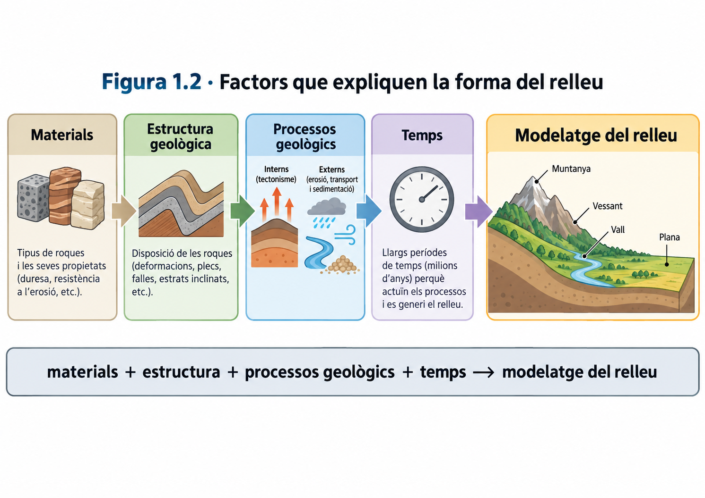
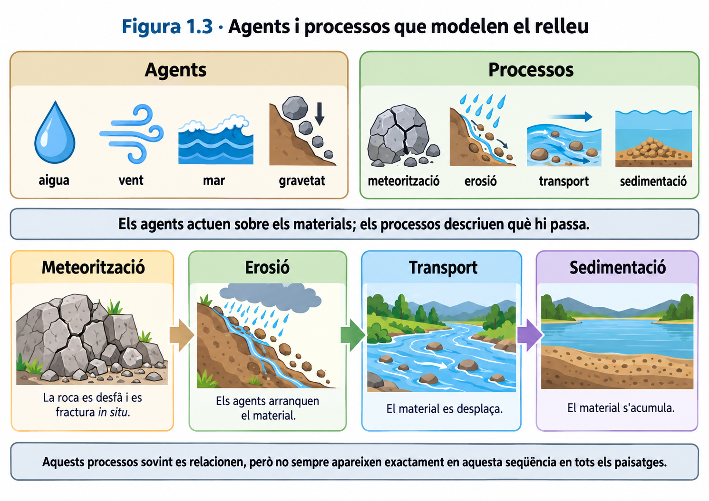
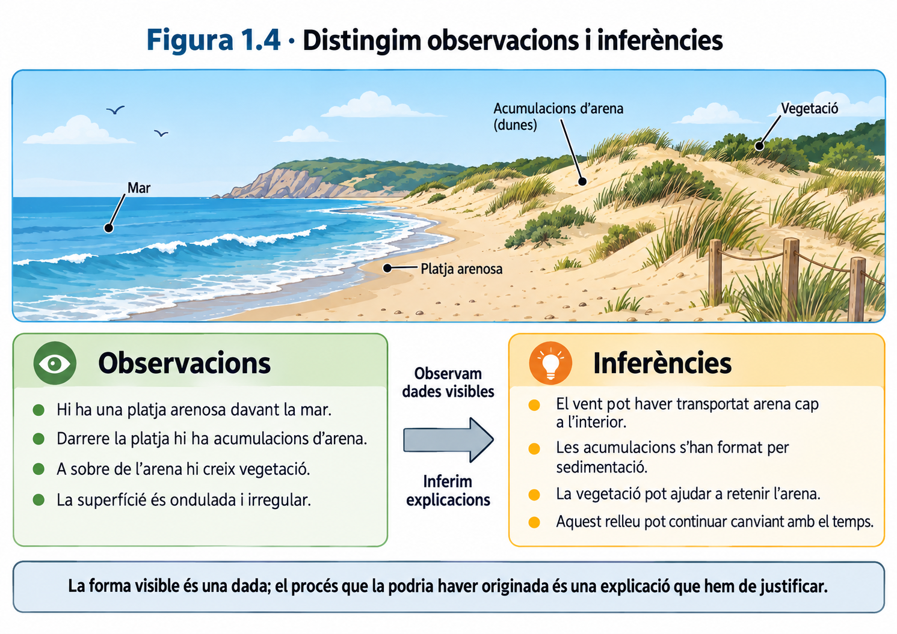
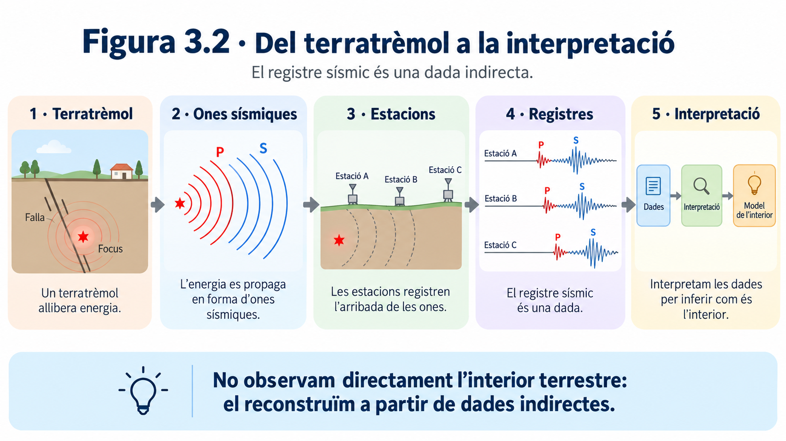
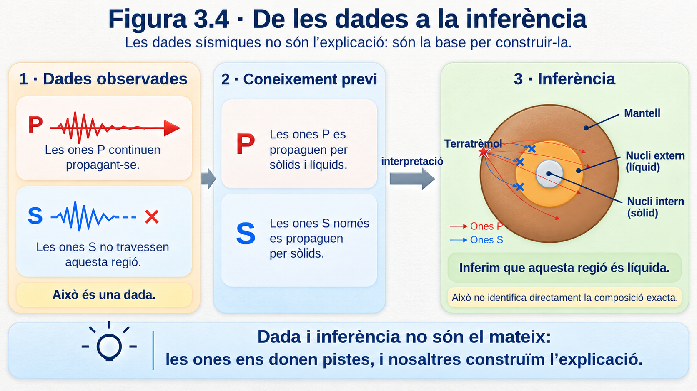

# UD1 · Com llegim la història de la Terra?

Aquesta unitat estudia com podem interpretar el relleu, obtenir informació sobre l'interior de la Terra, comprendre la tectònica de plaques, reconstruir la història geològica d'un territori i analitzar els riscs naturals.

---

## 1. El paisatge i el relleu

Quan observam un territori, veim formes del terreny, roques, vegetació, aigua, construccions i altres elements. Però **veure un paisatge no és el mateix que entendre com s'ha format**. Per interpretar-lo geològicament hem de separar primer allò que observam directament de les explicacions que proposam.

!!! note "Idea clau"
    Un paisatge és el resultat de molts factors que actuen al llarg del temps. Per explicar-lo no basta identificar una sola causa.

### 1.1. Paisatge i relleu

El **relleu** és el conjunt de formes de la superfície terrestre: muntanyes, valls, vessants, planes, penya-segats, depressions, etc.

El **paisatge** és un concepte més ampli. Inclou el relleu i també altres elements naturals o humans visibles, com la vegetació, els cursos d'aigua, els camps de conreu, les carreteres o les construccions.

> **El relleu forma part del paisatge, però relleu i paisatge no són sinònims.**

Per exemple, en un paisatge de muntanya podem observar un vessant molt inclinat, un torrent al fons d'una vall, un bosc, una carretera i diverses cases. **El vessant i la vall formen part del relleu**; el bosc, la carretera i les cases formen part del paisatge, però no són formes del relleu.

*Figura 1.1. Un paisatge conté informació sobre les formes del terreny i també sobre altres elements naturals i humans.*

#### Observar i inferir

Una **observació** descriu una característica que podem obtenir directament d'una imatge, una mesura o una altra dada.

Una **inferència** és una explicació que elaboram a partir de les observacions i dels coneixements que ja tenim.

Compareu aquestes dues afirmacions:

- **«El vessant és molt inclinat.»** És una observació: podem descriure la forma del terreny.
- **«L'aigua ha erosionat aquest vessant.»** És una inferència: proposa un procés que podria explicar la forma observada.

Una inferència pot ser raonable sense estar demostrada. Per acceptar-la necessitam **evidències compatibles amb aquella explicació** i, quan sigui possible, hem de comprovar si hi ha altres explicacions alternatives.

!!! tip "Quan interpretam una figura"
    Primer descrivim **què mostra**. Després intentam explicar **per què és així**. Barrejar observació i explicació és una font freqüent d'errors.

### 1.2. Què explica la forma del relleu?

Les formes del relleu no depenen d'un únic factor. Són el resultat de la interacció entre els **materials**, l'**estructura geològica**, els **processos geològics** i el **temps**.

#### Litologia

La **litologia** és el tipus de roca o material que forma el terreny. No tots els materials responen igual davant els mateixos processos.

Una roca molt resistent i una roca que s'altera o s'erosiona amb facilitat poden originar formes de relleu diferents encara que es trobin sota condicions semblants. Per això, saber de quin material està format un terreny pot canviar la nostra interpretació del paisatge.

#### Estructura geològica

Les roques poden estar disposades en capes horitzontals, inclinades o plegades, i poden estar tallades per fractures o falles. Aquesta **estructura** condiciona com actuen els processos sobre el terreny i quines formes poden aparèixer.

Més endavant veurem que aquesta disposició de les roques també conserva informació sobre la història geològica del territori.

#### Processos geològics interns

Els processos interns estan relacionats amb la dinàmica de l'interior terrestre. Poden **elevar, deformar, fracturar o generar nous materials** i, per tant, contribueixen a crear grans formes del relleu.

En aquesta unitat estudiarem aquests processos sobretot a través de la **tectònica de plaques**.

#### Processos geològics externs

Els processos externs actuen sobre la superfície terrestre i tendeixen a **alterar, erosionar, transportar i acumular materials**. L'aigua, la mar, el vent i la gravetat hi tenen un paper destacat.

El seu efecte depèn també de factors com el pendent, el clima, la vegetació i el temps durant el qual actuen.

Model senzill

**materials + estructura + processos geològics + temps → modelatge del relleu**

Aquest esquema és útil, però no s'ha d'interpretar com una cadena rígida. Els factors interactuen entre si i un mateix relleu pot haver estat modificat per processos diferents al llarg de la seva història.

*Figura 1.2. El relleu és el resultat de la interacció entre els materials, l'estructura geològica, els processos i el temps.*

### 1.3. Agents i processos que modelen el relleu

En geologia convé distingir entre **agent** i **procés**.

Un **agent geològic** és l'element o la força que actua sobre els materials de la superfície. Un **procés geològic** descriu què passa amb aquests materials.

| Exemples d'agents | Exemples de processos |
|---|---|
| Aigua, vent, mar, gravetat | Meteorització, erosió, transport, sedimentació |

Així, dir que **l'aigua** intervé en un paisatge identifica un agent. Dir que aquesta aigua **erosiona i transporta materials** identifica processos.

Els principals processos externs que utilitzarem en aquesta unitat són:

**Meteorització.** Alteració o fragmentació de les roques *in situ*, és a dir, sense que el material hagi estat necessàriament transportat.

**Erosió.** Arrencada o desgast dels materials de la superfície.

**Transport.** Desplaçament dels materials erosionats.

**Sedimentació.** Acumulació dels materials transportats quan disminueix la capacitat de l'agent per continuar movent-los.

A la realitat aquests processos sovint formen part d'una mateixa seqüència. Un material pot alterar-se, ser erosionat, transportar-se i acabar dipositat en un altre lloc.

!!! warning "Evita aquesta confusió"
    **Aigua, vent, mar o gravetat** no són processos. Són agents o forces que poden provocar processos com l'erosió, el transport o la sedimentació.

*Figura 1.3. Els agents geològics actuen sobre els materials i poden produir processos com la meteorització, l'erosió, el transport i la sedimentació.*

### 1.4. Com llegim un paisatge?

Interpretar un paisatge geològicament és construir una explicació a partir d'evidències. Un procediment útil és el següent:

1. **Descriure les observacions.** Identificam les formes del relleu i altres elements visibles sense explicar encara com s'han originat.
2. **Seleccionar les dades rellevants.** Ens fixam en el pendent, els materials, la disposició de les roques, els cursos d'aigua, la costa, la vegetació o altres elements que puguin aportar informació.
3. **Proposar una inferència.** Relacionam les observacions amb processos geològics que podrien explicar-les.
4. **Cercar evidències que la posin a prova.** Una explicació és més sòlida si permet fer prediccions o si és compatible amb dades independents.
5. **Revisar l'explicació quan apareixen dades noves.** Una nova dada —per exemple, conèixer la litologia— pot obligar-nos a modificar una interpretació inicial.

#### Exemple

Suposem que observam una acumulació d'arena darrere una platja.

**Observació:** hi ha una acumulació d'arena amb vegetació darrere la platja.

**Inferència:** el vent podria haver transportat arena des de la platja cap a l'interior i haver-la dipositat en aquesta zona.

**Dada que ajudaria a comprovar-ho:** mesures de la direcció del vent i del moviment real dels grans d'arena.

La diferència és important: **la forma visible és una dada; el procés que la podria haver originada és una explicació que hem de justificar**.

!!! note "Per interpretar bé un paisatge"
    No demanam «quina és la causa?» massa aviat. Primer convé preguntar: **què observam?, quines dades tenim?, quines explicacions són compatibles amb aquestes dades i quina evidència ens permetria distingir-les?**

*Figura 1.4. Les observacions descriuen allò que podem veure o mesurar; les inferències proposen explicacions que s'han de justificar amb evidències.*

### Síntesi del bloc 1

Al final d'aquest bloc has de poder distingir **paisatge i relleu**, separar **observacions i inferències**, diferenciar **agents i processos geològics** i explicar que la forma del relleu depèn de la interacció entre els **materials, l'estructura, els processos i el temps**.

---

## 2. Representam el relleu

Un mapa és una representació plana d'un territori. El problema és que el relleu té tres dimensions: a més de la posició horitzontal, cada punt es troba a una determinada altura. Els **mapes topogràfics** resolen aquest problema mitjançant corbes de nivell i altres símbols que ens permeten reconstruir mentalment la forma del terreny.

!!! note "Idea clau"
    En un mapa topogràfic, les línies no dibuixen només la posició dels llocs: també codifiquen informació sobre l'**altitud** i el **pendent**.

### 2.1. Altitud, cota i corbes de nivell

L'**altitud** és l'altura d'un punt respecte del nivell mitjà de la mar. Quan expressam l'altitud concreta d'un punt del terreny parlam de la seva **cota**.

Una **corba de nivell** és una línia que uneix punts situats a la mateixa altitud. Per això, tots els punts d'una mateixa corba tenen la mateixa cota.

Podem imaginar com es construeixen aquestes línies tallant un relleu amb diversos plans horitzontals situats a altures diferents. Cada pla talla el terreny seguint una línia. Si projectam aquestes línies sobre un mapa vist des de dalt, obtenim les corbes de nivell.

*Figura 2.1. Cada corba uneix punts situats a una mateixa altitud. En superposar corbes de diferents cotes obtenim una representació plana del relleu.*

Això permet comparar altituds sense veure directament el relleu. Si un punt és damunt la corba de 150 m, la seva cota és de 150 m. Si dos punts són damunt la mateixa corba, tenen exactament la mateixa altitud.

!!! warning "No confonguis"
    La **cota** correspon a un punt. La **corba de nivell** és una línia formada per molts punts que comparteixen la mateixa cota.

### 2.2. Equidistància i pendent

En un mateix mapa topogràfic, la diferència d'altitud entre dues corbes consecutives és constant. Aquesta diferència s'anomena **equidistància**.

Per exemple, si cinc corbes consecutives tenen les cotes 100, 150, 200, 250 i 300 m, l'equidistància és de **50 m**.

L'equidistància ens permet deduir la cota de corbes que no estan numerades i, sobretot, interpretar el pendent.

El **pendent** descriu com de ràpid canvia l'altitud quan ens desplaçam horitzontalment:

- si les corbes estan **molt juntes**, guanyam o perdem molta altitud en poca distància: el pendent és **fort**;
- si les corbes estan **molt separades**, necessitam recórrer més distància per canviar la mateixa altitud: el pendent és **suau**.

> **Més alt no significa necessàriament més pendent.** Un lloc pot ser molt alt i trobar-se sobre una superfície relativament plana, mentre que un altre lloc més baix pot tenir un vessant molt costerut.

<!-- FIGURA 2.2 PENDENT · Dues vessants equivalents vistes en perfil i en mapa: corbes juntes = pendent fort; corbes separades = pendent suau. Incloure explícitament que altitud i pendent són magnituds diferents. -->

### 2.3. Escala i distàncies

El mapa redueix les dimensions reals del territori. L'**escala** indica la relació entre una distància mesurada al mapa i la distància real corresponent.

Una escala gràfica es representa amb una barra dividida en trams amb una longitud real indicada. Per utilitzar-la, comparam la distància que mesuram al mapa amb aquesta barra i la convertim en distància real.

Aquesta informació és important perquè dues rutes poden tenir característiques diferents: una pot ser **més curta però més costeruda**, i una altra pot ser **més llarga però amb un pendent més suau**.

!!! tip "Per prendre decisions amb un mapa"
    No basta mirar un únic valor. Segons el problema, podem haver de combinar **distància, altitud i pendent**.

### 2.4. Com reconèixer formes del relleu en un mapa topogràfic

Les corbes de nivell no només ens indiquen altituds. El seu dibuix permet reconèixer formes del relleu.

#### Cims i elevacions

En una elevació, les corbes solen formar línies tancades. Si les cotes augmenten cap a l'interior, ens acostam a una zona cada vegada més alta. El cim es troba dins les corbes de cota més elevada.

#### Depressions

Una depressió també pot aparèixer com un conjunt de corbes tancades, però en aquest cas les altituds disminueixen cap a l'interior. Per identificar-la correctament no basta mirar la forma de les línies: cal llegir-ne les cotes i la simbologia del mapa.

#### Valls

Quan les corbes travessen una vall o un curs d'aigua solen formar una **V**. La punta de la V apunta, en general, cap a les zones més altes, és a dir, cap a l'origen de la vall.

#### Carenes

Una carena és una zona elevada que separa vessants. En planta, les corbes també poden formar V o U, però orientades en sentit contrari a les de les valls. Per distingir-les convé seguir com canvien les cotes a banda i banda.

#### Vessants i canvis de pendent

Un vessant apareix com una successió de corbes. La seva separació ens permet reconèixer si és suau o costerut i si el pendent canvia al llarg del recorregut.

<!-- FIGURA 2.3 PENDENT · Mapa topogràfic simplificat amb quatre formes assenyalades: cim, vall, carena i vessant. Al costat, mini-perfils laterals corresponents. -->

### 2.5. Del mapa al perfil topogràfic

Un **perfil topogràfic** és una representació del relleu vist de costat al llarg d'una línia determinada del mapa.

Si traçam una línia A–B sobre un mapa, podem predir com serà el perfil abans de dibuixar-lo:

- als trams on A–B travessa corbes **molt juntes**, el perfil serà més costerut;
- als trams on travessa corbes **molt separades**, el perfil serà més suau;
- quan la línia travessa corbes de cota cada vegada més alta, el perfil puja;
- quan travessa corbes de cota cada vegada més baixa, el perfil baixa.

Així, el perfil no és un dibuix inventat: és una altra manera de representar la mateixa informació topogràfica.

<!-- FIGURA 2.4 PENDENT · A l'esquerra, mapa amb línia A–B i corbes; a la dreta, perfil corresponent. Fer coincidir punts de creuament amb les cotes del perfil. -->

### 2.6. Com construïm un perfil topogràfic?

Per construir un perfil topogràfic a partir d'una línia A–B podem seguir aquest procediment:

1. **Traçam o localitzam la línia A–B** sobre el mapa.
2. **Marcam tots els punts on A–B talla una corba de nivell** i anotam la cota de cadascun.
3. En un eix horitzontal, **mantenim les mateixes distàncies relatives** entre aquests punts.
4. En un eix vertical, situam les **altituds corresponents**.
5. Projectam cada punt fins a la seva cota i **unim els punts amb una línia suau** que representi la forma del terreny.
6. Comprovam si el perfil és coherent amb el mapa: els trams de corbes juntes han de correspondre a pendents més forts i els de corbes separades, a pendents més suaus.

!!! warning "Evita aquesta errada"
    No dibuixis un pic cada vegada que travesses una corba. Les corbes indiquen **altituds successives**, no cims independents. El perfil ha de representar una superfície contínua.

En alguns perfils l'escala vertical i l'horitzontal poden ser diferents. Això pot exagerar visualment el pendent. Per tant, quan interpretam un perfil, convé comprovar sempre les escales utilitzades.

### Síntesi del bloc 2

Al final d'aquest bloc has de poder explicar què representen les **corbes de nivell**, calcular o deduir **cotes i equidistàncies**, interpretar el **pendent** a partir de la separació de les corbes, utilitzar una **escala** per estimar distàncies, reconèixer formes bàsiques del relleu i construir o interpretar un **perfil topogràfic**.

---

## 3. Com sabem què hi ha dins la Terra?

La major part de l'interior terrestre és inaccessible. Això planteja una qüestió científica important: **com podem construir un model d'una regió que no podem observar directament?** La resposta no consisteix a «imaginar» l'interior, sinó a obtenir dades que en depenen i utilitzar-les per posar a prova explicacions.

!!! note "Idea clau"
    Conèixer l'interior de la Terra és un problema d'**evidències i inferències**: mesuram efectes observables i, a partir d'ells, deduïm propietats de regions que no podem veure.

### 3.1. El problema: no podem observar directament l'interior terrestre

El radi mitjà de la Terra és d'uns **6.371 km**. En canvi, les perforacions humanes més profundes només han arribat a poc més de **12 km**. A escala planetària, això representa una fracció minúscula del radi terrestre.

Aquesta comparació és important perquè mostra el límit dels mètodes directes: encara que poguéssim perforar alguns quilòmetres més, continuaríem molt lluny de poder accedir a la major part de l'interior.

.png)

*Figura 3.1. Les perforacions proporcionen mostres directes, però només d'una part ínfima de la Terra.*

!!! warning "No memoritzis la dada sense entendre-la"
    El valor d'uns 12 km serveix sobretot per entendre l'**escala del problema**: els mètodes directes no poden descriure per si sols tot l'interior terrestre.

### 3.2. Mètodes directes i indirectes d'estudi

Podem obtenir informació sobre la Terra de dues maneres generals.

**Mètodes directes.** Estudiam materials als quals podem accedir físicament. Per exemple, mostres de perforacions, mines i afloraments, o determinats fragments de materials procedents de zones més profundes que han arribat a la superfície.

**Mètodes indirectes.** Mesuram senyals, propietats o efectes que depenen de l'interior i els interpretam per deduir com deu ser.

La diferència no és que un mètode sigui «bo» i l'altre «dolent». Els mètodes directes permeten analitzar materials reals, però arriben molt poc profund. Els indirectes poden aportar informació de regions inaccessibles, però exigeixen **interpretar les dades**.

| Tipus de mètode | Què obtenim | Limitació principal |
|---|---|---|
| Directe | Mostres o materials que podem observar i analitzar | Només accedim a una part molt petita de la Terra |
| Indirecte | Senyals o efectes mesurables | Necessitam inferir què els ha produït |

!!! tip "Pregunta que guia la investigació"
    Si no podem arribar a una regió, cercam algun **senyal que la travessi o que en depengui** i observam com canvia.

### 3.3. Els terratrèmols i les ones sísmiques

Quan es produeix un **terratrèmol**, s'originen vibracions que es propaguen per la Terra. Aquestes vibracions són les **ones sísmiques**.

Les estacions sísmiques mesuren el moviment del terreny al llarg del temps i en generen un **registre sísmic**. Aquest registre és una dada observable: ens informa de quan arriben determinades vibracions, de la seva amplitud i del seu comportament.

El registre, però, **no ens mostra directament la composició de l'interior**. Per obtenir aquesta informació hem de relacionar les característiques de les ones amb les propietats dels materials que han travessat.

*Figura 3.2. Un terratrèmol genera ones sísmiques que es registren en estacions; aquests registres aporten dades indirectes que després s'han d'interpretar.*

> **Dada:** una estació registra l'arribada d'una ona.  
> **Inferència:** el recorregut i el comportament d'aquella ona ens permeten deduir propietats dels materials que ha travessat.

### 3.4. Ones P i ones S

Les ones sísmiques que viatgen per l'interior no es comporten totes igual. En aquesta unitat ens interessen especialment les **ones P** i les **ones S**.

Les **ones P** produeixen sobretot compressions i expansions en la mateixa direcció en què es propaga l'ona. Poden transmetre's tant per **sòlids** com per **líquids**.

Les **ones S** produeixen una deformació transversal o de cisallament. Només es poden propagar per **sòlids**, perquè un líquid no manté aquest tipus de deformació de cisallament.

*Esquema complementari. Les ones P i S deformen el medi de manera diferent i, per això, no es propaguen igual per tots els materials.*

| Tipus d'ona | Sòlids | Líquids |
|---|:---:|:---:|
| **P** | ✓ | ✓ |
| **S** | ✓ | ✗ |

!!! note "Conseqüència important"
    Si les ones **P travessen una regió** però les **S no la travessen**, les dades són compatibles amb la presència d'un material **líquid** en aquella regió.

### 3.5. Què ens indiquen les ones sobre els materials que travessen?

No només ens interessa si una ona arriba o no. També podem estudiar la seva **velocitat** i la seva **trajectòria**.

Quan una ona entra en un medi amb propietats diferents, la seva velocitat pot canviar. Aquest canvi pot provocar una desviació de la trajectòria, és a dir, una **refracció**.

Per tant, un canvi brusc en la velocitat o la direcció de les ones és una evidència que el medi que travessen també ha canviat.

*Figura 3.3. La propagació de les ones no és uniforme: les seves trajectòries i la presència o absència d'ones S aporten informació sobre les regions internes.*

Aquesta idea és essencial: **les ones no «dibuixen» directament les capes internes**. Les capes són una interpretació construïda a partir dels canvis observats en les dades.

!!! warning "Evita aquesta conclusió"
    Que una ona P travessi una regió **no demostra que sigui sòlida**. Les P es propaguen tant per sòlids com per líquids. Per distingir-los necessitam altres dades, com el comportament de les ones S.

### 3.6. De les dades a les inferències

En ciència convé separar sempre tres nivells:

1. **Observació o dada:** què hem mesurat realment.
2. **Inferència:** quina propietat del medi és compatible amb aquella dada.
3. **Model:** com organitzam moltes inferències coherents en una explicació general de l'interior terrestre.

#### Exemple de raonament

Suposem que les estacions indiquen que:

- les ones **P** travessen una regió interna;
- les ones **S** no la travessen.

La primera dada, tota sola, **no permet decidir** si la regió és sòlida o líquida. Quan incorporam la segona dada, la interpretació canvia: com que les ones S no es propaguen pels líquids, la hipòtesi que la regió és líquida queda reforçada.

Cadena de raonament

**dades → propietats de les ones → inferència sobre el material → model de l'interior**

Això també explica per què una conclusió científica es pot haver de **revisar quan apareixen dades noves**. Revisar una conclusió no és un fracàs: és precisament una part del procés d'investigació.

!!! tip "Quan hagis de justificar una conclusió"
    No escriguis només «és líquid» o «és sòlid». Indica **quina dada** utilitzes, **quina propietat de les ones** hi relaciones i **quina inferència** en derives.

*Figura 3.4. La combinació de dades sobre ones P i S permet passar d'una observació a una inferència sobre l'estat físic dels materials interns.*

### 3.7. Discontinuïtats i estructura interna de la Terra

Quan les dades sísmiques mostren un **canvi brusc de propietats** a una determinada profunditat, inferim que hi ha una frontera entre dues regions internes. Aquesta frontera s'anomena **discontinuïtat sísmica**.

Una discontinuïtat no és una línia que s'hagi observat directament dins la Terra. És una frontera **inferida** a partir de canvis en la velocitat, la trajectòria o la propagació de les ones.

Les principals discontinuïtats que utilitzarem són:

- **Mohorovičić (Moho):** separa l'**escorça** del **mantell**. La seva profunditat és variable perquè el gruix de l'escorça no és igual a tot arreu.
- **Gutenberg:** se situa aproximadament a **2.900 km** de profunditat i separa el **mantell** del **nucli extern**.
- **Lehmann:** se situa aproximadament a **5.150 km** de profunditat i separa el **nucli extern** del **nucli intern**.

Les dades sísmiques són compatibles amb un **mantell majoritàriament sòlid**, encara que alguns dels seus materials es poden deformar lentament; un **nucli extern líquid** i un **nucli intern sòlid**.

!!! warning "Evita aquesta confusió"
    El **mantell no és una gran capa de magma líquid**. És majoritàriament sòlid. Que un sòlid es pugui deformar molt lentament no significa que sigui líquid.

*Esquema complementari de l'estructura interna de la Terra. Les fronteres representades són discontinuïtats inferides, no superfícies observades directament.*

!!! note "Un model no és una fotografia"
    Els esquemes de l'interior terrestre representen una **interpretació científica de les evidències disponibles**. Si apareguessin dades noves incompatibles amb el model, caldria revisar-lo.

### Síntesi del bloc 3

Al final d'aquest bloc has de poder diferenciar **mètodes directes i indirectes**, explicar què és un **registre sísmic**, comparar el comportament de les **ones P i S**, utilitzar la presència, absència, velocitat o desviació de les ones per fer **inferències** sobre els materials, i explicar com aquestes dades permeten identificar **discontinuïtats** i construir un model de l'**estructura interna de la Terra**.

---

## 4. Una Terra fragmentada i dinàmica

### 4.1. La litosfera està fragmentada en plaques

### 4.2. Evidències de la dinàmica terrestre

- Distribució dels terratrèmols
- Distribució dels volcans
- Relleu del fons oceànic
- Moviment de les plaques

### 4.3. Límits divergents

### 4.4. Límits convergents

### 4.5. Límits transformants

### 4.6. La tectònica de plaques com a model explicatiu

---

## 5. Les roques conserven la història

### 5.1. Temps geològic relatiu

### 5.2. Principi d'horitzontalitat original

### 5.3. Principi de superposició

### 5.4. Principi d'intersecció

### 5.5. Sedimentació, deformació, falles, intrusions i erosió

### 5.6. Superfícies d'erosió i discontinuïtats

### 5.7. Com establim relacions d'edat entre esdeveniments?

---

## 6. Com reconstruïm una història geològica?

### 6.1. Identificar els elements del tall

### 6.2. Establir relacions temporals

### 6.3. Ordenar els esdeveniments

### 6.4. Justificar l'ordre amb principis geològics

### 6.5. Redactar una història geològica coherent

### 6.6. Com revisar una reconstrucció

---

## 7. Quan un procés natural es converteix en risc

### 7.1. Procés natural, perill i risc

### 7.2. Exposició i vulnerabilitat

### 7.3. Factors que poden augmentar el risc

- Pendent
- Litologia
- Aigua
- Vegetació
- Modificacions humanes del terreny

### 7.4. Com pot l'activitat humana augmentar o reduir el risc?

### 7.5. Conseqüències sobre les persones, els béns i el territori

### 7.6. Prevenció i mesures de reducció del risc

---

## 8. Idees i procediments que has de dominar

### 8.1. Interpretar un paisatge i un mapa topogràfic

### 8.2. Construir i interpretar un perfil topogràfic

### 8.3. Extreure inferències a partir de dades sísmiques

### 8.4. Relacionar tectònica de plaques i fenòmens geològics

### 8.5. Aplicar els principis de datació relativa

### 8.6. Reconstruir una història geològica

### 8.7. Analitzar un risc geològic en un territori concret

### 8.8. Revisar una conclusió quan apareixen dades noves