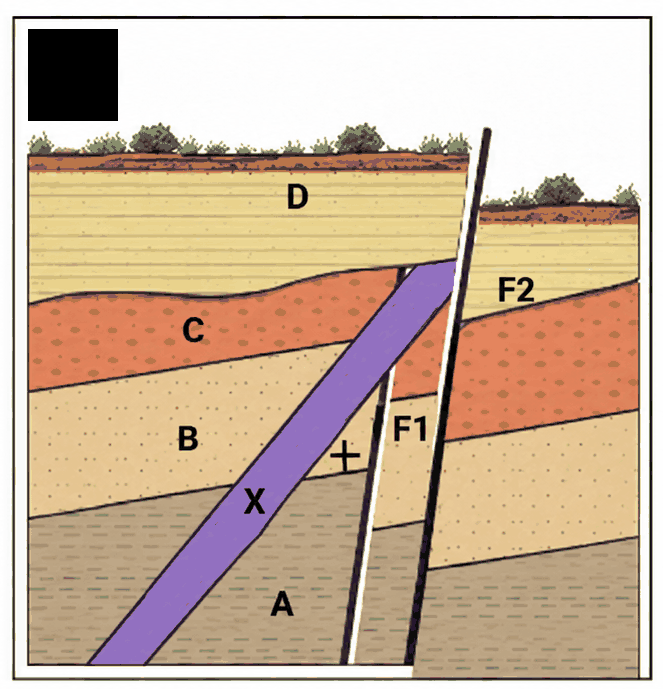
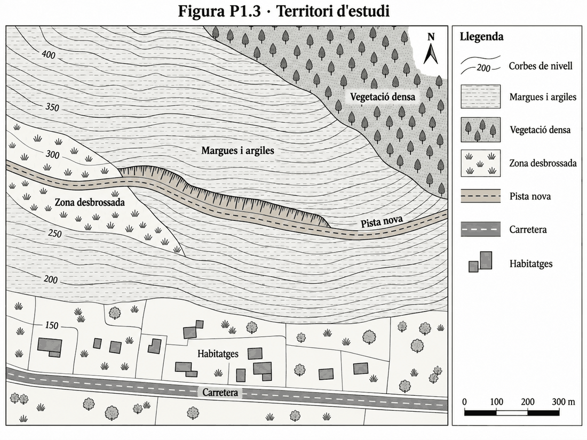

# P1 · Geologia — UD01

**Biologia i Geologia · 4t d'ESO · 50 minuts**  
**Nom i llinatges:** ______________________________ · **Grup:** ______ · **Data:** __________

**Criteris:** CA 6.1 · CA 5.1 · CA 4.2

---

## 1.1 · Relacions d'edat — CA 6.1 · 2 punts

Observa el tall geològic.

Selecciona **tres relacions temporals diferents** que puguis demostrar a partir del tall.

Per a cada relació:

1. indica quines **unitats, estructures o esdeveniments** compares;
2. assenyala quin és anterior i quin és posterior;
3. descriu quina evidència observable del tall ho demostra;
4. indica quin principi geològic utilitzes.

> No basta dir que un element és «més antic» o «més modern». Has d'explicar **com ho saps a partir del tall**.

---

## 1.2 · Reconstruïm la història geològica — CA 6.1 · 2 punts

Utilitza **el mateix tall geològic de la pregunta 1.1**.

### a) Ordena els esdeveniments

Escriu els esdeveniments geològics **del més antic al més recent**.

Inclou:

- la **sedimentació dels estrats**;
- els processos que després els han modificat.

### b) Explica la història geològica

Redacta una explicació breu i coherent.

Has de:

- seguir l'ordre cronològic;
- diferenciar **sedimentació, deformació, falles, intrusions i erosió** quan correspongui;
- justificar almenys **dues relacions temporals importants** a partir del tall;
- arribar fins als esdeveniments més recents que expliquen l'aspecte actual del terreny.

> No basta enumerar els esdeveniments. Has de mostrar com les relacions observables permeten reconstruir la història geològica.

---

## 1.3 · Risc en un territori — CA 5.1 · 3 punts

Observa el territori.

En aquest territori hi ha:

- un **vessant amb pendent fort**;
- **margues i argiles**;
- una zona amb **vegetació densa** i una altra **desbrossada**;
- **habitatges i una carretera** al peu del vessant;
- una **pista nova** que ha obligat a excavar i modificar el vessant.

Després de diversos dies de pluja intensa:

### a) Què podria passar?

Quin **problema geològic** creus que podria produir-se?

Descriu què podria passar.

**No és necessari utilitzar un terme tècnic exacte.**

Indica també **dues dades del territori** que justifiquin la teva resposta.

Explica per què són rellevants.

### b) Influència de l'activitat humana

Explica com la construcció de la pista podria **augmentar el risc**.

### c) Conseqüències

Indica **dos elements que podrien resultar afectats**.

Explica per què les conseqüències no depenen només del procés natural.

Relaciona-les també amb **com està ocupat i organitzat el territori**.

### d) Reducció del risc

Proposa **una mesura concreta** per reduir el risc.

Explica **com actuaria** i per què seria adequada.

> No basta identificar un risc. L'has de relacionar amb les característiques del territori i amb les actuacions humanes.

---

## 1.4 · Revisam una conclusió amb dades noves — CA 4.2 · 3 punts

Un equip científic estudia una **regió X de l'interior de la Terra** a partir de les ones produïdes per un terratrèmol.

### Primera informació

Les estacions sísmiques detecten **ones P que han travessat la regió X**.

L'equip conclou:

> **«La regió X és sòlida.»**

### a) Valora la conclusió inicial

Indica si aquesta conclusió queda **prou demostrada** només amb aquesta informació.

Justifica la resposta.

### Dada nova

En analitzar més estacions s'observa que:

- les **ones P continuen travessant** la regió X;
- les **ones S no la travessen**.

| Tipus d'ona | Sòlids | Líquids |
|---|:---:|:---:|
| **P** | ✓ | ✓ |
| **S** | ✓ | ✗ |

### b) Posa a prova la conclusió

Indica quina dada nova és especialment important per revisar la conclusió inicial.

Explica per què.

Digues si la nova informació **reforça**, **manté** o **obliga a modificar** la conclusió.

### c) Formula una conclusió revisada

Escriu una nova conclusió **compatible amb totes les dades**.

Explica el raonament que et permet passar de les observacions a aquesta inferència.

> Diferencia **què indiquen directament les dades** i **què inferim a partir d'elles**.
